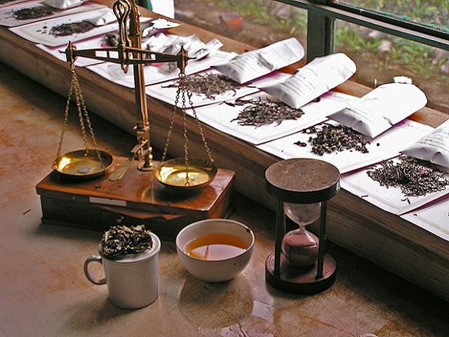
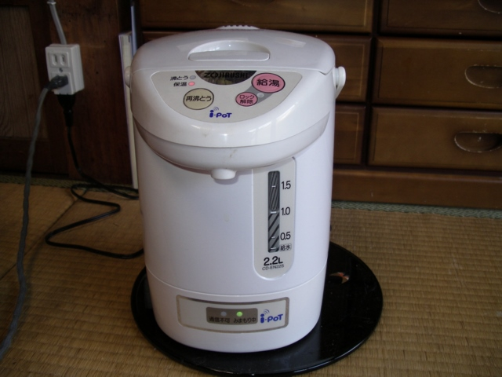
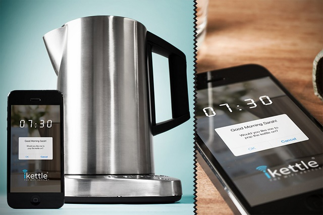

The kettle, a humble yet indispensable kitchen appliance, has a rich history that spans thousands of years. From its ancient origins to modern smart devices, the evolution of the kettle reflects humanity's enduring relationship with hot beverages and technological progress. In this article, we'll explore the fascinating journey of the electric kettle, tracing its development from simple heating vessels to sophisticated, WiFi-enabled appliances.

## The Origins of Tea and Its Influence on Kettle Development

The history of the kettle is inextricably linked to the history of tea, one of the world's most popular beverages. Tea's journey from its birthplace in China to becoming a global phenomenon played a crucial role in driving kettle innovation.

Tea cultivation began in China over 5,000 years ago, but it wasn't until the 16th century that it made its way to Europe. The first European mention of tea was in Venice in 1559, where it was referred to as "Chai Catai." However, it was the British who truly embraced tea culture, leading to its widespread adoption throughout the empire and beyond.

The British fascination with tea had far-reaching consequences, not just for cultural practices but also for trade and technology. By 1760, tea had become the third most traded commodity in the world, behind only cotton and slaves. This surge in popularity created a demand for more efficient ways to heat water, setting the stage for the development of the electric kettle.

The introduction of tea to America in the early 1700s further expanded the global tea market and, consequently, the need for kettles. As tea consumption grew, so did the desire for faster, more convenient ways to prepare it. This consumer demand would eventually drive the innovation that led to the electric kettle.

[Learn more about how electric kettles have made our lives easier](https://www.electrickettlesguide.com/how-electric-kettles-made-our-life-easier/)

## Evolution of the Kettle: From Ancient Times to Electricity

The kettle's evolution is a testament to human ingenuity and our constant quest for improvement. Let's trace its development from ancient times to the advent of electricity:

| Period | Key Development |
|--------|-----------------|
| 3500-2000 BC | Oldest known kettle (Mesopotamia) |
| Pre-19th century | Non-electric kettles used over flames |
| Late 19th century | Introduction of electric kettles |

The oldest known kettle, discovered in Mesopotamia, dates back to 3500-2000 BC. These early kettles were simple vessels used to heat water over open flames. For thousands of years, the basic design remained largely unchanged. Kettles were made from various materials such as clay, copper, or iron, and were placed directly over fire or on stoves to heat water.

The Industrial Revolution in the 19th century brought significant changes to many aspects of daily life, including how we prepare hot beverages. The invention of the electric stove in the 1890s paved the way for the development of the electric kettle. This innovation marked a turning point in kettle design, offering a safer and more efficient alternative to traditional stovetop kettles.

[Discover the differences between stovetop and electric kettles](https://www.electrickettlesguide.com/stovetop-kettle-vs-electric-kettle-which-one-is-better/)

## The Dawn of Electric Kettles

The late 19th century saw the birth of the electric kettle, a revolutionary appliance that would transform the way people prepared hot beverages. The key milestones in the early development of electric kettles were:

1. **1891**: Carpenter Electric Company in Chicago introduces the first electric kettle
2. **1891**: R.E.B. Crompton in the UK develops the heat radiator concept
3. **1893**: Crompton's concept is incorporated into Carpenter's design

The first electric kettle, introduced by the Carpenter Electric Company in Chicago in 1891, was a groundbreaking invention. However, it had a significant drawback: the heating element was separate from the water container. This design was inefficient and potentially dangerous, as the exposed element could cause fires if the kettle boiled dry.

Simultaneously, in the UK, R.E.B. Crompton was working on a heat radiator concept that would prove crucial for the development of safer electric kettles. His idea involved immersing the heating element in the water, which would greatly improve efficiency and safety.

In 1893, Crompton's concept was incorporated into Carpenter's design, marking a significant improvement in electric kettle technology. This integration of the heating element into the kettle itself set the stage for future innovations and laid the foundation for the electric kettles we use today.

[Learn about the safety ratings of modern electric kettles](https://www.electrickettlesguide.com/kettle-safety-ratings/)

## The Integrated Heating Revolution

The next major breakthrough in electric kettle design came in 1922 when the Swan company presented the first electric kettle with an integrated heating element. This innovation represented a significant leap forward in both safety and efficiency.

The integrated heating element solved several problems associated with earlier designs:

1. **Improved safety**: By fully encasing the heating element within the kettle, the risk of electrical accidents was greatly reduced.
2. **Enhanced efficiency**: Direct contact between the heating element and water allowed for faster boiling times.
3. **Better durability**: The enclosed design protected the heating element from damage and corrosion.

4. **Easier cleaning**: With no exposed parts, these kettles were much easier to clean and maintain.

This new design quickly gained popularity and became the standard for electric kettles moving forward. It paved the way for further improvements and set the stage for the development of automatic kettles in the coming decades.

[Explore the best stainless steel kettles with integrated heating elements](https://www.electrickettlesguide.com/stainless-steel-kettle/)

## The Automatic Kettle Breakthrough

In 1955, Russell Hobbs achieved another milestone in kettle technology with the introduction of the first automatic electric kettle. This innovation addressed one of the main inconveniences of earlier electric kettles: the need for constant monitoring to prevent boiling over or boiling dry.

The key feature of Russell Hobbs' automatic kettle was a bimetallic strip that functioned as a temperature-sensitive switch. Here's how it worked:

1. As the water heated, the bimetallic strip would bend due to the different expansion rates of the two metals.
2. When the water reached boiling point, the strip would bend enough to trigger a switch.
3. This switch would cut off the power supply, automatically shutting off the kettle.

This automatic shut-off feature was a game-changer, offering several benefits:

- **Safety**: It prevented kettles from boiling dry, reducing the risk of fire or damage to the appliance.
- **Convenience**: Users could now start the kettle and walk away, knowing it would turn off by itself.
- **Energy efficiency**: By stopping the heating process as soon as the water boiled, it prevented unnecessary energy consumption.

The automatic electric kettle quickly became popular, setting a new standard for kettle design that continues to this day. Modern electric kettles still use variations of this automatic shut-off technology, combined with other advanced features for temperature control and energy efficiency.

[Check out our guide on the best variable temperature kettles](https://www.electrickettlesguide.com/best-variable-temperature-kettles/)

## Notable Improvements in the 20th Century

The 20th century saw a series of innovations that further improved the functionality and safety of electric kettles:

1. **1923**: Arthur L. Large invents the fully immersible heat resistance
   - This innovation allowed for more efficient heating and easier cleaning of the kettle.

2. **1930s**: Walter H. Bullpitt creates the electric kettle safety valve
   - This safety feature prevented pressure build-up in the kettle, reducing the risk of accidents.

3. **Late 20th century**: John C. Taylor perfects the kettle thermostat
   - Taylor's improved thermostat allowed for more precise temperature control, paving the way for variable temperature kettles.

These improvements collectively made electric kettles safer, more efficient, and more versatile. They set the stage for the advanced features we see in modern electric kettles, such as precise temperature control for different types of tea and coffee.

## The Smart Kettle Era

As we entered the 21st century, the integration of digital technology into household appliances gave birth to the era of smart kettles. These devices combine the basic functionality of boiling water with advanced features controlled by microprocessors and often connected to smartphones or home automation systems.

### The I-pot: A Kettle with a Social Purpose

One of the first notable smart kettles was the I-pot, developed through a collaboration between Zojirushi, Fujitsu, and NTT. The I-pot was designed with a unique purpose: to serve as a non-intrusive monitoring tool for elderly care.

Key features of the I-pot included:

- Wireless communication capabilities
- Usage tracking and reporting
- Alerts sent to caregivers or family members

The I-pot would record each time it was used to boil water and send this information to a monitoring center. If the kettle wasn't used for an extended period, it could indicate that the elderly user might need assistance, prompting a check-in.

This innovative use of kettle technology demonstrated how everyday appliances could be reimagined to serve broader social needs, particularly in aging societies.

### The iKettle: Bringing WiFi to Your Tea Time

Building on the concept of connected appliances, the iKettle took smart kettle technology a step further by introducing WiFi connectivity. This innovation allowed users to control their kettle remotely through a smartphone app.

Key features of the iKettle include:

- Remote activation through a smartphone app
- Programmable boiling times
- Temperature selection for different types of beverages
- "Keep warm" function to maintain water temperature
- Integration with smart home systems and voice assistants

The iKettle and similar smart kettles offer unprecedented convenience. Users can start boiling water from bed in the morning, have hot water ready when they return home, or even ask their voice assistant to prepare water for tea.

[Explore our guide to the best smart kettles available today](https://www.electrickettlesguide.com/best-smart-kettles/)

## Environmental Impact and Sustainability

As we consider the history and future of electric kettles, it's important to address their environmental impact and the industry's move towards sustainability. Modern electric kettles are generally more energy-efficient than their stovetop counterparts or other methods of boiling water like microwaves. However, there's still room for improvement in terms of energy consumption and materials used.

Many manufacturers are now focusing on creating more sustainable electric kettles:

1. **Energy efficiency**: Newer models often include features like rapid boil technology and precise temperature control to minimize energy waste.

2. **Materials**: There's a growing trend towards using recyclable or biodegradable materials in kettle construction.

3. **Longevity**: Durable designs and replaceable parts help extend the lifespan of kettles, reducing electronic waste.

4. **Smart features**: Some smart kettles can be programmed to operate during off-peak electricity hours, potentially reducing their carbon footprint.

As consumers become more environmentally conscious, the electric kettle industry is likely to continue innovating in ways that balance convenience with sustainability.

[Learn more about the energy efficiency of electric kettles](https://www.electrickettlesguide.com/are-electric-kettles-energy-efficient/)

## Conclusion

The electric kettle's journey from a simple heating device to a smart appliance reflects our technological progress and changing lifestyles. From its ancient origins to the latest WiFi-enabled models, the kettle has remained an essential part of our daily routines, evolving to meet our needs for convenience, safety, and efficiency.

As we look to the future, we can expect further innovations in electric kettle technology. These may include even more advanced smart features, improved energy efficiency, and designs that prioritize sustainability. Whether you're a tea enthusiast, a coffee lover, or simply someone who appreciates efficient kitchen gadgets, understanding the rich history of the electric kettle enhances our appreciation for this humble yet indispensable appliance.

The next time you enjoy a hot beverage prepared with your electric kettle, take a moment to appreciate the centuries of innovation that have gone into making that simple act possible. From ancient fire-heated vessels to WiFi-connected smart kettles, the story of the electric kettle is a testament to human ingenuity and our never-ending quest for the perfect cup of tea.
