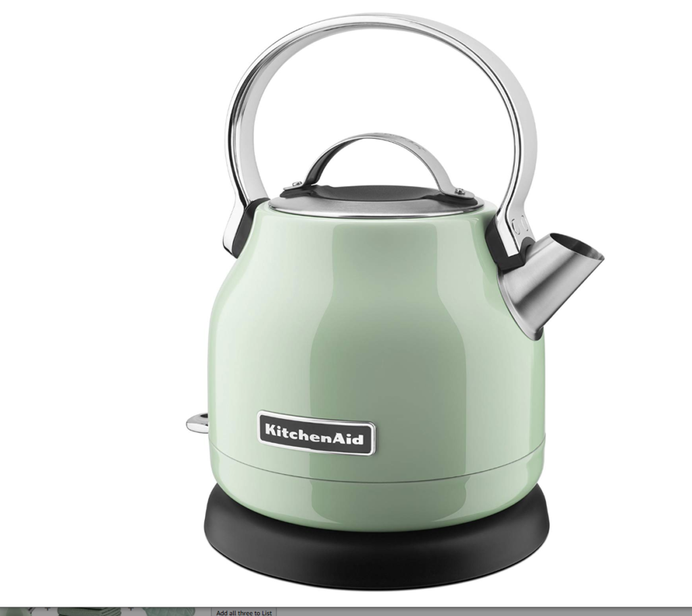

For tea enthusiasts and coffee lovers, the prospect of a long train journey without access to their favorite hot beverages can be daunting. The question arises: can you bring your own electric kettle on board? Let's dive into this topic and explore the various aspects of using electric kettles on trains.

## Why Bring an Electric Kettle on a Train?

There are several compelling reasons to consider bringing an electric kettle on your train journey. First and foremost, it offers unparalleled convenience, allowing you to brew your favorite hot drinks anytime, without relying on train schedules or onboard services. This level of control extends to quality as well – you can ensure you have access to the exact tea or coffee you prefer, rather than settling for whatever is available on the train.

From a financial perspective, bringing your own kettle can lead to significant cost savings. Train beverages are often overpriced, and having your own kettle means you can avoid these expensive onboard purchases. Additionally, in situations where the safety of drinking water is a concern, an electric kettle can be used to [clean and purify water](https://www.electrickettlesguide.com/how-to-clean-an-electric-kettle/), providing peace of mind during your journey.

For longer trips, an electric kettle can be a game-changer when it comes to meal preparation. You can easily heat water for instant meals, soups, or noodles, providing more diverse and potentially healthier food options than what might be available on the train. Lastly, having your own kettle can contribute to a sense of comfort and familiarity, bringing a cozy, homely feeling to your travel experience, which can be especially valuable on long or overnight journeys.

[Learn more about how electric kettles have made our lives easier](https://www.electrickettlesguide.com/how-electric-kettles-made-our-life-easier/)

## Train Baggage Policies: What's Allowed?

Before packing your kettle, it's crucial to understand train baggage policies. These can vary by company and country, but here are some general guidelines:

| Aspect | Common Policy |
|--------|---------------|
| Hand Luggage | Usually allowed, with size restrictions |
| Carry-on Bags | Often permitted, limited to 1-2 per person |
| Weight Limit | Typically 20-25 kg per bag |
| Size Restrictions | Varies, but generally must fit in overhead compartments or under seats |

### Key Points to Remember:

- Most trains prohibit large appliances and bulky items.
- Space is limited, so compact travel kettles are ideal.
- Some trains may charge fees for excess baggage.

It's important to note that while these guidelines are common, policies can differ significantly between train companies and countries. For example, Amtrak in the United States generally allows small appliances in carry-on bags, while some European train services might have stricter regulations. Always check the specific baggage policy of your train operator before travel.

Additionally, consider the practicality of bringing an electric kettle. On shorter journeys, the benefit might not outweigh the inconvenience of carrying an extra item. However, for long-distance or overnight trips, especially those lasting several days, having a kettle could significantly enhance your travel experience.

When packing your kettle, ensure it's well-protected to prevent damage during transit. Consider using padded bags or wrapping it in soft clothing within your luggage. This not only protects your kettle but also prevents it from potentially damaging other items in your bag.

## Power Usage Policies on Trains

Unlike airplanes, many trains do offer power outlets for passengers. However, there are important considerations when it comes to using these outlets for devices like electric kettles. The availability and specifications of power outlets can vary greatly depending on the train service, class of travel, and even the specific train model.

1. **Outlet Availability**:
   - Coach and business class usually have one outlet per pair of seats.
   - First-class often provides individual outlets.
   - Some older trains may have limited or no power outlets available.

2. **Power Limitations**:
   - Outlets typically have wattage restrictions to prevent overloading the train's electrical system.
   - High-power devices may trip circuit breakers or pose fire hazards.
   - Some trains may have a maximum wattage limit per outlet (e.g., 150W or 200W).

3. **Voltage Differences**:
   - Amtrak uses standard 110V American outlets.
   - European trains often use 220V outlets.
   - Always check the voltage requirements for your destination.

4. **Adapters and Converters**:
   - Bring appropriate adapters for international travel.
   - Avoid using voltage converters; opt for dual-voltage kettles instead.

It's crucial to understand that while power outlets may be available, their use for high-wattage devices like electric kettles might be restricted or prohibited. Some train services explicitly state in their policies that outlets are intended for low-power devices such as laptops and mobile phones.

Before relying on train power outlets for your electric kettle, research the specific policies of your train operator. Some may require passengers to obtain permission before using high-power devices. Others might have strict prohibitions against using heating appliances on board.

For international travel, be aware of voltage differences. While many modern electric kettles are dual voltage, using the wrong voltage can damage your device or create a safety hazard. Always check your kettle's voltage requirements and compare them with the available power supply on the train.

Lastly, consider the etiquette of using power outlets on trains. In shared spaces, it's courteous to limit the use of high-power devices and to be mindful of other passengers who may also need to use the outlets. If you plan to use your kettle frequently, consider bringing a portable power bank as an alternative power source to avoid potential conflicts or inconveniences.

[Explore the best variable temperature kettles for precise brewing](https://www.electrickettlesguide.com/best-variable-temperature-kettles/)

## Choosing the Right Travel Kettle

When selecting a kettle for train travel, several factors come into play to ensure you choose a device that is both practical and compliant with train regulations. Size is paramount – opt for compact, [mini kettles](https://www.electrickettlesguide.com/best-small-electric-kettle-of-17-ounces-0-5l/) that easily fit in your luggage without taking up too much precious space. Look for models specifically designed for travel, as these often feature space-saving designs like collapsible bodies or detachable power cords.

Voltage compatibility is another crucial consideration, especially for international travel. Choose dual-voltage models (110V/220V) for maximum versatility. These kettles can automatically adjust to different power systems, eliminating the need for bulky voltage converters and reducing the risk of damaging your device.

Capacity is an important factor to balance – you want a kettle that holds enough water for your needs without being too large. Generally, kettles that hold around 0.5L (enough for 1-2 cups) are ideal for train travel. This size provides a good balance between usability and portability.

Material choice can significantly impact the kettle's suitability for travel. Silicone or collapsible kettles are excellent options as they are lightweight and can be compressed when not in use, saving valuable luggage space. However, if you prefer a more traditional kettle, look for durable materials like stainless steel that can withstand the rigors of travel.

Safety features are non-negotiable when it comes to travel kettles. Auto shut-off functionality is essential to prevent accidents if you get distracted or the train experiences sudden movements. Boil-dry protection is another crucial feature that prevents the kettle from operating when there's insufficient water, protecting both the device and your safety.

### Top Features to Look for in Travel Kettles:

- Foldable or collapsible design for easy packing
- Dual voltage capability (110V/220V)
- Rapid boiling time to save energy and time
- Leak-proof construction to prevent spills in your luggage
- Compact size (ideally under 1L capacity)
- Detachable power cord for easier storage
- Cool-touch exterior for safety in confined spaces
- Multiple temperature settings for different beverages (if space allows)

When considering these features, it's important to prioritize based on your specific needs and the types of train journeys you typically undertake. For frequent international travelers, dual voltage and adaptability to different plug types might be top priorities. For those mainly traveling domestically, factors like size and boiling speed might take precedence.

Remember, the ideal travel kettle strikes a balance between functionality and portability. While it's tempting to opt for the smallest possible kettle, ensure it still meets your practical needs. Similarly, while additional features like variable temperature control are nice to have, they may not be worth the extra bulk or complexity for short train trips.

For more options and detailed reviews, check out our guide on the [best foldable electric kettles for traveling](https://www.electrickettlesguide.com/best-foldable-electric-kettle-for-traveling/).

## Train-Specific Kettle Regulations

While policies can vary, here's a general overview of kettle regulations on popular train services:

| Train Service | Kettle Policy |
|---------------|---------------|
| Amtrak (USA) | Small appliances allowed, subject to space limitations |
| Eurostar (Europe) | Small kettles permitted in hand luggage |
| Indian Railways | Kettles generally allowed, but may be restricted in certain classes |
| Japan Railways | Small kettles usually permitted, but use may be limited |

It's important to note that these policies can change and may have specific conditions or restrictions. For example:

- **Amtrak**: While small appliances are generally allowed, they should be used responsibly and without disturbing other passengers. Amtrak recommends using low-wattage devices to avoid overloading the electrical system. [Amtrak Baggage Policy](https://www.amtrak.com/personal-items-baggage-policy)

- **Eurostar**: Eurostar allows small personal appliances, but they must fit within your luggage allowance. The use of kettles might be restricted in certain areas of the train. [Eurostar Luggage Policy](https://www.eurostar.com/uk-en/travel-info/travel-preparation/baggage/baggage-allowance)

- **Indian Railways**: Policies can vary by train class and route. In some premium classes, kettles might be provided by the train service, making personal kettles unnecessary. [Indian Railways Luggage Rules](https://indianrailways.gov.in/railwayboard/view_section.jsp?lang=0&id=0,1,304,366,533,1675)

- **Japan Railways**: While small kettles are often permitted, their use might be limited due to the availability of hot water dispensers on many Japanese trains. [JR-East Baggage Information](https://www.jreast.co.jp/e/customer_support/luggage.html)

Always check the specific policies of your train service before traveling. These can usually be found on the official websites of the train operators or by contacting their customer service directly. Keep in mind that even if kettles are allowed, their use might be subject to certain conditions, such as using them only in designated areas or during specific times.

Additionally, be aware that some train services might have different policies for domestic and international routes. For instance, a kettle that's permitted on a domestic journey might not be allowed on an international train crossing borders, due to varying customs regulations.

Lastly, remember that train staff have the discretion to restrict the use of any device if they believe it poses a safety risk or causes disturbance to other passengers. Always use your kettle responsibly and be prepared to stow it away if requested.

## Tips for Using Electric Kettles on Trains

Using an electric kettle on a train requires consideration for both safety and etiquette. Here are some detailed tips to ensure a smooth and enjoyable experience:

1. **Safety First**: Never leave your kettle unattended while in use. Train movements can be unpredictable, and an unattended kettle could pose a safety hazard. Always keep a close eye on your kettle and unplug it immediately after use.

2. **Be Considerate**: Use your kettle during appropriate hours to avoid disturbing fellow passengers. Early mornings or late evenings are generally good times, but avoid boiling water during quiet hours on overnight trains. Be mindful of the noise and steam produced by your kettle.

3. **Clean Up**: Always clean your kettle after use. This not only maintains hygiene but also prevents any odors that might bother other passengers. Bring a small cleaning kit with you, including a mild detergent and a soft cloth. Learn [how to clean an electric kettle](https://www.electrickettlesguide.com/how-to-clean-an-electric-kettle/) properly to ensure it stays in good condition throughout your journey.

4. **Water Source**: Use bottled water if you're unsure about tap water quality. While many trains provide potable water, the quality can vary, especially on international routes. Using bottled water also prevents any mineral buildup in your kettle.

5. **Timing**: Boil water during non-peak electricity usage times on the train. This typically means avoiding meal times when many passengers might be using power outlets. By choosing off-peak times, you reduce the risk of overloading the train's electrical system.

6. **Secure Placement**: Ensure your kettle is on a stable surface before use. Train tables can be small and unstable, so consider bringing a non-slip mat to place under your kettle for added security.

7. **Voltage Awareness**: Double-check the voltage of the power outlet before plugging in your kettle, especially on international trains. Using the wrong voltage can damage your kettle or create a safety hazard.

8. **Respect Shared Spaces**: If you're in a shared compartment or a busy area of the train, ask your fellow passengers if they mind you using your kettle. This courtesy can go a long way in maintaining a pleasant travel environment.

9. **Emergency Preparedness**: Familiarize yourself with the location of emergency stops and fire extinguishers in your train car. While accidents are rare, it's always best to be prepared.

10. **Packing Smart**: When not in use, ensure your kettle is completely dry before packing it away. This prevents any water leakage in your luggage and reduces the risk of mold growth.

By following these tips, you can enjoy the convenience of your electric kettle while ensuring a safe and comfortable journey for yourself and your fellow passengers. Remember, the key is to balance your personal comfort with respect for the shared travel environment.

[Discover the best stainless steel kettles for durability and safety](https://www.electrickettlesguide.com/stainless-steel-kettle/)

## Safety Precautions When Using Electric Kettles on Trains

When using an electric kettle on a train, safety should be your top priority. The unique environment of a moving train presents specific challenges that require extra caution. Here are some essential safety precautions to keep in mind:

1. **Stable Positioning**: Always place your kettle on a flat, stable surface. Train tables can be small and may wobble, so consider bringing a non-slip mat to provide extra stability. This prevents accidental spills or tipping, which could lead to burns or electrical hazards.

2. **Cord Management**: Keep the kettle's cord neat and tidy. Loose cords can be a tripping hazard in the confined space of a train compartment. Use cord organizers or wraps to keep the cord contained and away from walkways.

3. **Avoid Overfilling**: Never fill the kettle beyond its maximum capacity. Overfilling can lead to boiling water spilling out, which is particularly dangerous in a moving train. Most travel kettles have clear water level indicators – use these as a guide.

4. **Use the Right Voltage**: Ensure your kettle is compatible with the train's power supply. Using a kettle with the wrong voltage can cause overheating or electrical faults. If you're traveling internationally, a dual-voltage kettle is the safest choice.

5. **Regular Inspections**: Before each use, quickly inspect your kettle for any signs of damage, especially to the cord or plug. Damaged electrical components can pose serious safety risks.

6. **Mindful Pouring**: When pouring hot water, be extra careful of sudden train movements. Use both hands if necessary, and consider pouring over the sink in the train's bathroom to minimize spill risks.

7. **Cool Down Period**: Allow your kettle to cool down completely before storing it. This prevents any risk of burns when handling the kettle later and protects other items in your luggage from heat damage.

8. **Emergency Awareness**: Know the location of emergency equipment on the train, such as fire extinguishers and emergency stop buttons. While rare, electrical fires can occur, and quick action is crucial.

9. **Avoid Flammable Materials**: Keep flammable materials away from the kettle when in use. This includes papers, fabrics, and other easily ignitable items that might be common in a travel setting.

10. **Proper Storage**: When not in use, store your kettle in a protective case or wrap it in clothing to prevent damage during transit. A damaged kettle can be a safety hazard.

11. **Use Original Parts**: Only use the original power base and cord that came with your kettle. Mismatched or aftermarket parts may not meet safety standards and could pose risks.

12. **Mindful of Shared Air Space**: Be aware that the steam from your kettle can set off smoke alarms in some train compartments. Use your kettle in well-ventilated areas when possible.

By adhering to these safety precautions, you can significantly reduce the risks associated with using an electric kettle on a train. Remember, while the convenience of having hot water at your disposal is great, it should never come at the cost of safety. Always prioritize caution and be prepared to forgo using your kettle if conditions are not ideal for safe operation.

[Learn about the safety ratings of modern electric kettles](https://www.electrickettlesguide.com/kettle-safety-ratings/)

## Alternatives to Electric Kettles

If you're unsure about bringing an electric kettle or if it's not allowed on your train journey, there are several alternatives to consider. These options can provide hot water for your beverages or meals without relying on electrical appliances:

1. **Thermos Flask**: A high-quality, insulated thermos can keep water hot for several hours. Fill it with boiling water before boarding the train, and you'll have hot water available throughout your journey. This is an excellent option for shorter trips or when you know you'll only need hot water once or twice during your travel.

2. **Immersion Heater**: These small, portable devices can heat water directly in a cup or mug. They're often more compact than kettles and use less power, making them more likely to be permitted on trains. However, always check the train's policy on immersion heaters, as some services may restrict their use.

3. **Hot Water Bags**: Some trains provide hot water upon request. Bring your own tea bags, instant coffee, or soup packets, and ask the train staff for hot water. This service is often complimentary, though availability may vary depending on the train service and class of travel.

4. **Instant Heat Packets**: Chemical heat packs that don't require electricity can be a good alternative. These single-use packets generate heat when activated and can be used to warm up water. While not as effective as boiling water, they can provide enough heat for a warm beverage.

5. **Travel French Press**: Some travel mugs come with built-in French press mechanisms. While these don't heat water, they allow you to brew coffee or tea using hot water obtained from the train's dining car or station cafes before boarding.

6. **USB-Powered Cup Warmers**: These small devices can keep a cup of beverage warm, though they won't boil water. They're useful for maintaining the temperature of a drink you've purchased or prepared before boarding.

7. **Pre-Made Hot Beverages**: For shorter journeys, consider bringing a well-insulated travel mug filled with your hot beverage of choice. While it won't stay hot indefinitely, it can provide a warm drink for a good portion of your trip.

8. **Instant Hot Packs**: Similar to cold packs used for injuries, instant hot packs generate heat when activated. While not designed for food use, they can be used to warm up pre-packaged beverages externally.

When choosing an alternative to an electric kettle, consider factors such as the length of your journey, the availability of hot water or beverages on the train, and any restrictions on carrying liquids (especially for international travel). Each option has its pros and cons, so select the one that best fits your specific travel needs and preferences.

Remember, while these alternatives can provide hot or warm beverages, they may not offer the same level of control over water temperature as an electric kettle. For tea enthusiasts who prefer specific water temperatures for different types of tea, this might be a compromise. However, for many travelers, these alternatives can provide a satisfactory solution for enjoying hot drinks on the go without the need for electrical appliances.

[Explore our guide to the best smart kettles for tech-savvy travelers](https://www.electrickettlesguide.com/best-smart-kettles/)

## Environmental Considerations

When deciding whether to bring an electric kettle on a train, it's important to consider the environmental impact of your choice. As travelers become more environmentally conscious, understanding the ecological implications of our travel habits, including the use of personal appliances like kettles, becomes crucial.

Modern [electric kettles are generally energy-efficient](https://www.electrickettlesguide.com/are-electric-kettles-energy-efficient/), especially when compared to other methods of heating water such as stovetops or microwaves. They typically use less energy to boil water quickly, which can be beneficial in terms of overall energy consumption. However, the environmental impact of using an electric kettle on a train goes beyond just energy efficiency:

1. **Energy Source**: The environmental impact of using an electric kettle on a train depends partly on the train's power source. Trains powered by renewable energy will have a lower environmental impact compared to those running on fossil fuels.

2. **Waste Reduction**: Bringing your own kettle can significantly reduce reliance on disposable cups and packaging from onboard services. This reduction in single-use plastics and paper products can have a positive environmental impact, especially on long journeys where you might otherwise use multiple disposable items.

3. **Water Conservation**: Using your own kettle allows you to control the amount of water you boil, potentially reducing water waste compared to using pre-boiled water services on trains that might provide more water than necessary.

4. **Product Lifecycle**: Consider the environmental impact of manufacturing and eventually disposing of travel kettles. Opting for a durable, high-quality kettle that you can use for many trips is more environmentally friendly than frequently replacing cheaper, less durable models.

5. **Multi-use Potential**: A travel kettle can serve multiple purposes, potentially reducing the need for other single-use or disposable items. For instance, it can be used to sterilize water, prepare instant meals, or even wash small items, thus minimizing overall resource consumption during your journey.

6. **Carbon Footprint**: While the direct energy use of a small travel kettle is relatively low, it's worth considering the cumulative effect if many passengers used personal appliances. Train operators calculate their energy needs based on average usage, and widespread use of personal appliances could potentially increase the overall energy demand and carbon footprint of the journey.

To balance convenience with environmental consciousness when using an electric kettle on trains:

- Choose an energy-efficient, durable model that you can use for many trips.
- Use the kettle responsibly, boiling only the amount of water you need.
- Consider sharing your kettle with fellow travelers to reduce overall energy consumption.
- Bring reusable cups or mugs to further reduce waste.
- When possible, use your kettle to avoid purchasing bottled drinks, reducing plastic waste.

By being mindful of these factors, you can enjoy the convenience of your electric kettle while minimizing your environmental impact. Remember, sustainable travel is about making informed choices that balance personal comfort with ecological responsibility.

## Conclusion: Should You Bring an Electric Kettle on a Train?

The decision to bring an electric kettle on a train depends on several factors, each of which should be carefully considered to ensure both a comfortable journey and compliance with train regulations. Let's summarize the key points to help you make an informed decision:

1. **Journey Length**: For longer trips, especially those lasting several hours or overnight, having an electric kettle can significantly enhance your comfort and save money on beverage purchases. However, for short journeys, the convenience might not outweigh the effort of carrying an extra appliance.

2. **Train Policies**: Always check the specific regulations of your train service beforehand. While many trains allow small appliances, some may have restrictions on electrical devices or specific rules about kettles. Violating these policies could lead to inconvenience or even penalties.

3. **Personal Preferences**: Consider your need for hot beverages and meals during the journey. If you're particular about your tea or coffee, or if you rely on hot water for meals or medical reasons, a kettle might be essential for your comfort.

4. **Space Constraints**: Ensure you have room in your luggage for a kettle. Modern travel kettles are often compact, but they still take up valuable space. Weigh this against other items you need to pack.

5. **Power Availability**: Confirm that suitable outlets are available on your train and that they're compatible with your kettle's voltage requirements. Remember that power access can vary greatly between different train services and classes.

6. **Environmental Impact**: Consider the ecological implications of using a personal electric appliance versus relying on train services or alternatives like a thermos.

7. **Safety Considerations**: Evaluate your ability to use the kettle safely in a moving train environment, considering factors like stability and the risk of spills.

8. **Alternative Options**: Weigh the convenience of a kettle against other options like bringing a thermos, using train-provided hot water services, or purchasing beverages onboard.

If you decide to bring a kettle, opt for a small, dual-voltage travel kettle that complies with train regulations. Look for features like rapid boiling, compact design, and safety functions like automatic shut-off. Always use it responsibly and considerately, being mindful of other passengers and train staff.

Remember, while the convenience of having your own kettle can greatly enhance your train journey, it's essential to respect the rules and comfort of other passengers. With the right preparation and a suitable travel kettle, you can enjoy your favorite hot beverages while experiencing the joys of train travel.

Ultimately, the decision to bring an electric kettle on a train is a personal one that depends on your specific needs, the nature of your journey, and your willingness to carry and manage an additional device. By carefully considering all these factors, you can make a choice that enhances your travel experience while respecting train policies and fellow passengers.

For more information on electric kettles and travel tips, explore our other articles:
- [Best Smart Kettles](https://www.electrickettlesguide.com/best-smart-kettles/)
- [How to Choose the Best Electric Kettle for Seniors](https://www.electrickettlesguide.com/how-to-choose-the-best-electric-kettle-for-seniors/)
- [Best Electric Kettle with Tea Infuser](https://www.electrickettlesguide.com/best-electric-kettle-with-tea-infuser/)

Happy and safe travels with your electric kettle companion!
