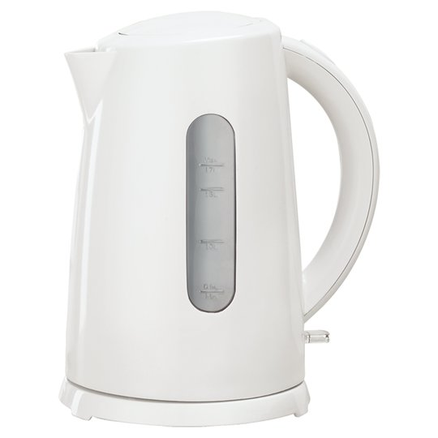

Electric kettles have become indispensable kitchen appliances, offering convenience and energy efficiency. However, recent studies have raised concerns about potential health risks associated with their use. This comprehensive guide examines these risks and provides solutions to ensure safe usage of electric kettles.

## Potential Health Risks of Electric Kettles

### 1. Plastic Components and BPA Exposure

Plastic electric kettles pose a significant risk due to the potential leaching of harmful compounds, particularly Bisphenol A (BPA). BPA is a chemical used in the production of certain plastics and resins, and its presence in food containers and water bottles has been a subject of concern for health experts worldwide.

#### BPA Risks:
- Acts as a synthetic hormone, mimicking estrogen in the body
- Impacts reproductive, neurological, and respiratory systems
- Potentially linked to:
  - Infertility and sexual disorders
  - Certain types of cancer, including breast and prostate cancer
  - Alzheimer's disease and other neurological disorders
  - Cardiovascular issues
  - Developmental problems in children

The main concern with BPA in electric kettles is that heat can accelerate the leaching process, potentially releasing more of the chemical into the water. This is particularly worrisome because boiling water is often used for preparing infant formula, teas, and other consumables where the water is ingested directly.

A study published in the journal "Toxicology Reports" found that some plastic kettles can release up to 3 million microplastics per liter of water boiled. While the full health implications of ingesting microplastics are still being researched, it's a concern that many consumers are becoming increasingly aware of.

#### Mitigating BPA Risks:
1. Opt for BPA-free electric kettles: Look for kettles explicitly labeled as BPA-free. However, be aware that BPA alternatives like BPS and BPF may also have similar health effects.
2. Choose kettles with minimal plastic contact with water: Some models have plastic components only in the outer casing, minimizing direct contact with the water.
3. Consider [stainless steel or glass alternatives](https://www.electrickettlesguide.com/stainless-steel-vs-glass-vs-plastic-kettle/): These materials do not leach chemicals like BPA and are generally considered safer options.
4. If using a plastic kettle, avoid leaving water sitting in it for long periods, especially when hot.

[Learn more about choosing the best electric kettle for your needs](https://www.electrickettlesguide.com/what-to-check-when-buying-an-electric-kettle/)

### 2. Nickel Contamination

Nickel, often used in heating elements and other components of electric kettles, can leach into water during boiling. This poses a particular risk for individuals with nickel allergies or sensitivities, but even for those without allergies, excessive nickel exposure can be harmful.

#### Nickel Exposure Risks:
- Particularly dangerous for those with nickel allergies, potentially causing skin reactions and other allergic responses
- A study published in the journal "Contact Dermatitis" found that 40% of kettles released nickel above the 50 microgram/L threshold, which is considered the safe limit by many health authorities
- Long-term exposure to high levels of nickel has been associated with increased risk of lung cancer, nasal cancer, and respiratory issues

The amount of nickel released can vary significantly between different kettle models and brands. Factors such as the quality of the materials used, the construction of the kettle, and even the pH and mineral content of the water can affect nickel leaching.

#### Reducing Nickel Exposure:
1. Choose kettles with concealed heating elements: This design reduces direct contact between the heating element and the water, potentially decreasing nickel leaching.
2. Check nickel emission ratings before purchasing: Some manufacturers provide this information, especially for higher-end models.
3. Opt for kettles with lower than 50 micrograms/L nickel emission: This is considered a safer level, though individual sensitivities may vary.
4. Consider using a water filter: Some water filters can remove or reduce nickel content in water.
5. Run the kettle through a few boiling cycles before first use, discarding the water each time. This can help remove some of the initial nickel that might be present on the surface of new elements.

[Discover the best variable temperature kettles for precise brewing](https://www.electrickettlesguide.com/best-variable-temperature-kettles/)

### 3. Other Metal Contaminants

Various metals used in kettle construction can pose health risks if they leach into the water in significant quantities. The potential for metal leaching can increase with frequent use, age of the kettle, and the acidity of the water being boiled.

| Metal      | Health Risks                                   | Additional Information |
|------------|------------------------------------------------|------------------------|
| Lead       | Anemia, neurological damage, kidney problems   | Particularly harmful to children and pregnant women |
| Copper     | Brain function impairment, liver damage        | Can cause nausea and vomiting in high doses |
| Aluminum   | Affects brain's blood purifying barrier        | Linked to Alzheimer's disease in some studies |
| Iron       | Excessive iron particle ingestion              | Can cause iron overload in sensitive individuals |

Lead is of particular concern due to its severe health impacts, especially on children's development. While lead is less commonly used in modern kettles, older models or those produced with less stringent safety standards may still pose a risk.

Copper, while an essential nutrient in small amounts, can be harmful in excess. Copper kettles or those with copper components may release more of this metal into water, especially if the water is acidic.

Aluminum has been a subject of debate in relation to Alzheimer's disease. While the link is not definitively proven, many health-conscious consumers prefer to minimize aluminum exposure as a precaution.

Iron leaching is generally less of a concern for health, as iron is an essential nutrient. However, excessive iron intake can be problematic for individuals with certain health conditions or genetic predispositions to iron overload.

To minimize risks from metal contaminants:
1. Choose high-quality kettles from reputable manufacturers
2. Regularly inspect your kettle for signs of wear, corrosion, or damage
3. Consider using filtered water to reduce the potential for reactions between water minerals and kettle materials
4. If you have concerns about specific metal exposures, consider having your water tested after boiling in your kettle

[Learn about the safety ratings of modern electric kettles](https://www.electrickettlesguide.com/kettle-safety-ratings/)

## Choosing a Safe Electric Kettle

To minimize health risks, consider the following factors when selecting an electric kettle:

1. **Material**: Opt for high-quality stainless steel or glass
   - Stainless steel is durable and doesn't leach chemicals
   - Glass is inert and allows you to see the water boiling

2. **Heating Element**: Choose models with concealed elements
   - Reduces direct contact between the element and water
   - Often easier to clean and maintain

3. **BPA-Free**: Ensure all plastic components are BPA-free
   - Look for explicit BPA-free labeling
   - Be aware that BPA alternatives may also have health concerns

4. **Certifications**: Look for safety certifications from recognized bodies
   - UL (Underwriters Laboratories) in the US
   - CE marking in Europe
   - RoHS compliance for reduced hazardous substances

5. **Brand Reputation**: Choose reputable brands known for quality and safety
   - Research customer reviews and independent testing results
   - Consider brands with a history of addressing safety concerns promptly

### Additional Factors to Consider:
- Power rating for energy efficiency: Higher wattage generally means faster boiling times
- Capacity suitable for your needs: Avoid overfilling by choosing an appropriate size
- Proper insulation for safety: Reduces risk of burns and improves energy efficiency
- Automatic shut-off feature: Prevents boil-dry situations and conserves energy
- Easy-to-read water level indicator: Helps prevent overfilling
- Cordless design with a separate base: Improves safety and convenience

When shopping for an electric kettle, it's worth investing in a higher-quality model from a reputable brand. While these may be more expensive initially, they often offer better safety features, more durable construction, and may be more energy-efficient in the long run.

[Explore our guide to the best smart kettles for tech-savvy users](https://www.electrickettlesguide.com/best-smart-kettles/)

## The Benefits of Using Electric Kettles

Despite potential risks, electric kettles offer several advantages that make them a popular choice for many households:

1. Energy Efficiency: Electric kettles are generally more efficient than stovetop kettles or microwaves for boiling water. They heat only the amount of water needed and have insulated walls to retain heat.

2. Speed: Most electric kettles can boil water faster than traditional methods. This is particularly useful for busy households or offices where time is at a premium.

3. Convenience: Easy to use with one-touch operation, electric kettles are ideal for people of all ages, including seniors or those with limited mobility. Many models also have cool-touch exteriors for added safety.

4. Safety Features: Modern electric kettles come with various safety features such as:
   - Automatic shut-off when water reaches boiling point
   - Boil-dry protection that turns off the kettle if there's insufficient water
   - Stay-cool handles and bases to prevent burns

5. Precision Temperature Control: Some advanced models offer variable temperature settings, which is ideal for different types of tea or coffee that require specific water temperatures for optimal flavor extraction.

6. Portability: Many electric kettles are cordless when removed from their base, making them easy to carry and pour from.

7. Versatility: While primarily used for boiling water, some electric kettles can be used for other purposes like [cooking with just a kettle](https://www.electrickettlesguide.com/how-to-cook-with-just-a-kettle/) in certain situations.

For more on the benefits, check our article on [how electric kettles made our life easier](https://www.electrickettlesguide.com/how-electric-kettles-made-our-life-easier/).

## Proper Maintenance and Care for Electric Kettles

To ensure the longevity and safety of your electric kettle, proper maintenance is crucial. Here are some tips for keeping your kettle in top condition:

1. Regular Cleaning:
   - Rinse the kettle after each use to prevent mineral buildup
   - Descale your kettle regularly, especially if you live in a hard water area
   - For detailed instructions, refer to our guide on [how to clean an electric kettle](https://www.electrickettlesguide.com/how-to-clean-an-electric-kettle/)

2. Proper Storage:
   - Empty the kettle completely after use
   - Store in a dry place to prevent moisture accumulation
   - Avoid storing with the lid closed to allow air circulation

3. Correct Usage:
   - Only use the kettle for boiling water, unless it's specifically designed for other purposes
   - Avoid overfilling beyond the maximum fill line
   - Don't turn on the kettle when it's empty

4. Regular Inspection:
   - Check the cord and plug regularly for any signs of wear or damage
   - Inspect the interior for any signs of rust or unusual residue
   - If you notice any issues, discontinue use and consider replacing the kettle

5. Descaling Methods:
   - Use a mixture of equal parts water and white vinegar
   - Alternatively, use commercial descaling products designed for kettles
   - Rinse thoroughly after descaling to remove any residual solution

By following these maintenance tips, you can extend the life of your kettle and ensure it continues to operate safely and efficiently.

## FAQs About Electric Kettle Safety

1. **Q: Are glass electric kettles safer than plastic ones?**
   A: Generally, yes. Glass doesn't leach chemicals like some plastics can. However, ensure the glass is high-quality and heat-resistant.

2. **Q: How often should I replace my electric kettle?**
   A: Every 2-3 years, or sooner if you notice any damage or changes in performance. Regular use can lead to wear and tear that may affect safety and efficiency.

3. **Q: Can I use my electric kettle for purposes other than boiling water?**
   A: It's best to use electric kettles only for boiling water unless specifically designed for other purposes. For alternative uses, check our guide on [cooking with just a kettle](https://www.electrickettlesguide.com/how-to-cook-with-just-a-kettle/).

4. **Q: Are there any eco-friendly electric kettle options?**
   A: Yes, look for kettles made from recycled materials or those with energy-saving features. Learn more about [energy-efficient electric kettles](https://www.electrickettlesguide.com/are-electric-kettles-energy-efficient/).

5. **Q: How can I test if my kettle is leaching harmful substances?**
   A: While home testing is challenging, you can send water samples to a laboratory for analysis. Alternatively, consider using a high-quality water testing kit designed to detect various contaminants.

6. **Q: Is it safe to leave water in the kettle between uses?**
   A: It's best to empty the kettle after each use. Leaving water can lead to mineral buildup and potentially increase the risk of bacterial growth or contamination.

7. **Q: Can electric kettles explode?**
   A: While rare, it is possible if safety features fail or the kettle is misused. To learn more about kettle safety, read our article on [can electric kettles explode](https://www.electrickettlesguide.com/can-electric-kettles-explode/).

## Conclusion

While electric kettles can pose some health risks, these can be mitigated by choosing the right product and using it correctly. By opting for high-quality, BPA-free kettles with concealed heating elements and proper certifications, you can enjoy the convenience of an electric kettle without compromising your health.

Remember to regularly inspect your kettle for any signs of wear or damage, and replace it when necessary. Proper maintenance, including regular cleaning and descaling, can help ensure your kettle remains safe to use over time.

The benefits of electric kettles, including energy efficiency, convenience, and safety features, make them a valuable addition to many kitchens. By staying informed about potential risks and taking appropriate precautions, you can safely enjoy the convenience of quick, hot water at the touch of a button.

With the right precautions, an electric kettle can be a safe and efficient addition to your kitchen. Stay informed, choose wisely, and enjoy your hot beverages with peace of mind.

For more information on choosing and using electric kettles safely, explore our other articles:
- [Best Smart Kettles](https://www.electrickettlesguide.com/best-smart-kettles/)
- [How to Clean an Electric Kettle](https://www.electrickettlesguide.com/how-to-clean-an-electric-kettle/)
- [Best Electric Kettle for Seniors](https://www.electrickettlesguide.com/how-to-choose-the-best-electric-kettle-for-seniors/)

Stay informed and make the best choice for your health and convenience!
