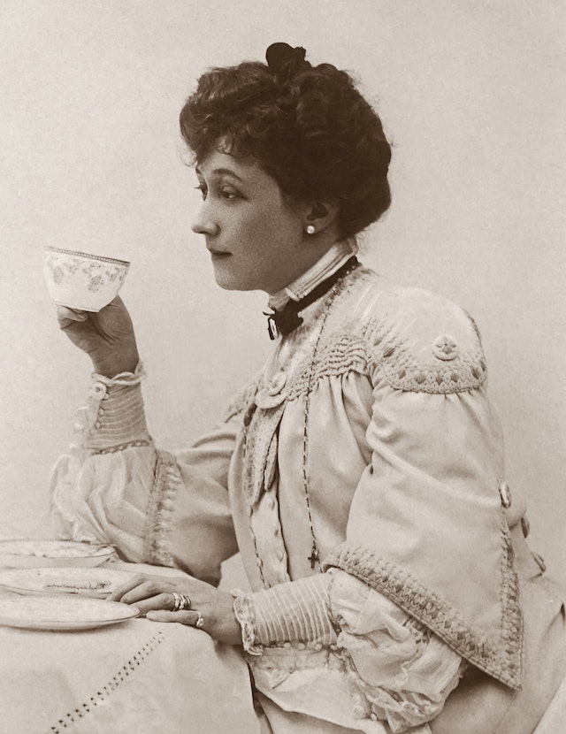
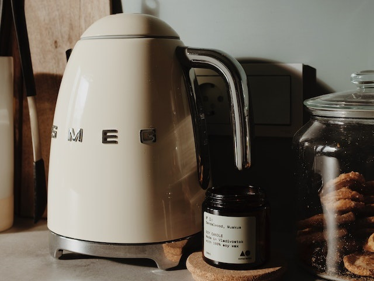
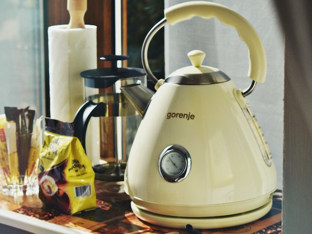

Vintage electric kettles have a unique appeal that combines nostalgia with functionality. This guide explores the charm of retro-style kettles and highlights some of the best models available.

## Why the Vintage/Retro Trend?

People are drawn to vintage items for several reasons:
1. Quality craftsmanship
2. Unique aesthetics
3. Nostalgia factor
4. Representation of a specific era or style

## Benefits of Retro-Looking Electric Kettles

1. Distinctive visual appeal
2. Often well-made and durable
3. Modern safety features (auto shut-off, boil-dry protection)
4. Energy efficiency compared to stovetop models

## Key Features to Look for in Vintage-Style Kettles

1. Automatic shut-off for safety
2. Detachable base for easy cleaning
3. Bold, retro-inspired design
4. Adequate capacity (typically 1.5-1.7L)
5. Stainless steel or high-quality materials

## Top Vintage Electric Kettle Reviews

### 1. KitchenAid KEK1222PT 1.25-Liter Electric Kettle

**Pros:**
- Stainless steel design with aluminum handle
- 1.25L capacity
- Limescale filter
- Available in retro colors

**Cons:**
- Base may get hot

[Check price on Amazon](#)

### 2. BELLA Electric Ceramic Tea Kettle

**Pros:**
- Unique ceramic design
- BPA-free silicone lid
- Long gooseneck spout
- Concealed heating element

**Cons:**
- No temperature control

[Check price on Amazon](#)

### 3. Smeg Retro Style Electric Kettle

**Pros:**
- Iconic retro design
- 1.7L capacity
- Stainless steel construction
- Fast boiling (1500W)

**Cons:**
- Premium price point
- Spout not precision-engineered

[Check price on Amazon](#)

## Comparison Table: Top Vintage Electric Kettles

| Feature | KitchenAid KEK1222PT | BELLA Ceramic | Smeg Retro |
|---------|----------------------|---------------|------------|
| Capacity | 1.25L | 1.2L | 1.7L |
| Material | Stainless Steel | Ceramic | Stainless Steel |
| Power | 1500W | 1200W | 1500W |
| Special Feature | Limescale filter | Gooseneck spout | Iconic design |
| Price Range | $$ | $$ | $$$ |

## FAQs About Vintage Electric Kettles

1. **Q: Are vintage-style kettles as efficient as modern ones?**
   A: Yes, many combine retro aesthetics with modern technology. Check our guide on [are electric kettles energy efficient](https://www.electrickettlesguide.com/are-electric-kettles-energy-efficient/) for more info.

2. **Q: Can I find vintage kettles with variable temperature control?**
   A: While less common, some retro-style kettles do offer this feature. See our [best variable temperature kettles](https://www.electrickettlesguide.com/best-variable-temperature-kettles/) guide for options.

3. **Q: How do I maintain a vintage-style electric kettle?**
   A: Regular cleaning is key. For tips, read our article on [how to clean an electric kettle](https://www.electrickettlesguide.com/how-to-clean-an-electric-kettle/).

4. **Q: Are ceramic vintage kettles safe to use?**
   A: Yes, when purchased from reputable brands. They often have modern safety features like auto shut-off.

## Conclusion

Vintage electric kettles offer a perfect blend of nostalgic charm and modern functionality. When choosing a retro-style kettle, consider:
- Design aesthetics that match your kitchen decor
- Capacity suitable for your needs
- Safety features like auto shut-off and boil-dry protection
- Material quality and durability

Whether you're a fan of mid-century design or simply want to add a unique touch to your kitchen, a vintage-style electric kettle can be both a functional appliance and a stylish accent piece.

For more insights on electric kettles and their uses, explore our other articles:
- [What to Check When Buying an Electric Kettle](https://www.electrickettlesguide.com/what-to-check-when-buying-an-electric-kettle/)
- [Best Electric Kettle with Tea Infuser](https://www.electrickettlesguide.com/best-electric-kettle-with-tea-infuser/)
- [How Electric Kettles Made Our Life Easier](https://www.electrickettlesguide.com/how-electric-kettles-made-our-life-easier/)

Embrace the charm of the past with the convenience of the present by choosing a vintage-style electric kettle for your home!
