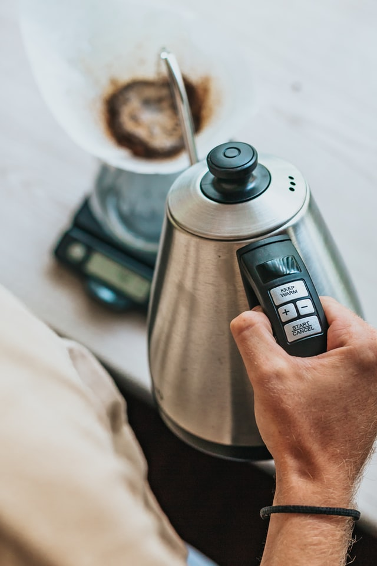

In an era where home safety is paramount, concerns about household appliances are common. This comprehensive guide addresses the question: Can electric kettles explode? We'll explore safety measures, risk factors, and tips for safe usage to ensure you can enjoy your hot beverages with peace of mind.

## Home Safety Checklist

Before diving into kettle safety, let's review general home safety tips. Maintaining a safe home environment is crucial, and understanding potential hazards in different areas of your house can help prevent accidents:

### Kitchen Safety
- Keep hot objects out of reach, especially from children and pets
- Store sharp items safely in designated drawers or knife blocks
- Unplug appliances when not in use to prevent electrical hazards
- Secure household chemicals in locked cabinets away from food items

### Living Room Safety
- Install smoke detectors and test them regularly (at least once a month)
- Keep a fire extinguisher handy and know how to use it
- Avoid overloading power strips to prevent electrical fires
- Secure heavy furniture to walls to prevent tipping

### Bathroom Safety
- Unplug electrical devices near water sources
- Use non-slip mats in showers and bathtubs to prevent falls
- Secure medicines and cosmetics in locked cabinets
- Install grab bars near toilets and in showers for added stability

### Bedroom Safety
- Remove choking hazards, especially in children's rooms
- Childproof electrical outlets with safety covers
- Install safety gates at the top and bottom of stairs if you have young children
- Ensure window treatments don't have long cords that could pose a strangulation risk

### Garden Safety
- Maintain regular cleaning of outdoor areas to prevent pest infestations
- Practice barbecue safety by keeping grills away from structures and never leaving them unattended
- Secure pool areas with proper fencing and locks
- Store garden tools and chemicals in locked sheds or cabinets

By following these general safety guidelines, you create a safer environment for your family and reduce the risk of accidents in your home.

## Can Electric Kettles Explode?

The short answer is yes, electric kettles can potentially explode, but it's extremely rare when proper precautions are taken. Electric kettles are generally safe when used correctly and maintained properly. However, understanding the potential risks and taking preventive measures is crucial for ensuring your safety.

### Factors That Could Lead to Kettle Explosions

1. Manufacturing defects: Poor quality control during production can result in faulty components or improper assembly.
2. Improper use: Using the kettle for purposes other than boiling water or overfilling can lead to dangerous situations.
3. Lack of maintenance: Buildup of mineral deposits can affect the kettle's performance and safety features.
4. Electrical faults: Issues with wiring or the power supply can cause overheating or short circuits.

It's important to note that modern electric kettles are designed with multiple safety features to prevent explosions. A 2013 survey by the French Directorate General for Competition, Consumer Affairs and Fraud Prevention found that out of 404 kettles tested, only 3 were deemed dangerous due to poor insulation. This statistic highlights the rarity of kettle explosions when safety standards are met.

However, even with these safety measures in place, it's crucial to use and maintain your kettle properly to minimize any potential risks. Regular inspection of your kettle for signs of wear or damage, and prompt replacement of any faulty units, can go a long way in ensuring your safety.

[Discover the best smart kettles with advanced safety features](https://www.electrickettlesguide.com/best-smart-kettles/)

## Understanding Electric Kettle Components

To better appreciate the safety features of electric kettles and understand potential failure points, let's examine the key components of a typical electric kettle:

1. **Heating Element**: This is the core component responsible for heating the water. It's usually made of a metal coil or plate that heats up when electricity passes through it.

2. **Thermostat**: This device monitors the water temperature and signals the kettle to shut off when the desired temperature is reached, typically boiling point.

3. **Automatic Shut-off Mechanism**: Connected to the thermostat, this safety feature cuts power to the kettle once the water reaches boiling point.

4. **Lid**: A well-designed lid prevents water from spilling during boiling and helps maintain temperature.

5. **Body**: Usually made of plastic, metal, or glass, the body houses the heating element and holds the water.

6. **Handle**: Designed to stay cool even when the kettle is hot, providing safe handling.

7. **Power Base**: This separate unit connects to the power outlet and allows the kettle to be cordless when lifted.

8. **Boil-dry Protection**: A safety feature that turns off the kettle if it's switched on without water.

9. **Water Level Indicator**: Helps users avoid overfilling the kettle, which can be a safety hazard.

Understanding these components can help you identify potential issues and ensure proper maintenance of your kettle. For example, limescale buildup on the heating element can affect its efficiency and potentially lead to overheating. Regular descaling can prevent this issue.

[Learn more about the different types of electric kettles and their features](https://www.electrickettlesguide.com/what-to-check-when-buying-an-electric-kettle/)

## Prevention Measures

To ensure safe kettle usage and minimize the risk of accidents, follow these preventive measures:

1. **Read the Manual**: Always follow manufacturer instructions. Each kettle model may have specific guidelines for use and maintenance.

2. **Proper Placement**: Use the kettle on flat, stable surfaces away from edges. This prevents accidental tipping or falling.

3. **Direct Connection**: Plug the kettle directly into wall sockets rather than using extension cords or power strips. This ensures a stable power supply and reduces the risk of electrical issues.

4. **Safety Features**: Choose kettles with automatic shut-off and secure lids. These features prevent overheating and spillage.

5. **Avoid Misuse**: Only use the kettle for boiling water, not other liquids. Other substances may react differently to heating and could damage the kettle or create safety hazards.

6. **Regular Maintenance**: Clean and descale your kettle regularly. Mineral buildup can affect performance and safety.

7. **Inspect Regularly**: Check the kettle, cord, and plug for any signs of wear or damage. Replace the kettle if you notice any issues.

8. **Avoid Overfilling**: Never fill the kettle above the maximum fill line. Overfilling can lead to boiling water spilling out, creating a burn hazard.

9. **Supervise Use**: Never leave a kettle unattended while it's boiling. Stay in the kitchen and monitor the appliance.

10. **Cool Down Period**: Allow the kettle to cool down between uses, especially if you're boiling multiple times in quick succession.

11. **Proper Storage**: Store the kettle in a dry place when not in use, and ensure the cord is neatly wound and not twisted or kinked.

12. **Child Safety**: Keep kettles out of reach of children and teach older children about safe usage.

By following these prevention measures, you can significantly reduce the risk of accidents and ensure the longevity of your electric kettle.

For cleaning tips, see our guide on [how to clean an electric kettle](https://www.electrickettlesguide.com/how-to-clean-an-electric-kettle/).

## Kettle Safety Comparison

When choosing an electric kettle, consider models with these safety features:

| Feature | Safety Impact | Description |
|---------|---------------|-------------|
| Automatic Shut-off | High | Turns off the kettle when water reaches boiling point |
| Insulated Body | Medium | Prevents burns from touching the exterior of the kettle |
| Secure Lid | High | Prevents spillage and steam burns |
| Concealed Heating Element | Medium | Reduces the risk of electrical faults and makes cleaning easier |
| Boil-dry Protection | High | Shuts off the kettle if there's insufficient water, preventing damage and fire risk |
| Cool-touch Handle | Medium | Ensures safe handling even when the kettle is hot |
| 360-degree Rotational Base | Low | Allows for easy placement and reduced cord tangling |
| Cordless Design | Medium | Enhances safety when pouring and reduces trip hazards |

When shopping for a new kettle, prioritize models that incorporate these safety features. While they may come at a higher price point, the added safety is well worth the investment.

[Explore our guide on choosing the best electric kettle for your needs](https://www.electrickettlesguide.com/what-to-check-when-buying-an-electric-kettle/)

## FAQs About Electric Kettle Safety

1. **Q: Are expensive kettles safer?**
   A: Not necessarily. While higher-priced kettles may offer more features, safety depends more on the specific safety mechanisms and build quality rather than price alone. Look for kettles with key safety features regardless of price point.

2. **Q: How often should I replace my kettle?**
   A: On average, every 2-3 years, or sooner if you notice any issues such as slow heating, strange noises, or visible damage to the kettle or cord. Regular use can wear out components over time, so it's important to monitor your kettle's performance.

3. **Q: Can I use my kettle for anything other than water?**
   A: It's not recommended. Kettles are designed specifically for boiling water. Using other liquids can damage the kettle, void your warranty, and potentially create safety hazards. Stick to water for safety and longevity of your appliance.

4. **Q: What should I do if my kettle starts malfunctioning?**
   A: Unplug it immediately and discontinue use. Inspect the kettle for visible damage. If it's still under warranty, contact the manufacturer. For older kettles, consider professional repair or, more likely, replacement with a new unit.

5. **Q: Can limescale buildup cause a kettle to explode?**
   A: While limescale buildup itself won't cause an explosion, it can lead to overheating if it covers the heating element, which could potentially damage the kettle or create a safety hazard. Regular descaling is important to prevent this issue.

6. **Q: Are glass kettles safer than plastic ones?**
   A: Both can be safe if they meet safety standards. Glass kettles allow you to see the water boiling, which some users prefer, but they can be more fragile. High-quality plastic kettles are durable and often have good insulation properties. The safety depends more on the kettle's features and build quality than the material alone.

7. **Q: How can I tell if my kettle is overheating?**
   A: Signs of overheating include the kettle taking longer than usual to boil, making unusual noises, or the exterior becoming excessively hot. If you notice any of these signs, stop using the kettle and have it checked or replaced.

[Learn about the energy efficiency of electric kettles](https://www.electrickettlesguide.com/are-electric-kettles-energy-efficient/)

## Conclusion

While electric kettles can theoretically explode, the risk is minimal with proper use and maintenance. Modern electric kettles are designed with multiple safety features to prevent accidents, and incidents of kettle explosions are extremely rare when safety guidelines are followed.

By following safety guidelines, choosing quality products with robust safety features, and performing regular maintenance, you can enjoy the convenience of electric kettles without worry.

Remember, the key to kettle safety lies in:
- Proper selection (look for safety features like automatic shut-off and boil-dry protection)
- Correct usage (follow manufacturer instructions and avoid misuse)
- Regular maintenance (clean and descale to prevent mineral buildup)
- Prompt replacement of faulty units (don't ignore signs of wear or malfunction)

Electric kettles have become an indispensable part of many kitchens due to their convenience and efficiency. With the right precautions and care, they can continue to serve as a safe and reliable appliance in your home.

For more insights on electric kettles and their safe use, explore our other articles:
- [What to Check When Buying an Electric Kettle](https://www.electrickettlesguide.com/what-to-check-when-buying-an-electric-kettle/)
- [Are Electric Kettles Energy Efficient?](https://www.electrickettlesguide.com/are-electric-kettles-energy-efficient/)
- [How to Descale an Electric Kettle Naturally](https://www.electrickettlesguide.com/how-descale-an-electric-kettle/)

Stay informed, stay safe, and enjoy the convenience of your electric kettle with peace of mind!
