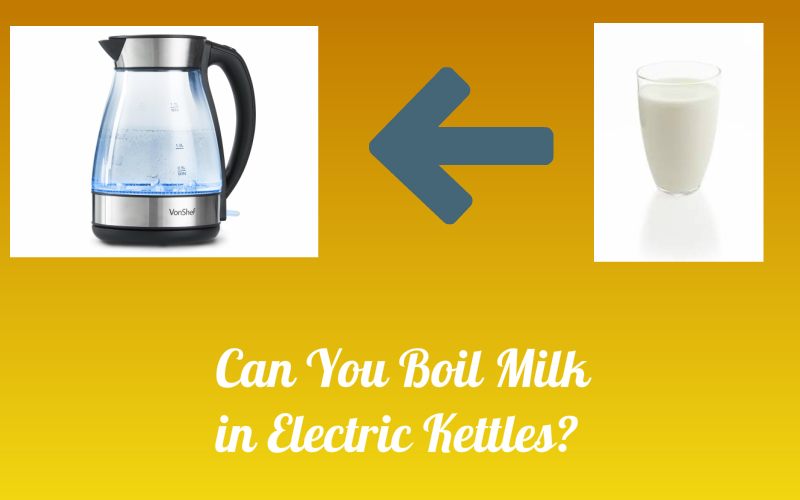

Electric kettles remain indispensable in modern 2025 households, offering rapid and efficient heating for various purposes. However, as people explore the versatility of these smart appliances, a common question persists: Can you boil milk in electric kettles? This comprehensive 2025 guide delves into the risks, potential methods, and modern alternatives for heating milk, providing you with expert insights for safe appliance usage.

## Are 2025 Electric Kettles Designed for Boiling Milk?

<Notice type="warning" title="Important Disclaimer">
Standard electric kettles in 2025, even smart models, are still primarily engineered for water only. Using them for milk risks damage and voids warranties.
</Notice>

The straightforward answer remains no. Despite technological advances, standard electric kettles are specifically designed for heating water, not milk. Here's why this fundamental design principle persists in 2025:

<Accordion label="Milk Spillover Risk" group="milk-risks" expanded="true">
Milk creates a protein film that traps steam, leading to sudden overflow. Unlike water's predictable evaporation, milk can violently boil over in seconds, creating safety hazards and electrical risks. Even smart sensors struggle to predict milk's unpredictable behavior.
</Accordion>

<Accordion label="Safety System Incompatibility" group="milk-risks" expanded="false">
Modern kettles use steam-based auto-shutoff mechanisms. Milk's protein film prevents normal steam release, confusing safety sensors and potentially disabling critical safety features. This can lead to overheating or burning.
</Accordion>

<Accordion label="Residue and Maintenance Issues" group="milk-risks" expanded="false">
Milk proteins, fats, and sugars create stubborn residues on heating elements and internal surfaces. These deposits are difficult to remove, reduce heating efficiency, promote bacterial growth, and permanently damage sensitive components like temperature sensors.
</Accordion>

<Accordion label="Odor Contamination" group="milk-risks" expanded="false">
Burnt milk smell is notoriously persistent. Once milk proteins burn onto heating elements, the odor can be impossible to eliminate completely, affecting all future beverages. This contamination can permanently ruin a kettle for its intended water-boiling purpose.
</Accordion>

<Accordion label="Warranty Voidance" group="milk-risks" expanded="false">
Using standard 2025 electric kettles for milk explicitly voids manufacturer warranties. Smart kettles with usage tracking can detect non-water substances, automatically invalidating warranty claims for damage.
</Accordion>

Understanding these factors is crucial for safe appliance usage. However, 2025 has seen the emergence of specialized multi-function kettles designed specifically for both water and milk heating with appropriate technology.

For more on modern kettle functionality, see our article on [how electric kettles made our life easier](https://www.electrickettlesguide.com/how-electric-kettles-made-our-life-easier/).

## The Science Behind Milk Boiling

To fully understand why boiling milk in an electric kettle is problematic, it's helpful to explore the science behind milk's behavior when heated:

1. **Composition**: Milk is a complex emulsion of water, fats, proteins, and sugars, unlike water which is a simple compound. This composition affects how milk reacts to heat.

2. **Protein Behavior**: As milk heats, its proteins (primarily casein and whey) begin to denature. This denaturation causes the proteins to unfold and bond with each other, creating a film on the surface of the milk.

3. **Fat Content**: The fat in milk also plays a role. As the milk heats, fat globules rise to the surface, contributing to the film formation.

4. **Maillard Reaction**: When milk is heated, the proteins and sugars in it undergo the Maillard reaction, which can produce a caramelized flavor and brown color. This reaction doesn't occur with water.

5. **Boiling Point**: While water has a consistent boiling point (100°C or 212°F at sea level), milk's boiling point can vary slightly due to its composition and can be affected by factors like fat content.

6. **Steam Production**: Water produces a steady stream of steam as it approaches its boiling point. Milk, however, doesn't produce steam in the same way due to the film on its surface, which can trap heat and lead to sudden boiling over.

Understanding these scientific principles helps explain why milk behaves so differently from water when heated and why electric kettles, designed with water in mind, are not suitable for boiling milk.

[Learn about the different types of electric kettles and their specific uses](https://www.electrickettlesguide.com/stainless-steel-kettle/)

## 2025 Risks of Boiling Milk in Standard Electric Kettles

<Notice type="error" title="Critical Warning">
Attempting to boil milk in standard 2025 electric kettles can damage your appliance, void your warranty, and create serious safety hazards.
</Notice>

Attempting to boil milk in a standard electric kettle leads to multiple serious risks:

| Risk Category | 2025 Specific Consequences |
|---------------|---------------------------|
| **Spillover Hazard** | Electrical short circuits, smart base damage, potential fire risk, voided insurance claims |
| **Burnt Milk Residue** | Permanent element damage, impossible cleaning, persistent odor, sensor malfunction |
| **Component Failure** | Heating element burnout, thermostat damage, smart sensor failure, reduced lifespan |
| **Safety System Failure** | Disabled auto-shutoff, boil-dry protection failure, overheating risk, fire hazard |
| **Hygiene Contamination** | Bacterial growth, mold formation, health risks, impossible sanitization |
| **Smart Feature Loss** | App connectivity issues, sensor errors, firmware corruption, device bricking |
| **Warranty Issues** | Instant warranty voidance, manufacturer liability release, no repair coverage |
| **Cross-Contamination** | Permanent taste/odor transfer, ruined water quality, allergen residue risk |

Let's explore these risks in more detail:

1. **Spillover**: This is perhaps the most immediate risk. As milk heats, it can quickly rise and spill out of the kettle. This not only creates a mess but can also lead to electrical hazards if the milk comes into contact with the kettle's base or electrical components.

2. **Burnt Milk**: Milk can easily burn on the bottom of the kettle, especially if it's left unattended. Burnt milk is notoriously difficult to clean and can leave a lasting, unpleasant odor that affects the taste of anything else heated in the kettle.

3. **Kettle Damage**: The proteins and fats in milk can coat the heating element and other internal components of the kettle. Over time, this can reduce the kettle's efficiency and potentially lead to malfunction or complete failure of the appliance.

4. **Safety Hazard**: If milk seeps into the electrical components of the kettle, it can cause a short circuit. In extreme cases, this could potentially lead to a fire, especially if the kettle is left unattended.

5. **Hygiene Issues**: Milk residue left in the kettle can become a breeding ground for bacteria, especially if the kettle isn't cleaned thoroughly immediately after use. This can pose health risks for future use of the kettle.

6. **Taste Alteration**: Even after cleaning, traces of milk can remain in the kettle, potentially affecting the taste of water or other beverages heated in it afterward. This can be particularly noticeable in delicate teas or coffees.

Given these risks, it's clear that the potential consequences of boiling milk in a standard electric kettle far outweigh any perceived convenience. It's always best to use appliances for their intended purpose to ensure safety, longevity, and optimal performance.

[Discover the best smart kettles with advanced safety features](https://www.electrickettlesguide.com/best-smart-kettles/)

## Methods for Heating Milk (If You Must)

While it's strongly advised against using a standard electric kettle for boiling milk, if you find yourself in a situation where you absolutely must heat milk in an electric kettle, here are some methods that might minimize risks. However, please note that these methods still carry risks and should only be used as a last resort:

1. **Open Lid Method**:
   - Remove the kettle lid completely.
   - Fill the kettle only about one-third full with milk to allow for expansion.
   - Monitor the milk closely throughout the heating process.
   - Turn off the kettle immediately when the milk starts to rise or show signs of boiling.
   - Never leave the kettle unattended during this process.

2. **Indirect Heating**:
   - Place a small amount of water in the kettle, about 1-2 inches deep.
   - Put milk in a heat-safe container that can fit inside the kettle without touching the water.
   - Place the container of milk in the kettle.
   - Heat the water to warm the milk indirectly.
   - Use oven mitts to carefully remove the container of milk once it's warm.

3. **Gradual Heating Method**:
   - Fill the kettle with milk only up to one-third of its capacity.
   - Turn on the kettle for short intervals (20-30 seconds) at a time.
   - After each interval, open the lid and stir the milk to distribute heat evenly.
   - Repeat this process until the milk reaches the desired temperature.

4. **Cold Start Method**:
   - Start with cold milk directly from the refrigerator.
   - Fill the kettle only about one-quarter full.
   - Turn on the kettle and stay nearby to monitor it closely.
   - Turn off the kettle as soon as you see small bubbles forming around the edges.

Remember, these methods are not foolproof and still carry risks. They should only be attempted if you have no other options for heating milk. Always prioritize safety and be prepared to clean the kettle thoroughly immediately after use.

It's important to note that using these methods may void your kettle's warranty and can still potentially damage the appliance. The safest approach is always to use appliances designed specifically for heating milk.

[Learn about the energy efficiency of electric kettles](https://www.electrickettlesguide.com/are-electric-kettles-energy-efficient/)

## 2025 Modern Alternatives for Heating Milk

<Notice type="success" title="Better Solutions Available">
In 2025, numerous specialized appliances safely heat milk with precision temperature control and smart features, eliminating the need to risk your standard kettle.
</Notice>

Instead of risking damage to your standard electric kettle, consider these modern 2025 alternatives:

<Accordion label="Smart Milk Frothers" group="alternatives" expanded="true">
**2025 Features**: App-controlled temperature presets, automatic frothing levels, self-cleaning cycles, multiple texture settings (silky, thick, airy), allergen-safe materials.

**Best For**: Daily coffee/tea drinkers, latte enthusiasts, barista-quality beverages at home.

**Price Range**: $50-$200 for smart models.
</Accordion>

<Accordion label="Multi-Function Smart Kettles" group="alternatives" expanded="false">
**2025 Features**: Specialized milk mode with anti-overflow sensors, dual heating elements, easy-clean coatings, temperature holds, app presets for different milk types (dairy, oat, almond, soy).

**Best For**: Those wanting one appliance for both water and milk with proper safeguards.

**Price Range**: $120-$300 for quality models.
</Accordion>

<Accordion label="Precision Milk Warmers" group="alternatives" expanded="false">
**2025 Features**: Exact temperature control (±0.5°C), batch warming, timer functions, smart notifications, bottle sterilization modes, voice assistant integration.

**Best For**: Parents, precise temperature requirements, baby formula preparation.

**Price Range**: $40-$150.
</Accordion>

<Accordion label="Induction Milk Heaters" group="alternatives" expanded="false">
**2025 Features**: Rapid heating, precise temperature zones, auto-stirring, spill sensors, energy efficiency, easy cleaning, portable designs.

**Best For**: Fast heating, energy-conscious users, renters with limited outlets.

**Price Range**: $80-$180.
</Accordion>

<Accordion label="Smart Stovetop Solutions" group="alternatives" expanded="false">
**2025 Features**: Temperature-sensing milk pans with app alerts, magnetic stirrers, boil-over prevention rims, smart timers, induction compatibility.

**Best For**: Traditional cooking preference with modern safety features.

**Price Range**: $30-$100.
</Accordion>

<Accordion label="Advanced Microwave Methods" group="alternatives" expanded="false">
**2025 Features**: Smart microwave-safe containers with temperature indicators, built-in stirrers, vented lids, portion markers, dishwasher-safe materials.

**Best For**: Quick heating, small quantities, dorm rooms, offices.

**Price Range**: $15-$40 for specialized containers.
</Accordion>

Each of these methods offers a safer and more appropriate way to heat milk compared to using a standard electric kettle. Choose the method that best suits your needs, considering factors like the quantity of milk you need to heat, the desired temperature, and the equipment you have available.

[Explore our guide on choosing the best electric kettle for your needs](https://www.electrickettlesguide.com/what-to-check-when-buying-an-electric-kettle/)

## Maintaining Your Electric Kettle

If you've used your kettle for milk, whether intentionally or accidentally, proper cleaning is crucial to maintain the appliance and ensure it continues to function properly for its intended use of boiling water. Here's a detailed guide on how to clean your kettle after milk exposure:

1. Clean immediately after use:
   - Don't let the milk residue dry in the kettle
   - Empty any remaining milk and rinse with cold water

2. Use a mixture of vinegar and water for descaling:
   - Mix equal parts white vinegar and water
   - Fill the kettle halfway with this solution
   - Boil the mixture and let it sit for 15-20 minutes
   - Empty and rinse thoroughly

3. Scrub gently:
   - Use a soft sponge or cloth to clean the interior
   - Pay special attention to the heating element and any crevices
   - Avoid abrasive cleaners that could damage the kettle

4. Rinse thoroughly:
   - Use clean water to rinse several times
   - Ensure no vinegar smell remains

5. Dry completely:
   - Wipe the interior and exterior with a clean, dry cloth
   - Leave the lid open to air dry fully

6. Deodorize if necessary:
   - If milk odor persists, boil water with a few lemon slices
   - Let it sit for an hour, then rinse and dry

7. Regular maintenance:
   - Even if you only use your kettle for water, descale it regularly
   - This prevents mineral buildup and ensures efficient operation

Remember, prevention is better than cure. It's always best to avoid using your electric kettle for anything other than water to maintain its longevity and performance.

For more detailed cleaning instructions, check our comprehensive guide on [how to clean an electric kettle](https://www.electrickettlesguide.com/how-to-clean-an-electric-kettle/).

## FAQs About Heating Milk in 2025

<Accordion label="Will boiling milk damage my 2025 smart kettle?" group="faq" expanded="false">
Yes, definitively. Standard 2025 kettles, even smart models, will suffer permanent damage from milk use. Residues coat sensors, heating elements fail, and smart features malfunction. Warranty voidance is automatic. Use only specialized milk-capable appliances.
</Accordion>

<Accordion label="Are there 2025 kettles designed for milk?" group="faq" expanded="false">
Yes, multi-function smart kettles with dedicated milk modes launched in 2024-2025. These feature anti-overflow sensors, easy-clean coatings, dual heating systems, and milk-specific temperature programs. Brands include Breville, Cuisinart Smart, and Fellow. Price range: $120-$300.
</Accordion>

<Accordion label="How do I clean milk residue from my kettle?" group="faq" expanded="false">
For emergency cleaning: Mix equal parts white vinegar and water, boil, let sit 20 minutes. Add baking soda paste to stubborn spots. Use soft brushes for elements. Boil fresh water 3 times to rinse. However, milk damage may be permanent. Prevention is critical - never use standard kettles for milk.
</Accordion>

<Accordion label="Can I heat plant-based milks in kettles?" group="faq" expanded="false">
No, not in standard kettles. While oat, almond, and soy milk have different protein structures than dairy, they still leave residues, can boil over, and damage heating elements. Use specialized milk heaters or multi-function kettles with milk modes for plant-based alternatives.
</Accordion>

<Accordion label="Best quick milk heating method in 2025?" group="faq" expanded="false">
Smart milk frothers offer the fastest, safest solution (60-90 seconds to heat). For larger quantities, multi-function kettles with milk mode or induction milk heaters. Microwave with smart containers works for small amounts. Never use standard water kettles regardless of urgency.
</Accordion>

<Accordion label="Why does milk boil over but water doesn't?" group="faq" expanded="false">
Milk proteins create a surface film that traps steam. Pressure builds underneath until it explosively breaks through, causing violent boiling over. Water evaporates freely without film formation. This fundamental difference makes standard kettles incompatible with milk, even with smart sensors.
</Accordion>

<Accordion label="Health risks from milk-contaminated kettles?" group="faq" expanded="false">
Significant risks include bacterial growth (especially in concealed areas), mold formation, allergen cross-contamination affecting those with milk allergies, and impossible complete sanitization. Milk-contaminated kettles should be replaced, not reused for water. Food safety standards prohibit reuse.
</Accordion>

<Accordion label="Can smart kettles detect milk usage?" group="faq" expanded="false">
Yes, advanced 2025 smart kettles monitor viscosity, temperature curves, steam production, and heating patterns. Anomalies trigger app alerts and void warranties. Some models auto-disable if non-water substances are detected, preventing damage and protecting users from safety hazards.
</Accordion>

[Learn about specialized multi-function kettles](https://www.electrickettlesguide.com/best-variable-temperature-kettles/)

## Conclusion

<Notice type="success" title="Key Takeaway for 2025">
Standard electric kettles remain unsuitable for milk despite technological advances. However, specialized 2025 multi-function appliances now safely handle both water and milk with proper engineering.
</Notice>

While standard electric kettles excel at boiling water, they fundamentally cannot safely heat milk. The risks—spillover, component damage, safety hazards, and warranty voidance—significantly outweigh any perceived convenience. Milk's unique properties (protein film formation, unpredictable boiling behavior, residue creation) remain incompatible with standard kettle design even in 2025 smart models.

The good news: 2025 offers excellent specialized alternatives:

<ListCheck>
<ul>
<li>**Smart milk frothers** with app control and precision heating ($50-$200)</li>
<li>**Multi-function smart kettles** engineered specifically for milk and water ($120-$300)</li>
<li>**Precision milk warmers** ideal for parents and precise temperature needs ($40-$150)</li>
<li>**Induction milk heaters** combining speed with safety ($80-$180)</li>
<li>**Smart stovetop solutions** bringing traditional methods into the smart home era ($30-$100)</li>
</ul>
</ListCheck>

The key to appliance longevity and safety:

- **Use the right tool**: Standard kettles for water only, specialized appliances for milk
- **Respect warranties**: Using kettles for milk voids coverage and can be detected by smart systems
- **Prioritize safety**: Milk boiling creates real hazards—use proper equipment
- **Invest wisely**: Quality multi-function appliances save money versus replacing damaged kettles
- **Stay informed**: 2025 technology offers solutions—research before purchasing

By understanding appliance limitations and leveraging 2025's specialized solutions, you can safely heat both water and milk with appropriate equipment. Modern technology has solved the milk-heating challenge—just not with standard water kettles.

For more insights on modern electric kettles and kitchen appliances, explore our articles:
- [Best Smart Kettles with Advanced Features](https://www.electrickettlesguide.com/best-smart-kettles/)
- [What to Check When Buying a 2025 Electric Kettle](https://www.electrickettlesguide.com/what-to-check-when-buying-an-electric-kettle/)
- [Best Variable Temperature Kettles for Precise Heating](https://www.electrickettlesguide.com/best-variable-temperature-kettles/)

Make informed appliance choices, use equipment as designed, and enjoy safe, efficient beverage preparation in your modern kitchen!
