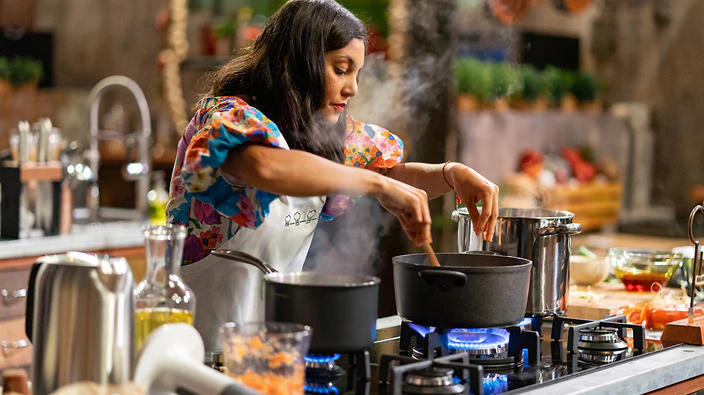

Electric kettles are often underestimated in their versatility. While primarily used for boiling water quickly, they can be surprisingly useful for cooking, including pasta preparation. This guide explores the possibilities and methods of cooking pasta in an electric kettle, providing you with all the information you need to make an informed decision about this unconventional cooking technique.

## Can You Really Cook Pasta in a Kettle?

The short answer is yes, you can cook pasta in an electric kettle. However, there are several important considerations to keep in mind:

1. **Kettle Size**: You need a larger kettle, ideally 2 liters or more. Smaller kettles may not provide enough space for the pasta to cook properly.

2. **Quantity**: This method is suitable for small portions, not family-sized meals. Typically, you can cook one to two servings of pasta at a time.

3. **Type of Pasta**: Some pasta shapes work better than others. Smaller shapes like macaroni, fusilli, or penne are more suitable than long pasta like spaghetti or linguine.

4. **Kettle Material**: [Stainless steel kettles](https://www.electrickettlesguide.com/stainless-steel-kettle/) are generally better suited for cooking pasta due to their durability and heat retention properties.

5. **Cooking Time**: Cooking pasta in a kettle may take slightly longer than traditional methods, as the water temperature can fluctuate more.

For more on kettle versatility, check our guide on [how to cook with just a kettle](https://www.electrickettlesguide.com/how-to-cook-with-just-a-kettle/).

## Methods for Cooking Pasta in a Kettle

There are two primary methods for cooking pasta in an electric kettle:

### Method 1: Boil and Transfer

1. Boil water in the kettle
2. Transfer boiling water to a pot with pasta
3. Continue cooking on a stove

This method is more traditional and allows for better control over the cooking process. It's ideal if you have access to a stove but want to save time on boiling water.

### Method 2: Direct Kettle Cooking

1. Place pasta in the kettle
2. Add water and boil
3. Cook until pasta is al dente

This method is more unconventional but can be very useful in situations where you don't have access to a stove, such as in a dorm room or while traveling.

**Pro Tip**: Keep the lid open with a wooden spoon to prevent auto-shutoff. This allows you to monitor the cooking process and stir the pasta occasionally.

## Step-by-Step Guide to Cooking Pasta in a Kettle

1. **Choose the right pasta**: Opt for smaller shapes like macaroni, fusilli, or penne.
2. **Measure your ingredients**: Use about 1 cup of pasta per person and enough water to cover the pasta by about an inch.
3. **Add pasta and water to the kettle**: Ensure the pasta is fully submerged.
4. **Boil the water**: Turn on the kettle and bring the water to a boil.
5. **Cook the pasta**: Once boiling, let the pasta cook for about 8-12 minutes, stirring occasionally.
6. **Check for doneness**: Test the pasta regularly to achieve your desired level of doneness.
7. **Drain and serve**: Carefully drain the water and serve your pasta with your favorite sauce.

For more tips on using electric kettles efficiently, read our article on [how electric kettles made our life easier](https://www.electrickettlesguide.com/how-electric-kettles-made-our-life-easier/).

## Advantages of Cooking Pasta in a Kettle

| Advantage | Description |
|-----------|-------------|
| Speed | Boils water faster than traditional methods, saving time in meal preparation |
| Energy Efficiency | Uses less energy than a stove, making it a more eco-friendly option |
| Convenience | Ideal for dorms, hotels, or small kitchens where stove access is limited |
| Versatility | Can be used for other quick meals, making it a multi-functional appliance |
| Portability | Perfect for travel or outdoor cooking scenarios |

For more on efficiency, see our article on [are electric kettles energy efficient](https://www.electrickettlesguide.com/are-electric-kettles-energy-efficient/).

## Safety Precautions

When cooking pasta in an electric kettle, safety should be your top priority. Here are some important precautions to keep in mind:

1. **Handle with Care**: Kettles, especially [stainless steel models](https://www.electrickettlesguide.com/stainless-steel-vs-glass-vs-plastic-kettle/), get very hot. Use oven mitts or a thick towel when handling the kettle.

2. **Use Wooden Utensils**: Avoid metal utensils due to electrical conductivity. Wooden or silicone utensils are safer options.

3. **Avoid Overcrowding**: Don't overfill the kettle with pasta. This can lead to boiling over and potential safety hazards.

4. **Monitor Closely**: Stay nearby to prevent boil-overs and ensure the pasta cooks properly.

5. **Unplug When Not in Use**: Always unplug the kettle when you're done cooking to prevent any electrical accidents.

6. **Clean Thoroughly**: After cooking, clean the kettle thoroughly to prevent any buildup of starch or food particles.

For more information on kettle safety, check out our guide on [kettle safety ratings](https://www.electrickettlesguide.com/kettle-safety-ratings/).

## Tips for Perfect Kettle Pasta

To ensure your kettle-cooked pasta turns out delicious every time, follow these expert tips:

1. **Choose the Right Pasta**: Smaller shapes like macaroni, fusilli, or penne work best in kettles.

2. **Pre-Soak for Faster Cooking**: Soak the pasta in cold water for 30 minutes before cooking to reduce cooking time.

3. **Salt the Water**: Add a pinch of salt to the water for flavor, just as you would when cooking pasta on the stove.

4. **Stir Occasionally**: Give the pasta a gentle stir every few minutes to prevent sticking and ensure even cooking.

5. **Test Frequently**: Start testing the pasta for doneness a few minutes before the recommended cooking time.

6. **Reserve Some Cooking Water**: Before draining, save a small amount of the starchy cooking water to help your sauce adhere to the pasta.

7. **Experiment with Timing**: Different pasta shapes and kettle models may require slight adjustments in cooking time. Keep notes to perfect your technique.

For more culinary tips using electric kettles, read our article on [how to make your kettle quieter](https://www.electrickettlesguide.com/how-to-make-your-kettle-quieter/), which includes advice on reducing noise during cooking.

## FAQs About Cooking Pasta in a Kettle

1. **Q: Will cooking pasta damage my kettle?**
   A: Not if done properly and cleaned thoroughly afterward. However, frequent pasta cooking may lead to more rapid mineral buildup, requiring more frequent [descaling](https://www.electrickettlesguide.com/how-descale-an-electric-kettle/).

2. **Q: Can I cook all types of pasta in a kettle?**
   A: Smaller shapes work best. Long pastas like spaghetti may be challenging and may not cook evenly.

3. **Q: How long does it take to cook pasta in a kettle?**
   A: It varies, but generally 8-12 minutes after the water boils. Factors like pasta shape, kettle size, and personal preference for doneness can affect cooking time.

4. **Q: Is it safe to eat pasta cooked in a kettle?**
   A: Yes, as long as the kettle is clean and the pasta is fully cooked. Ensure the internal temperature of the pasta reaches at least 165°F (74°C) for food safety.

5. **Q: Can I add sauce directly to the kettle?**
   A: It's not recommended. Cook the pasta first, then drain and add sauce separately to avoid damaging your kettle or affecting its performance.

## Choosing the Right Kettle for Cooking Pasta

When selecting an electric kettle for cooking pasta, consider the following factors:

1. **Capacity**: Choose a kettle with at least 1.7-2 liters capacity for adequate cooking space.

2. **Material**: Stainless steel kettles are durable and easy to clean, making them ideal for pasta cooking.

3. **Variable Temperature Control**: While not essential, this feature can help you maintain the perfect temperature for cooking pasta.

4. **Wide Mouth**: A kettle with a wide opening makes it easier to add and remove pasta.

5. **Powerful Heating Element**: Look for kettles with at least 1500 watts for quick boiling and efficient cooking.

For more guidance on selecting the perfect kettle, read our comprehensive guide on [what to check when buying an electric kettle](https://www.electrickettlesguide.com/what-to-check-when-buying-an-electric-kettle/).

## Conclusion

Cooking pasta in an electric kettle is a convenient and efficient method, especially for those with limited kitchen access or space. While it may not replace traditional cooking methods for large meals, it's an excellent solution for quick, single-serving pasta dishes.

This technique showcases the versatility of electric kettles beyond just boiling water for tea or coffee. With a little creativity, your kettle can become a valuable tool for various cooking tasks, making it an essential appliance for small living spaces or travel.

Remember to choose the right kettle for the job and always prioritize safety when experimenting with new cooking methods. By following the tips and guidelines in this article, you can enjoy delicious pasta meals using just your electric kettle.

For more innovative uses of electric kettles and cooking tips, explore our other articles:
- [Best Fast Boil Electric Kettle](https://www.electrickettlesguide.com/best-fast-boil-electric-kettle/)
- [Best Electric Kettle for French Press](https://www.electrickettlesguide.com/best-electric-kettle-for-french-press/)
- [Best Variable Temperature Kettles](https://www.electrickettlesguide.com/best-variable-temperature-kettles/)

Experiment with your electric kettle and discover the convenience and versatility it offers for quick, easy pasta meals and beyond!
