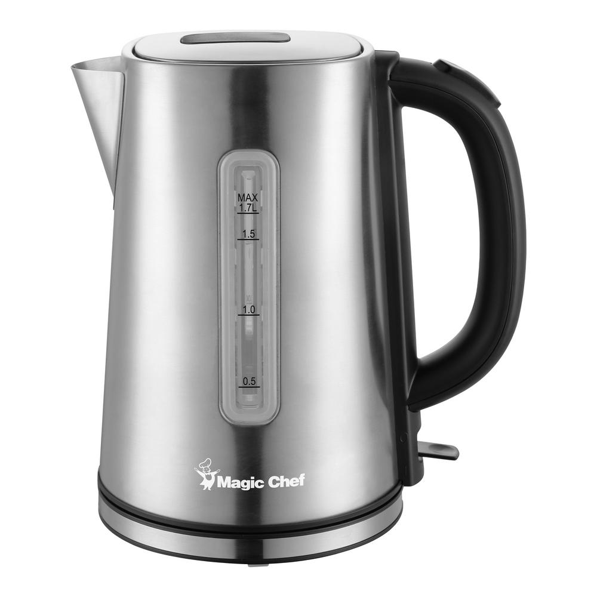
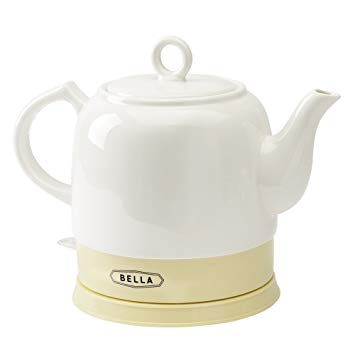

Electric kettles remain indispensable in 2025 kitchens, combining convenience, efficiency, and smart technology. This comprehensive comparison examines two enduringly popular types: ceramic and stainless steel electric kettles, helping you make an informed choice for your modern home with updated 2025-2026 perspectives on materials, technology, and performance.

## Introduction

<Notice type="info" title="2025 Material Science">
Both ceramic and stainless steel kettles have evolved with smart technology integration, improved insulation, and enhanced safety features, making the choice more about lifestyle preferences than pure functionality.
</Notice>

The choice between ceramic and stainless steel electric kettles in 2025 encompasses aesthetics, functionality, durability, smart features, and sustainability considerations. Modern manufacturing has elevated both materials, each offering unique benefits for contemporary lifestyles.

[Electric kettles have revolutionized our kitchens](https://www.electrickettlesguide.com/how-electric-kettles-made-our-life-easier/), with 2025 models featuring precision temperature control, app connectivity, and eco-friendly designs. Whether you're a tea enthusiast valuing traditional aesthetics or a tech-savvy professional prioritizing efficiency, understanding the 2025 differences between ceramic and stainless steel options guides you to the perfect kettle.

## Stainless Steel Electric Kettles

Stainless steel electric kettles have gained popularity for their sleek appearance and practical benefits. These kettles are known for their durability and efficiency, making them a favorite in many households and offices.

### Advantages:
1. **Durability**: Resistant to cracks, chips, and dents, ideal for long-term use.
2. **Cost-effective**: Generally more affordable than ceramic options.
3. **Limescale Filters**: Many models include built-in filters for cleaner water.
4. **Modern Designs**: Sleek, contemporary aesthetics that complement modern kitchens.
5. **Lightweight**: Easier to handle and pour, especially for those with mobility issues.
6. **Fast Heating**: Excellent heat conductivity for quick boiling.

### Disadvantages:
- Exterior can become hot during use (some models address this with double-wall insulation)
- May impart a slight metallic taste to water if not properly maintained

Stainless steel kettles are particularly suited for busy households or office environments where durability and quick heating are priorities. They're also an excellent choice for those who prefer a modern, minimalist kitchen aesthetic.

For more insights on stainless steel options, explore our [guide to the best stainless steel kettles](https://www.electrickettlesguide.com/stainless-steel-kettle/).

## Ceramic Electric Kettles

Ceramic electric kettles offer a blend of traditional charm and modern functionality. These kettles are prized for their aesthetic appeal and ability to retain heat, making them a favorite among tea enthusiasts and those who appreciate a touch of elegance in their kitchen appliances.

### Advantages:
1. **Excellent Heat Retention**: Keeps water hot for longer periods.
2. **Elegant Designs**: Often feature decorative patterns and classic looks.
3. **Cool Exterior**: Generally safer to touch during operation.
4. **Detachable Bases**: Many models can be removed from the base for serving.
5. **Scale Filters**: Some high-end models include filtration systems.
6. **No Metallic Taste**: Ceramic doesn't affect the water's flavor.

### Disadvantages:
- Generally heavier than stainless steel models
- More fragile and susceptible to cracks or chips
- Often more expensive than other types of kettles

Ceramic kettles are ideal for those who prioritize aesthetics and heat retention. They're perfect for creating a cozy atmosphere during tea time or for serving hot beverages during gatherings.

For a selection of top ceramic models, check out our [guide to the best ceramic electric kettles](https://www.electrickettlesguide.com/best-ceramic-electric-kettles/).

## Performance and Efficiency

When it comes to performance, both ceramic and stainless steel kettles have their strengths. Stainless steel kettles generally heat water more quickly due to their superior heat conductivity. This makes them ideal for those who value speed and efficiency in their daily routine.

Ceramic kettles, while slightly slower to heat, excel in heat retention. Once the water is hot, a ceramic kettle will keep it at temperature for longer, making it perfect for those who enjoy leisurely tea sessions or who may not immediately use all the hot water.

In terms of energy efficiency, the difference is minimal when it comes to initial heating. However, ceramic kettles may have a slight edge for those who frequently reheat water, as their better insulation reduces the need for reheating.

For more on energy efficiency in electric kettles, read our article on [are electric kettles energy efficient](https://www.electrickettlesguide.com/are-electric-kettles-energy-efficient/).

## 2025 Comparison Table: Ceramic vs Stainless Steel Kettles

| Feature | Ceramic Kettles (2025) | Stainless Steel Kettles (2025) |
|---------|------------------------|--------------------------------|
| **Durability** | Moderate to High (improved glazing tech) | High (316-grade steel standard) |
| **Weight** | Medium (lighter designs available) | Light (improved alloys) |
| **Heat Retention** | Excellent (double-wall ceramic) | Excellent (vacuum insulation common) |
| **Price Range** | $60-$200 | $40-$180 |
| **Smart Features** | Limited integration | Extensive app connectivity |
| **Aesthetics** | Traditional, artisanal, customizable | Modern, minimalist, professional |
| **Cleaning** | Easy (nano-coating technology) | Very Easy (self-cleaning modes) |
| **Design Variety** | Growing (modern ceramic styles) | Extensive (countless options) |
| **Heating Speed** | Fast (improved elements) | Very Fast (2000W+ standard) |
| **Taste Impact** | Completely neutral | Neutral (high-grade steel) |
| **Temperature Control** | Basic to Advanced | Advanced (±1°C precision) |
| **Sustainability** | Natural materials, recyclable | 100% recyclable, long lifespan |
| **Exterior Safety** | Always cool-touch | Cool-touch (triple-wall insulation) |

## Factors to Consider When Choosing

1. **Aesthetic Preference**: Ceramic for traditional look, stainless steel for modern
2. **Budget**: Stainless steel generally more affordable
3. **Weight**: Consider if you have mobility issues
4. **Durability**: Stainless steel more resistant to breakage
5. **Heat Retention**: Ceramic better for keeping water hot longer
6. **Maintenance**: Stainless steel typically easier to clean and maintain
7. **Usage Frequency**: High-use environments may benefit from stainless steel's durability
8. **Water Quality**: Hard water areas might prefer kettles with built-in filters
9. **Safety Features**: Look for auto-shutoff and boil-dry protection in both types
10. **Capacity**: Consider your typical usage - family size vs. personal use

When making your decision, think about how the kettle will fit into your daily routine. Are you a tea aficionado who values tradition and presentation? A ceramic kettle might be your best bet. For those who prioritize quick, efficient boiling for various uses, a stainless steel model could be more suitable.

For cleaning tips applicable to both types, see our guide on [how to clean an electric kettle](https://www.electrickettlesguide.com/how-to-clean-an-electric-kettle/).

## Environmental Impact

The environmental impact of electric kettles is an increasingly important consideration for many consumers. Both ceramic and stainless steel kettles have their environmental pros and cons:

- **Ceramic Kettles**:
  - Often made from natural materials
  - Can be more energy-efficient due to better heat retention
  - May have a longer lifespan if cared for properly
  - Harder to recycle due to mixed materials

- **Stainless Steel Kettles**:
  - Highly recyclable material
  - Often more durable, potentially reducing waste
  - May consume slightly more energy over time due to lower heat retention

Regardless of the type you choose, opting for a high-quality, durable kettle and using it efficiently can significantly reduce your environmental impact. Consider [variable temperature kettles](https://www.electrickettlesguide.com/best-variable-temperature-kettles/) for more precise heating and energy savings.

## Popular Brands and Models

To help you start your search, here are some well-regarded brands and models in both categories:

### Ceramic Electric Kettles:
1. Breville BTM100 Tea Maker
2. Russell Hobbs Legacy Kettle
3. Smeg '50s Retro Style Electric Kettle

### Stainless Steel Electric Kettles:
1. Cuisinart CPK-17 PerfecTemp
2. OXO Brew Adjustable Temperature Kettle
3. Fellow Stagg EKG Electric Pour-Over Kettle

When choosing a brand, consider factors like warranty, customer service, and user reviews. For more guidance on selecting the right kettle, read our article on [what to check when buying an electric kettle](https://www.electrickettlesguide.com/what-to-check-when-buying-an-electric-kettle/).

## Maintenance and Care

Proper maintenance is crucial for the longevity and performance of your electric kettle, regardless of its material:

### For Ceramic Kettles:
- Handle with care to avoid chips or cracks
- Clean regularly with mild soap and warm water
- Avoid abrasive cleaners that can damage the glaze
- Descale periodically, especially in hard water areas

### For Stainless Steel Kettles:
- Wipe the exterior with a damp cloth regularly
- Clean the interior with a mixture of vinegar and water to remove mineral deposits
- Polish occasionally with a stainless steel cleaner for shine
- Check and clean the filter regularly

For both types, avoid immersing the base or electrical components in water. Regular descaling is essential to maintain efficiency and prevent mineral buildup. For detailed cleaning instructions, refer to our guide on [how to descale an electric kettle](https://www.electrickettlesguide.com/how-descale-an-electric-kettle/).

## FAQs About Ceramic and Stainless Steel Kettles

1. **Q: Which type is better for tea brewing?**
   A: Both are suitable, but ceramic may be preferred by tea connoisseurs for its heat retention. For tea-specific kettles, check our [best electric kettle with tea infuser](https://www.electrickettlesguide.com/best-electric-kettle-with-tea-infuser/) guide.

2. **Q: Are stainless steel kettles safe for health?**
   A: Yes, high-quality stainless steel kettles are safe and do not leach harmful chemicals. Look for food-grade stainless steel for the best quality.

3. **Q: Do ceramic kettles affect water taste?**
   A: Generally no, but ensure you purchase from reputable brands to avoid any glaze issues. Ceramic is known for its neutral impact on taste.

4. **Q: Which is more energy-efficient?**
   A: This depends more on the kettle's design than the material. Ceramic may have a slight edge in maintaining temperature, while stainless steel might heat faster. For energy efficiency info, see our article on [are electric kettles energy efficient](https://www.electrickettlesguide.com/are-electric-kettles-energy-efficient/).

5. **Q: Can I use either type for boiling milk or other liquids?**
   A: While possible, it's generally recommended to use kettles solely for water. Other liquids can leave residues and affect performance. For alternative uses, consult our guide on [can you boil milk in electric kettles](https://www.electrickettlesguide.com/can-you-boil-milk-in-electric-kettles/).

## Conclusion

<Notice type="success" title="2025 Bottom Line">
Both ceramic and stainless steel kettles excel in 2025, offering smart features, safety, and performance. Your choice should reflect aesthetic preferences and specific lifestyle needs rather than concerns about basic functionality.
</Notice>

Choosing between ceramic and stainless steel electric kettles in 2025-2026 depends on your priorities:

**Choose Ceramic if you value:**
<ListCheck>
<ul>
<li>Traditional or artisanal aesthetics with modern smart features</li>
<li>Superior heat retention for extended hot water availability</li>
<li>Completely neutral taste impact (ideal for tea connoisseurs)</li>
<li>Natural, eco-friendly materials with improved durability</li>
<li>Unique, customizable designs as kitchen statement pieces</li>
</ul>
</ListCheck>

**Choose Stainless Steel if you prioritize:**
<ListCheck>
<ul>
<li>Maximum durability and long-term investment value</li>
<li>Extensive smart features and app connectivity</li>
<li>Fast heating speed and energy efficiency</li>
<li>Easy maintenance with self-cleaning capabilities</li>
<li>Modern, professional aesthetics with wide variety</li>
<li>Lighter weight for easier handling and storage</li>
</ul>
</ListCheck>

Both materials have evolved significantly, with 2025 models offering:
- Advanced temperature control (±1°C precision)
- Smart home integration and app connectivity
- Superior insulation (cool-touch exteriors standard)
- Enhanced safety features (multiple redundant systems)
- Eco-friendly manufacturing and recyclability
- Extended warranties (2-5 years typical)

The "best" choice reflects your aesthetic preferences, kitchen design, beverage rituals, and smart home ecosystem. Modern manufacturing ensures both materials deliver excellent performance, safety, and longevity.

For more insights on 2025 electric kettles and making the right choice:
- [Best Smart Kettles with Advanced Features](https://www.electrickettlesguide.com/best-smart-kettles/)
- [Best Variable Temperature Kettles for Precision Brewing](https://www.electrickettlesguide.com/best-variable-temperature-kettles/)
- [Complete Guide to Choosing Your Perfect Kettle](https://www.electrickettlesguide.com/what-to-check-when-buying-an-electric-kettle/)

Whether you choose ceramic for its timeless elegance or stainless steel for its modern efficiency, your 2025 electric kettle will be an indispensable companion for perfect beverages, combining convenience, smart technology, and reliable performance!
