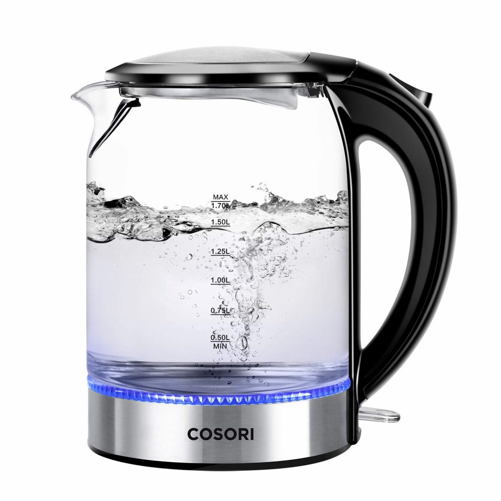

The Cosori 1.7L Glass Electric Kettle combines elegance with functionality, making it a popular choice for modern kitchens. This review explores its features, performance, and overall value.

## Design and Build

- **Capacity**: 1.7 liters, ideal for small to medium families
- **Materials**: Borosilicate glass body, 304 food-grade stainless steel interior

### Key Design Features:
- Clear, calibrated glass body for precise water measurement
- Wide-mouth opening for easy cleaning
- Sturdy handle for balanced pouring
- Stainless steel filter in the spout
- 360-degree power base with British Strix thermostat technology

For more on kettle materials, see our comparison of [stainless steel vs glass vs plastic kettles](https://www.electrickettlesguide.com/stainless-steel-vs-glass-vs-plastic-kettle/).

## Performance

- **Boiling Time**: 3-5 minutes for full capacity
- **Power**: 1500 watts
- **Energy Efficiency**: Fast boiling saves time and energy

## Key Functionalities

1. Rapid water boiling
2. Auto shut-off within 30 seconds of boiling
3. Boil-dry protection
4. LED indicator light
5. Versatile use for beverages and instant foods

## Specifications Table

| Feature | Specification |
|---------|---------------|
| Capacity | 1.7 liters |
| Power | 1500 watts |
| Materials | Borosilicate glass, stainless steel |
| Safety Features | Auto shut-off, boil-dry protection |
| Special Features | LED indicator, wide mouth |
| Warranty | 2 years |

## Pros and Cons

### Pros:
- Elegant, transparent design
- Fast boiling time
- Multiple safety features
- Wide mouth for easy cleaning
- 100% BPA-free
- Versatile for various hot beverages and foods

### Cons:
- Potential for limescale build-up in hard water areas
- May be heavy for some users

For tips on dealing with limescale, check our guide on [best kettles for hard water](https://www.electrickettlesguide.com/best-kettles-for-hard-water/).

## User Experience

The Cosori kettle offers a premium user experience with its:
- Clear view of boiling process
- Quiet operation
- Easy-to-use controls
- Comfortable handle for pouring

## Comparison with Other Glass Kettles

| Feature | Cosori 1.7L | Average Glass Kettle | High-End Glass Kettle |
|---------|-------------|----------------------|------------------------|
| Capacity | 1.7L | 1.5-1.8L | 1.5-2L |
| Power | 1500W | 1000-1500W | 1500-3000W |
| Price Range | $$ | $-$$ | $$-$$$ |
| Safety Features | Advanced | Basic to Moderate | Advanced |
| Special Features | LED, Wide Mouth | Varies | Multiple |

For more glass kettle options, explore our guide on [best glass kettle models](https://www.electrickettlesguide.com/a-brutal-selection-of-the-best-glass-kettle-models/).

## FAQs

1. **Q: How do I clean this kettle?**
   A: Use a mixture of vinegar and water for descaling. For detailed instructions, see our guide on [how to clean an electric kettle](https://www.electrickettlesguide.com/how-to-clean-an-electric-kettle/).

2. **Q: Can I control the water temperature?**
   A: This model doesn't have variable temperature control. For kettles with this feature, check our [best variable temperature kettles](https://www.electrickettlesguide.com/best-variable-temperature-kettles/) guide.

3. **Q: Is it safe to use for boiling milk or cooking?**
   A: It's designed primarily for water. For cooking options, see our article on [how to cook with just a kettle](https://www.electrickettlesguide.com/how-to-cook-with-just-a-kettle/).

4. **Q: How long does the warranty last?**
   A: Cosori offers a 2-year warranty on this model.

## Conclusion

The Cosori 1.7L Glass Electric Kettle stands out for its elegant design, fast boiling capabilities, and safety features. It's an excellent choice for those who appreciate visual appeal along with functionality in their kitchen appliances.

This kettle is ideal for:
- Users who prefer to see the boiling process
- Households needing a large capacity kettle
- Those who value safety features and quick boiling times

While it may require more frequent cleaning in hard water areas, its overall performance and design make it a worthy investment for many households.

[Check price on Amazon](#)

For more insights on electric kettles and their uses, explore our other articles:
- [What to Check When Buying an Electric Kettle](https://www.electrickettlesguide.com/what-to-check-when-buying-an-electric-kettle/)
- [Are Electric Kettles Energy Efficient?](https://www.electrickettlesguide.com/are-electric-kettles-energy-efficient/)
- [How Electric Kettles Made Our Life Easier](https://www.electrickettlesguide.com/how-electric-kettles-made-our-life-easier/)

Choose the Cosori 1.7L Glass Electric Kettle for a blend of style and functionality in your daily brewing routine!
