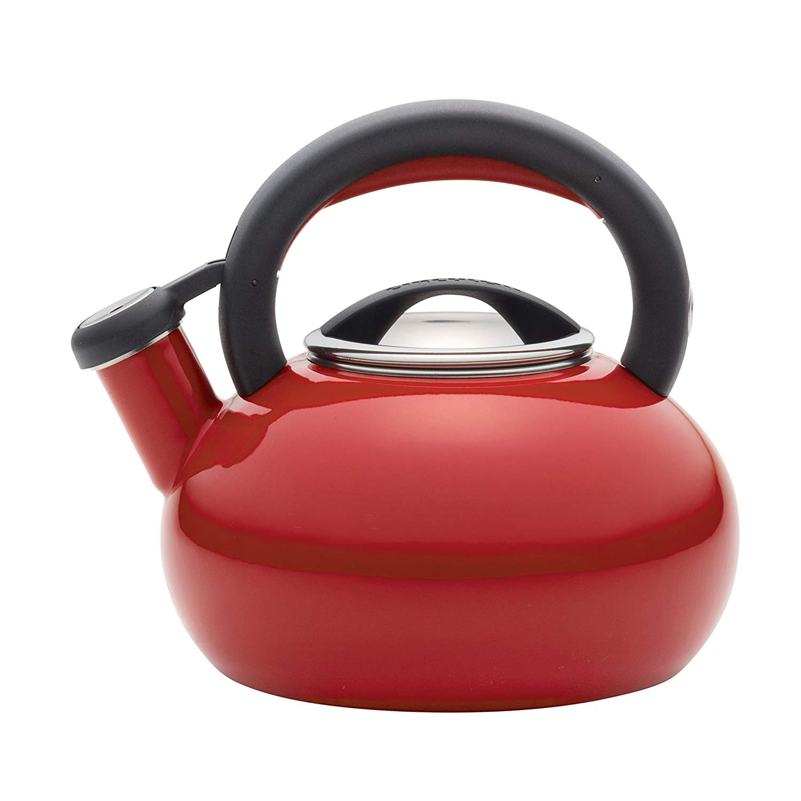

The art of brewing and enjoying tea has been refined over centuries, with each culture developing its own tools and techniques. In modern kitchens, we have access to a variety of equipment designed to enhance our tea experience. Understanding the roles of teapots, kettles, and teapot warmers can elevate your tea ritual from a simple beverage to a sophisticated experience.

[Electric kettles have revolutionized our kitchens](https://www.electrickettlesguide.com/how-electric-kettles-made-our-life-easier/), making hot water preparation faster and more efficient. However, they're just one part of the tea-making equation. Let's explore how each tool contributes to the perfect cup of tea.

## The History of Tea Brewing Tools

Tea brewing tools have evolved significantly over time:

- **Ancient China**: Clay teapots were used as early as the Song Dynasty (960-1279 AD).
- **15th Century**: Metal kettles became popular in Europe for boiling water.
- **19th Century**: The electric kettle was invented in 1891 by Carpenter Electric Company.
- **20th Century**: Teapot warmers gained popularity to keep tea hot during long conversations.

Understanding this history helps appreciate the specialized functions of modern tea tools.

## Teapot: For Brewing and Serving Tea

A teapot is designed for brewing and serving tea, not for boiling water. It's an essential tool for tea enthusiasts who appreciate the nuances of different tea varieties.

### Key Features:
- Brewing container for loose leaf tea
- Often includes a built-in strainer
- Available in various materials (porcelain, ceramic, glass)
- Not suitable for stovetop use
- Designed to maintain tea temperature

### Types of Teapots:
1. **Ceramic Teapots**: Excellent heat retention, traditional aesthetic
2. **Glass Teapots**: Allow visual appreciation of tea color and flowering teas
3. **Cast Iron Teapots**: Durable, provide even heat distribution
4. **Porcelain Teapots**: Elegant, often used in formal tea services

### Best Teapot Recommendation: Glass Teapot by Tea Beyond

**Pros:**
- Elegant glass design
- Easy to clean
- Temperature shock resistant
- Microwave and dishwasher safe
- Cool-touch handle

**Cons:**
- Requires careful handling to maintain pristine condition

[Check price on Amazon](#)

For more on tea brewing, see our guide on [best electric kettle with tea infuser](https://www.electrickettlesguide.com/best-electric-kettle-with-tea-infuser/).

## Kettle: For Boiling Water

Kettles are specifically designed to heat water efficiently. They are the first step in the tea-making process, providing the hot water necessary for brewing.

### Types of Kettles:

1. **Stovetop Kettles**
   - Affordable
   - Works on various heat sources
   - Less energy-efficient than electric
   - Often feature a whistle to indicate boiling

2. **Electric Kettles**
   - Fast and energy-efficient
   - Often include temperature control
   - More convenient features
   - Available in various materials (stainless steel, glass, plastic)

For a detailed comparison, read our article on [stovetop kettle vs electric kettle](https://www.electrickettlesguide.com/stovetop-kettle-vs-electric-kettle-which-one-is-better/).

### Best Stovetop Kettle: Circulon 1.5-Quart Sunrise Teakettle

**Pros:**
- Durable steel construction
- 6-cup capacity
- Whistling feature
- Lifetime warranty
- Multiple color options

**Cons:**
- Narrow opening

[Check price on Amazon](#)

### Best Electric Kettle: Ovente KP72B Electric Kettle

**Pros:**
- 1.7-liter capacity
- BPA-free exterior
- Auto shut-off and boil-dry protection
- Stainless steel interior
- Removable filter

**Cons:**
- No variable temperature control

[Check price on Amazon](#)

For more electric kettle options, explore our [best fast boil electric kettle](https://www.electrickettlesguide.com/best-fast-boil-electric-kettle/) guide.

## Teapot Warmer: For Maintaining Tea Temperature

Teapot warmers keep brewed tea warm for extended periods, allowing you to enjoy your tea at leisure without it going cold.

### Key Features:
- Candle-powered or electric
- Suitable for various teapot sizes
- Decorative and functional
- Maintains optimal drinking temperature

### Types of Teapot Warmers:
1. **Candle Warmers**: Traditional, creates a cozy atmosphere
2. **Electric Warmers**: More consistent heat, no open flame
3. **USB-Powered Warmers**: Modern, portable option

### Best Teapot Warmer: Yeme Stainless Steel Candle Lit Teapot Warmer

**Pros:**
- Durable metal design
- Elegant appearance
- Versatile for different teapot sizes
- Easy to use

**Cons:**
- Slightly pricier than other options

[Check price on Amazon](#)

## Comparison Table: Teapot vs Kettle vs Teapot Warmer

| Feature | Teapot | Kettle | Teapot Warmer |
|---------|--------|--------|---------------|
| Primary Function | Brewing tea | Boiling water | Keeping tea warm |
| Heat Source | N/A | Stove/Electricity | Candle/Electricity |
| Material Options | Ceramic, Glass, Metal | Metal, Plastic | Metal, Ceramic |
| Temperature Control | No | Some electric models | No |
| Serving Capability | Yes | No | Enhances serving |
| Price Range | $20-$200+ | $15-$150+ | $10-$50+ |
| Maintenance | Regular cleaning | Descaling required | Minimal |

## Choosing the Right Tool for Your Tea Ritual

Selecting the right tools depends on your tea preferences and lifestyle:

1. **For Casual Tea Drinkers**: An electric kettle and a simple teapot may suffice.
2. **For Tea Connoisseurs**: Invest in a high-quality teapot, variable temperature kettle, and teapot warmer.
3. **For Office Use**: Consider a compact electric kettle and an insulated teapot.
4. **For Traditional Tea Ceremonies**: Choose a ceramic teapot and a stovetop kettle for authenticity.

Remember to consider factors like frequency of use, type of tea preferred, and available space when making your choice.

## Maintenance and Care Tips

Proper care ensures longevity and optimal performance of your tea tools:

1. **Teapots**:
   - Rinse after each use
   - Use mild detergents for cleaning
   - Avoid thermal shock (sudden temperature changes)

2. **Kettles**:
   - [Descale regularly](https://www.electrickettlesguide.com/how-descale-an-electric-kettle/) to prevent mineral buildup
   - Wipe exterior with a damp cloth
   - For electric kettles, never immerse the base in water

3. **Teapot Warmers**:
   - Clean candle residue regularly
   - For electric warmers, wipe with a damp cloth
   - Check electrical components periodically

For more cleaning tips, see our guide on [how to clean an electric kettle](https://www.electrickettlesguide.com/how-to-clean-an-electric-kettle/).

## Eco-Friendly Options in Tea Brewing

As sustainability becomes increasingly important, consider these eco-friendly choices:

1. **Reusable Tea Filters**: Replace disposable tea bags
2. **Glass or Stainless Steel Kettles**: More durable and recyclable than plastic
3. **Solar-Powered Teapot Warmers**: Reduce electricity consumption
4. **Local and Organic Teas**: Support sustainable farming practices

By choosing environmentally friendly options, you can enjoy your tea ritual while minimizing your ecological footprint.

## FAQs

1. **Q: Can I use a teapot to boil water?**
   A: No, teapots are not designed for boiling water. Use a kettle instead.

2. **Q: Are electric kettles more efficient than stovetop kettles?**
   A: Yes, electric kettles are generally more energy-efficient. See our article on [are electric kettles energy efficient](https://www.electrickettlesguide.com/are-electric-kettles-energy-efficient/).

3. **Q: Can I put a glass teapot on a teapot warmer?**
   A: Yes, but ensure the warmer is suitable for glass to avoid thermal shock.

4. **Q: How long can a teapot warmer keep tea warm?**
   A: Typically, a few hours, depending on the initial temperature and ambient conditions.

5. **Q: Is it safe to leave an electric kettle plugged in all the time?**
   A: While many modern kettles have safety features, it's best to unplug when not in use to save energy and reduce potential risks.

## Conclusion

Understanding the differences between teapots, kettles, and teapot warmers is crucial for any tea enthusiast. Each plays a unique role in the tea preparation and serving process:

- **Teapots** are ideal for brewing and serving tea, offering a traditional and elegant way to enjoy your favorite blends.
- **Kettles** efficiently boil water for various uses, with electric models providing convenience and speed.
- **Teapot warmers** maintain the temperature of brewed tea, allowing for a leisurely tea-drinking experience.

By choosing the right tools, you can enhance your tea-drinking experience and enjoy perfectly brewed tea at the right temperature. Whether you're a casual tea drinker or a dedicated connoisseur, the right equipment can make a significant difference in your tea ritual.

For more insights on tea preparation and kitchen appliances, explore our other articles:
- [What to Check When Buying an Electric Kettle](https://www.electrickettlesguide.com/what-to-check-when-buying-an-electric-kettle/)
- [Best Variable Temperature Kettles](https://www.electrickettlesguide.com/best-variable-temperature-kettles/)
- [Best Electric Kettle for French Press](https://www.electrickettlesguide.com/best-electric-kettle-for-french-press/)

Enhance your tea ritual with the right equipment and enjoy the perfect cup every time!
