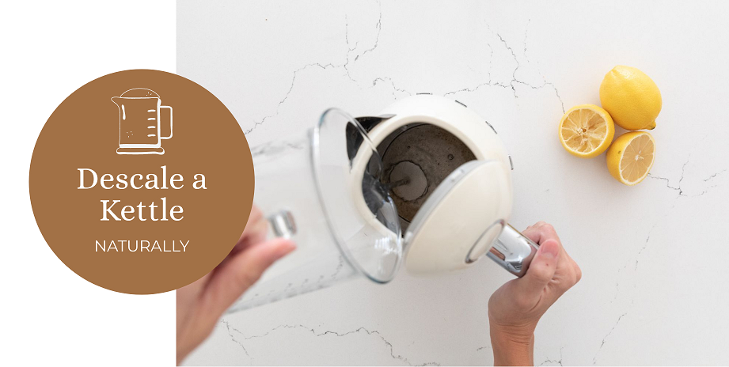

Descaling your electric kettle is crucial for maintaining its efficiency and ensuring the best-tasting beverages. This guide will walk you through natural, eco-friendly methods to descale your kettle without using harsh chemicals.

## Introduction

Electric kettles have become indispensable in modern kitchens, offering convenience and speed in boiling water. However, with regular use, especially in areas with hard water, kettles can accumulate limescale, affecting their performance and the taste of your beverages.

[Electric kettles have revolutionized our kitchens](https://www.electrickettlesguide.com/how-electric-kettles-made-our-life-easier/), but to keep enjoying their benefits, proper maintenance is key. This guide focuses on natural descaling methods that are not only effective but also environmentally friendly and cost-efficient.

## The Importance of Regular Descaling

Regular descaling is more than just a cleaning routine; it's essential for:

1. **Maintaining Efficiency**: Limescale buildup can reduce heating efficiency, leading to longer boiling times and increased energy consumption.
2. **Preserving Taste**: Scale can affect the taste of water and beverages made with it.
3. **Extending Kettle Lifespan**: Regular descaling prevents damage to heating elements and internal components.
4. **Ensuring Safety**: Heavy scale buildup can interfere with auto-shutoff features in some models.

For more on kettle maintenance and its importance, check our guide on [what to check when buying an electric kettle](https://www.electrickettlesguide.com/what-to-check-when-buying-an-electric-kettle/).

## Understanding Limescale

Limescale is a chalky deposit primarily composed of calcium carbonate. It's common in areas with hard water and can affect the performance and lifespan of your kettle.

### Causes of Limescale
- Hard water rich in minerals like calcium and magnesium
- Heating water, which causes these minerals to solidify
- Leaving water in the kettle for extended periods

### Effects of Limescale
1. Reduced heating efficiency
2. Altered taste of water and beverages
3. Potential damage to kettle components
4. Shortened lifespan of the appliance

For more on how water quality affects kettles, see our guide on [best kettles for hard water](https://www.electrickettlesguide.com/best-kettles-for-hard-water/).

## Natural Descaling Methods

### 1. Vinegar Method

**Steps:**
1. Mix equal parts water and white vinegar in the kettle
2. Let sit for 1 hour
3. Boil the mixture
4. Rinse thoroughly

**Tip:** Pour the vinegar solution over baking soda in the sink for an extra cleaning boost.

### 2. Rice Cleaning Method

**Steps:**
1. Fill kettle with water and add a handful of uncooked rice
2. Boil for 15 minutes
3. Let cool, then rinse

### 3. Baking Soda Method

**Steps:**
1. Fill kettle with water and add 1 cup baking soda
2. Let sit for 1 hour
3. Boil the mixture
4. Rinse thoroughly
5. For stubborn scale, scrub gently with a baking soda paste

### 4. Lemon Juice Method

**Steps:**
1. Add 1/2 cup lemon juice to the kettle
2. Let sit for 30 minutes
3. Boil for 2-3 minutes
4. Rinse thoroughly

## Comparison of Descaling Methods

| Method | Effectiveness | Eco-Friendliness | Cost | Smell/Taste Residue |
|--------|---------------|-------------------|------|---------------------|
| Vinegar | High | High | Low | Potential slight odor |
| Rice | Medium | High | Low | None |
| Baking Soda | High | High | Low | None |
| Lemon Juice | High | High | Medium | Pleasant citrus scent |

## How to Prevent Limescale Build-up

Prevention is better than cure. Here are some tips to minimize limescale formation:

1. **Use Filtered Water**: Reduces mineral content in water.
2. **Empty the Kettle After Use**: Prevents mineral deposits from settling.
3. **Regular Cleaning**: Wipe the interior after each use.
4. **Descale Regularly**: Even before visible buildup occurs.
5. **Consider a Water Softener**: For areas with very hard water.

For more tips on kettle care, see our article on [how to make your kettle quieter](https://www.electrickettlesguide.com/how-to-make-your-kettle-quieter/), which also covers maintenance aspects.

## Safety Precautions When Descaling

While natural methods are generally safe, consider these precautions:

1. **Avoid Mixing Cleaners**: Stick to one method at a time to prevent harmful chemical reactions.
2. **Protect Your Hands**: Use gloves when handling acidic solutions like vinegar or lemon juice.
3. **Ventilate the Area**: Especially when using vinegar, which can produce strong odors.
4. **Follow Manufacturer Guidelines**: Some kettles may have specific cleaning instructions.
5. **Rinse Thoroughly**: Ensure no cleaning residues remain in the kettle.

For more on kettle safety, read our guide on [can electric kettles explode](https://www.electrickettlesguide.com/can-electric-kettles-explode/).

## Environmental Impact of Descaling Methods

Natural descaling methods are not only effective but also environmentally friendly:

- **Low Chemical Load**: Unlike commercial descalers, natural methods don't introduce harsh chemicals into water systems.
- **Biodegradable**: Vinegar, lemon juice, and baking soda are all biodegradable.
- **Energy Efficient**: Regular descaling maintains kettle efficiency, reducing energy consumption.
- **Waste Reduction**: Using household items reduces packaging waste from commercial products.

For eco-conscious consumers, consider exploring [ceramic electric kettles](https://www.electrickettlesguide.com/best-ceramic-electric-kettles/), which often require less frequent descaling.

## Choosing the Right Kettle to Minimize Scaling

Some kettles are designed to reduce limescale buildup:

1. **Kettles with Built-in Filters**: Help reduce mineral content in water.
2. **Glass or Stainless Steel Kettles**: Easier to monitor and clean than plastic models.
3. **Kettles with Wide Openings**: Allow easier access for cleaning.
4. **Models with Scale Filters**: Catch loose scale particles.

For more on kettle selection, check our guide on [best variable temperature kettles](https://www.electrickettlesguide.com/best-variable-temperature-kettles/), which often include features to combat limescale.

## Maintenance Tips

- Descale your kettle every 4-8 weeks, depending on water hardness
- Always empty the kettle after use
- Use filtered water to reduce limescale buildup
- Wipe the interior and exterior regularly with a damp cloth
- Check and clean the spout filter regularly

For more cleaning tips, check our guide on [how to clean an electric kettle](https://www.electrickettlesguide.com/how-to-clean-an-electric-kettle/).

## FAQs

1. **Q: How do I know if my kettle needs descaling?**
   A: Look for white, chalky deposits inside the kettle, a longer boiling time, or changes in water taste.

2. **Q: Can I use these methods on all types of kettles?**
   A: Most methods are safe for all kettles, but always check your manufacturer's guidelines.

3. **Q: Will descaling affect the taste of my water?**
   A: No, proper rinsing after descaling should eliminate any residual taste.

4. **Q: How often should I descale my kettle?**
   A: Every 4-8 weeks, or more frequently if you have very hard water.

5. **Q: Is it safe to use vinegar for descaling if I have a stainless steel kettle?**
   A: Yes, vinegar is safe for stainless steel. Just ensure thorough rinsing afterward.

## Conclusion

Regular descaling is essential for maintaining your electric kettle's efficiency and longevity. These natural methods provide eco-friendly, cost-effective solutions to keep your kettle in top condition. By incorporating these practices into your routine, you'll ensure better-tasting beverages and a longer-lasting appliance.

Remember, the frequency of descaling depends on your water hardness and kettle usage. Consistent maintenance not only improves the performance of your kettle but also contributes to energy efficiency and better-tasting beverages.

For those looking to minimize maintenance, consider kettles with built-in descaling features or water filtration systems. These can significantly reduce the frequency of manual descaling required.

For more insights on electric kettles and their maintenance, explore our other articles:
- [Are Electric Kettles Energy Efficient?](https://www.electrickettlesguide.com/are-electric-kettles-energy-efficient/)
- [Stovetop Kettle vs Electric Kettle: Which One is Better?](https://www.electrickettlesguide.com/stovetop-kettle-vs-electric-kettle-which-one-is-better/)
- [Best Electric Kettles Made in the USA](https://www.electrickettlesguide.com/best-electric-kettles-made-in-the-usa/)

Keep your kettle clean and enjoy perfectly boiled water every time!
