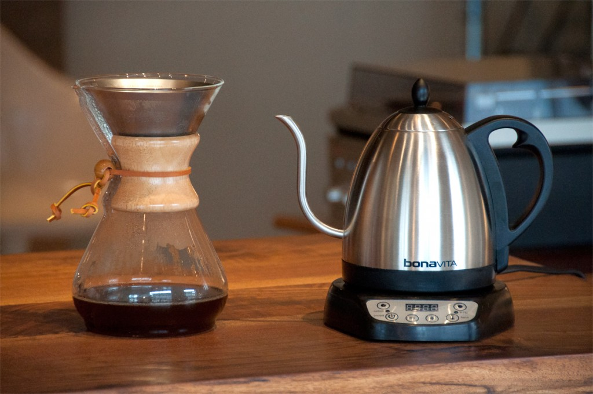

Electric kettles have become an indispensable appliance in modern kitchens, offering unparalleled convenience and efficiency. This article explores the myriad ways electric kettles have simplified our lives and provides guidance on choosing the best model for your needs.

## Introduction

The humble electric kettle has come a long way since its inception, evolving from a simple water boiling device to a versatile kitchen appliance. Its impact on our daily routines has been profound, offering time-saving solutions for busy individuals and families alike.

[Electric kettles have made our lives easier](https://www.electrickettlesguide.com/how-electric-kettles-made-our-life-easier/) in numerous ways, from quick morning brews to convenient meal preparations. As we delve into the benefits and features of these appliances, we'll discover why they've become a staple in kitchens worldwide.

## The Evolution of Electric Kettles

The journey of the electric kettle is a testament to human ingenuity:

1. **1891**: The first electric kettle was invented by Carpenter Electric Company.
2. **1922**: The Swan Company introduced the first electric kettle with an internal heating element.
3. **1955**: Russell Hobbs created the first fully automatic electric kettle.
4. **1960s-1970s**: Plastic kettles became popular, offering lighter and more affordable options.
5. **1980s-1990s**: Introduction of cordless models with separate bases.
6. **2000s onwards**: Smart kettles with temperature control and wifi connectivity emerged.

This evolution has led to the diverse range of electric kettles available today, catering to various needs and preferences.

## Why Electric Kettles Are a Game-Changer

### Functionality, Practicality, and Efficiency

1. **Rapid Heating**: Up to 5 times faster than stovetop methods
2. **Energy Efficiency**: Consumes less power than microwaves or stoves
3. **Precise Temperature Control**: Ideal for different types of tea and coffee
4. **Safety Features**: Auto shut-off prevents accidents and boil-dry protection

For more on efficiency, check our article on [are electric kettles energy efficient](https://www.electrickettlesguide.com/are-electric-kettles-energy-efficient/).

### Time and Energy Savings

- Quick boiling saves precious morning minutes
- Efficient heating reduces electricity bills
- Versatility allows for various hot beverage preparations and simple cooking tasks

### Perfect Brewing with Temperature Control

Many models offer specific temperature settings, crucial for:
- Green tea (70-80°C)
- White tea (65-70°C)
- Black tea (90-100°C)
- Coffee (91-96°C)

This precision ensures optimal flavor extraction and prevents burning delicate teas. Learn more about [variable temperature kettles](https://www.electrickettlesguide.com/best-variable-temperature-kettles/).

### Easy Maintenance

Keeping your kettle in top shape is simple:

1. **Regular Descaling**: Removes mineral deposits
2. **Natural Cleaning Solutions**:
   - White vinegar solution
   - Lemon juice mixture
   - Baking soda paste

For detailed cleaning instructions, see our guide on [how to clean an electric kettle](https://www.electrickettlesguide.com/how-to-clean-an-electric-kettle/).

## Environmental Impact of Electric Kettles

Electric kettles can contribute to a more sustainable lifestyle:

1. **Energy Efficiency**: Boil only the amount of water needed, reducing energy waste.
2. **Durability**: Quality kettles last for years, reducing electronic waste.
3. **Eco-Friendly Materials**: Some models use recycled or sustainable materials.
4. **Reduced Plastic Waste**: Encourages use of reusable tea bags and coffee filters.

For eco-conscious consumers, consider exploring [ceramic electric kettles](https://www.electrickettlesguide.com/best-ceramic-electric-kettles/), which are often more durable and environmentally friendly.

## Innovative Uses Beyond Boiling Water

Electric kettles are more versatile than you might think:

1. **Cooking Instant Meals**: Perfect for instant noodles, oatmeal, and soup mixes.
2. **Sterilizing Small Items**: Useful for baby bottles or small kitchen tools.
3. **Preheating Dishes**: Pour hot water over plates to warm them before serving.
4. **Speeding Up Cooking**: Use hot water to expedite cooking pasta or vegetables.
5. **Making Hot Compresses**: Quick solution for minor aches and pains.

For more creative uses, check our guide on [how to cook with just a kettle](https://www.electrickettlesguide.com/how-to-cook-with-just-a-kettle/).

## Comparing Electric Kettles to Other Heating Methods

| Method | Speed | Energy Efficiency | Temperature Control | Safety |
|--------|-------|-------------------|---------------------|--------|
| Electric Kettle | Very Fast | High | Good (in some models) | Excellent |
| Stovetop Kettle | Slow | Low | Poor | Good |
| Microwave | Fast | Moderate | Poor | Moderate |
| Instant Hot Water Tap | Instant | Varies | Limited | Good |

Electric kettles stand out for their combination of speed, efficiency, and safety features.

## Choosing the Best Electric Kettle

Consider these factors when selecting your ideal electric kettle:

### 1. Capacity

| Usage | Recommended Size |
|-------|------------------|
| Personal Use | 0.5 - 1 liter |
| Family Use | 1.5 - 2 liters |
| Office Use | 2 - 3 liters |

### 2. Material

- **Plastic**: Affordable, lightweight, but may retain odors
- **Glass**: Aesthetically pleasing, allows visual monitoring of water
- **Stainless Steel**: Durable, easy to clean, but may be prone to limescale
- **Ceramic**: Excellent heat retention, eco-friendly, but heavier

For a detailed comparison, read our [stainless steel vs glass vs plastic kettle guide](https://www.electrickettlesguide.com/stainless-steel-vs-glass-vs-plastic-kettle/).

### 3. Essential Features

- Non-slip handle
- Large pouring spout
- Safety certifications
- Concealed heating element

### 4. Advanced Features to Consider

- Auto shut-off
- Temperature control
- LED indicators
- Touch display
- Keep-warm function
- Cordless design with 360° rotating base
- Gooseneck spout for precise pouring
- Water level indicator

### 5. Design and Space Considerations

- Kitchen aesthetics
- Available counter space
- Portability needs
- Cord storage options

For more guidance on selecting the perfect kettle, see our article on [what to check when buying an electric kettle](https://www.electrickettlesguide.com/what-to-check-when-buying-an-electric-kettle/).

## Future Trends in Electric Kettle Technology

The future of electric kettles looks promising with innovations like:

1. **Smart Home Integration**: Voice-controlled kettles that work with home assistants.
2. **Advanced Energy Efficiency**: Kettles with improved insulation and heating elements.
3. **Multifunctional Designs**: Kettles that can brew, cook, and even purify water.
4. **Sustainable Materials**: Increased use of recycled and biodegradable components.
5. **Personalization Features**: App-controlled kettles with user profiles and preferences.

Keep an eye on [smart kettles](https://www.electrickettlesguide.com/best-smart-kettles/) for the latest in kettle technology.

## FAQs About Electric Kettles

1. **Q: Are electric kettles safe to use?**
   A: Yes, most modern kettles have safety features like auto shut-off and boil-dry protection. For more on safety, read our article on [can electric kettles explode](https://www.electrickettlesguide.com/can-electric-kettles-explode/).

2. **Q: Can I use an electric kettle for cooking?**
   A: Many kettles can be used for simple cooking tasks. Check our guide on [how to cook with just a kettle](https://www.electrickettlesguide.com/how-to-cook-with-just-a-kettle/).

3. **Q: How long do electric kettles typically last?**
   A: With proper care, a quality electric kettle can last 3-5 years or more.

4. **Q: Are there travel-friendly electric kettles?**
   A: Yes, many compact models are available. See our article on [best foldable electric kettle for traveling](https://www.electrickettlesguide.com/best-foldable-electric-kettle-for-traveling/).

5. **Q: How do I prevent limescale buildup in my kettle?**
   A: Regular descaling and using filtered water can help. Learn more in our guide on [how to descale an electric kettle](https://www.electrickettlesguide.com/how-descale-an-electric-kettle/).

## Conclusion

Electric kettles have significantly improved our daily routines, offering speed, efficiency, and convenience in preparing hot beverages and simple meals. By choosing the right model and maintaining it properly, you can enjoy the benefits of this versatile appliance for years to come.

Whether you're a tea connoisseur, coffee enthusiast, or simply someone who appreciates the convenience of quickly boiled water, an electric kettle is a valuable addition to any kitchen. Its ability to save time, energy, and provide precise temperature control makes it an indispensable tool in our fast-paced lives.

As technology continues to evolve, we can expect electric kettles to become even more integrated into our smart homes and daily routines. Their impact on energy efficiency and sustainability will likely grow, making them an even more essential appliance in the future.

For more insights on electric kettles and their uses, explore our other articles:
- [Best Electric Kettle with Tea Infuser](https://www.electrickettlesguide.com/best-electric-kettle-with-tea-infuser/)
- [Best Electric Kettles Made in the USA](https://www.electrickettlesguide.com/best-electric-kettles-made-in-the-usa/)
- [Stovetop Kettle vs Electric Kettle: Which One is Better?](https://www.electrickettlesguide.com/stovetop-kettle-vs-electric-kettle-which-one-is-better/)

Embrace the convenience and efficiency of electric kettles and transform your daily beverage routine!
