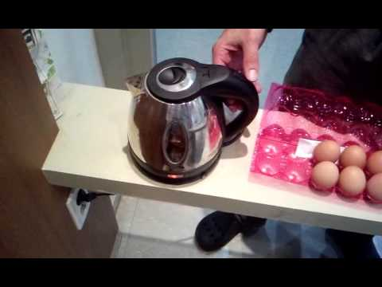

Electric kettles are versatile appliances that extend beyond just boiling water for tea or coffee. One surprising use is boiling eggs, which can be particularly handy when traveling or in places without a traditional stove. This guide will walk you through the process of safely boiling eggs in an electric kettle.

## Introduction

The humble electric kettle, primarily known for its efficiency in boiling water, has become an unexpected ally in egg preparation. This unconventional method of boiling eggs not only showcases the versatility of electric kettles but also provides a solution for those with limited cooking facilities.

[Electric kettles have revolutionized our kitchens](https://www.electrickettlesguide.com/how-electric-kettles-made-our-life-easier/) in many ways, and their ability to boil eggs is just another testament to their adaptability. Whether you're a college student in a dorm, a traveler in a hotel room, or simply looking for a quick and efficient way to prepare eggs, this guide will provide you with all the information you need.

## Why Use an Electric Kettle for Boiling Eggs?

Using an electric kettle for boiling eggs offers several advantages:

1. **Convenience**: Ideal for dorm rooms, offices, or travel situations where traditional cooking appliances are unavailable.
2. **Speed**: Electric kettles typically boil water faster than stovetops, reducing overall cooking time.
3. **Energy Efficiency**: Electric kettles use less energy than a stove for the same task. Learn more about [electric kettle efficiency](https://www.electrickettlesguide.com/are-electric-kettles-energy-efficient/).
4. **Versatility**: Adds another function to your kettle, making it a multi-purpose appliance.
5. **Consistent Results**: The controlled heating of electric kettles can lead to more consistent egg cooking.
6. **Space-Saving**: Eliminates the need for additional cookware in small living spaces.

For more creative uses of electric kettles, check our guide on [how to cook with just a kettle](https://www.electrickettlesguide.com/how-to-cook-with-just-a-kettle/).

## Nutritional Benefits of Boiled Eggs

Before diving into the cooking process, it's worth noting the nutritional value of boiled eggs:

- **High-Quality Protein**: Essential for muscle building and repair.
- **Rich in Vitamins**: Particularly B vitamins and vitamin D.
- **Contain Antioxidants**: Such as lutein and zeaxanthin, beneficial for eye health.
- **Good Source of Choline**: Important for brain health and metabolism.
- **Low in Calories**: About 70 calories per large egg.

Boiled eggs are a nutritious and versatile food, making them an excellent choice for quick meals or snacks.

## Step-by-Step Guide to Boiling Eggs in an Electric Kettle

### What You'll Need:
- Electric kettle
- Eggs (room temperature for best results)
- Water
- Timer
- Spoon or tongs
- Bowl of cold water (for cooling eggs)

### Steps:

1. **Prepare the Kettle**:
   - Ensure the kettle is clean. See our [guide on cleaning electric kettles](https://www.electrickettlesguide.com/how-to-clean-an-electric-kettle/).
   - Carefully place eggs in the kettle, avoiding cracks.
   - Fill with cold water, covering eggs by about 1 inch.

2. **Position the Kettle**:
   - Prop up one side slightly to prevent eggs from touching heating elements.
   - Use a small notepad or similar object for elevation.

3. **Boil the Water**:
   - Turn on the kettle.
   - Most modern kettles will auto-shutoff once boiling.

4. **Cooking Time**:
   - Set a timer based on desired egg consistency:
     - Soft-boiled: 10-12 minutes
     - Medium-boiled: 12-13 minutes
     - Hard-boiled: 13-15 minutes

5. **Cool and Serve**:
   - Drain water carefully using the kettle's spout.
   - Transfer eggs to cold water to stop cooking process.
   - Peel and serve with salt and pepper, or as desired.

## Important Considerations

| Consideration | Explanation |
|---------------|-------------|
| Kettle Type | Avoid kettles with exposed heating coils; stainless steel interior is ideal |
| Egg Quantity | Don't overcrowd; typically 2-4 eggs depending on kettle size |
| Positioning | Ensure eggs don't touch steam cut-off tube or heating element |
| Cooking Time | Adjust based on egg size and desired consistency |
| Water Temperature | Start with cold water for more even cooking |
| Altitude | Cooking times may need adjustment at higher altitudes |

## Safety Precautions

1. **Avoid Cracking**: Handle eggs gently to prevent mess and potential damage to the kettle.
2. **Mind the Steam**: Be careful when opening the kettle lid to avoid burns.
3. **Use Proper Tools**: Remove eggs with a spoon or tongs, never with bare hands.
4. **Clean Thoroughly**: Clean kettle after use to prevent odors and bacterial growth.
5. **Avoid Overheating**: Don't let the kettle boil dry; ensure enough water is present.
6. **Check Manufacturer Guidelines**: Some kettle manufacturers may advise against using the appliance for cooking.

For more on kettle safety, see our article on [kettle safety ratings](https://www.electrickettlesguide.com/kettle-safety-ratings/).

## Comparing Electric Kettle Egg Boiling to Other Methods

| Method | Pros | Cons |
|--------|------|------|
| Electric Kettle | Fast, energy-efficient, convenient for travel | Limited capacity, potential for uneven cooking |
| Stovetop | Traditional, allows for larger quantities | Slower, less energy-efficient |
| Microwave | Quick, no additional equipment needed | Risk of explosion if not done correctly |
| Egg Cooker | Designed specifically for eggs, consistent results | Single-purpose appliance, takes up extra space |

## Creative Recipes Using Kettle-Boiled Eggs

1. **Quick Egg Salad**: Mash kettle-boiled eggs with mayonnaise, mustard, and herbs.
2. **Ramen Upgrade**: Add a soft-boiled egg to instant ramen for extra protein and flavor.
3. **Portable Protein Snack**: Pack hard-boiled eggs with a sprinkle of salt and pepper for on-the-go nutrition.
4. **Simple Deviled Eggs**: Halve hard-boiled eggs, mix yolks with mayo and spices, then refill.

For more kettle cooking ideas, explore our guide on [how to cook with just a kettle](https://www.electrickettlesguide.com/how-to-cook-with-just-a-kettle/).

## Best Electric Kettles for Egg Boiling

When choosing a kettle for egg boiling, consider these features:

1. **Stainless Steel Interior**: Easy to clean and doesn't retain odors.
2. **Wide Opening**: Allows for easier egg placement and removal.
3. **Variable Temperature Control**: Offers more precise cooking control.
4. **Large Capacity**: Accommodates more eggs if needed.

For kettle recommendations, check our article on [what to check when buying an electric kettle](https://www.electrickettlesguide.com/what-to-check-when-buying-an-electric-kettle/).

## Environmental Impact of Using Electric Kettles for Cooking

Using electric kettles for cooking eggs can have positive environmental implications:

- **Energy Efficiency**: Electric kettles typically use less energy than stovetops.
- **Water Conservation**: Less water is usually required compared to pot-boiling methods.
- **Reduced Carbon Footprint**: Faster cooking times mean less overall energy consumption.

For more on eco-friendly kettle options, explore our guide on [ceramic electric kettles](https://www.electrickettlesguide.com/best-ceramic-electric-kettles/).

## FAQs About Boiling Eggs in Electric Kettles

1. **Q: Will boiling eggs damage my kettle?**
   A: Not if done properly and cleaned thoroughly afterward. However, frequent egg boiling may lead to more rapid mineral buildup.

2. **Q: Can I boil eggs in any electric kettle?**
   A: It's safer in kettles without exposed heating elements. Glass kettles are not recommended due to the risk of thermal shock.

3. **Q: How many eggs can I boil at once?**
   A: Depends on kettle size. Typically 2-4 eggs for standard kettles. Don't overcrowd to ensure even cooking.

4. **Q: Is it safe to eat eggs boiled in a kettle?**
   A: Yes, if the kettle is clean and eggs are cooked properly. Ensure the internal temperature of the eggs reaches at least 160°F (71°C).

5. **Q: How do I clean my kettle after boiling eggs?**
   A: Rinse thoroughly with water and mild soap. For deeper cleaning, use a vinegar solution. See our guide on [how to clean an electric kettle](https://www.electrickettlesguide.com/how-to-clean-an-electric-kettle/).

## Conclusion

Boiling eggs in an electric kettle is a convenient and energy-efficient method, especially useful in situations where a traditional stove isn't available. By following these steps and precautions, you can safely enjoy perfectly boiled eggs using just your electric kettle.

This technique showcases the versatility of electric kettles beyond their primary function of boiling water for beverages. It's particularly valuable for students, travelers, or anyone with limited kitchen access.

Remember, while this method is handy, it's important to clean your kettle thoroughly after boiling eggs to maintain its primary function and prevent any lingering odors or tastes. With proper care, your electric kettle can be a versatile tool in your cooking arsenal, providing both hot beverages and simple meal solutions.

For more insights on electric kettles and their uses, explore our other articles:
- [Best Electric Kettles Made in the USA](https://www.electrickettlesguide.com/best-electric-kettles-made-in-the-usa/)
- [Best Variable Temperature Kettles](https://www.electrickettlesguide.com/best-variable-temperature-kettles/)
- [Stovetop Kettle vs Electric Kettle: Which One is Better?](https://www.electrickettlesguide.com/stovetop-kettle-vs-electric-kettle-which-one-is-better/)

Enjoy your perfectly boiled eggs, no matter where you are!
