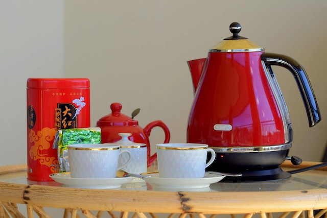
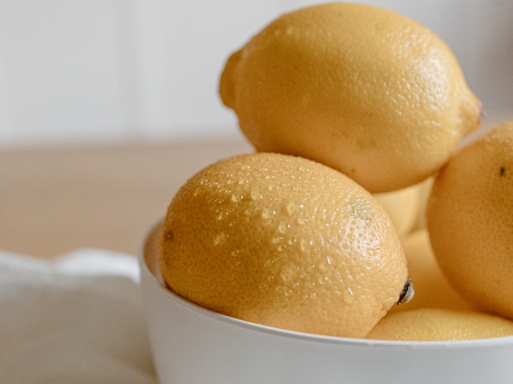

Electric kettles are essential kitchen appliances, offering convenience and energy efficiency for boiling water quickly. However, regular cleaning is crucial to maintain their performance and ensure the quality of your beverages. This comprehensive guide will walk you through various methods to clean your electric kettle effectively.

## Introduction

The humble electric kettle has become a staple in kitchens worldwide, providing quick and efficient hot water for various purposes. However, with regular use, these appliances can accumulate mineral deposits and other residues that affect their performance and the taste of your beverages.

[Electric kettles have revolutionized our kitchens](https://www.electrickettlesguide.com/how-electric-kettles-made-our-life-easier/), but to continue enjoying their benefits, proper maintenance is essential. This guide will provide you with all the information you need to keep your kettle clean, efficient, and long-lasting.

## Why Clean Your Electric Kettle?

Regular cleaning of your electric kettle is crucial for several reasons:

1. **Hygiene**: Prevents bacteria growth and ensures safe drinking water.
2. **Performance**: Maintains heating efficiency, reducing energy consumption.
3. **Taste**: Ensures pure-tasting water for beverages, free from any off-flavors.
4. **Longevity**: Extends the kettle's lifespan by preventing damage from mineral buildup.
5. **Safety**: Prevents potential malfunctions caused by excessive scale buildup.

## The Science Behind Kettle Cleaning

Understanding the science behind kettle cleaning can help you appreciate the importance of regular maintenance:

1. **Mineral Deposition**: When water boils, dissolved minerals (mainly calcium and magnesium) are left behind as the water evaporates.
2. **Scale Formation**: These minerals form a hard, chalky deposit known as limescale or calcium carbonate (CaCO₃).
3. **Heat Transfer Reduction**: Limescale acts as an insulator, reducing the efficiency of heat transfer from the heating element to the water.
4. **Chemical Reactions**: Cleaning agents work by either dissolving the scale (acids) or breaking down its structure (chelating agents).

For more on how water quality affects kettles, see our guide on [best kettles for hard water](https://www.electrickettlesguide.com/best-kettles-for-hard-water/).

## Understanding Limescale

Limescale is a common issue, especially in hard water areas. It's caused by mineral deposits left behind when water evaporates.

**Effects of Limescale:**
- Reduces kettle efficiency by up to 10%
- Affects taste of water, imparting a chalky flavor
- Can flake off into drinks, creating an unpleasant texture
- Shortens appliance lifespan by straining the heating element

**Composition of Limescale:**
- Primarily calcium carbonate (CaCO₃)
- May also contain magnesium carbonate and other mineral salts

## Natural Cleaning Methods

### 1. Vinegar Method

**You'll need:**
- White vinegar
- Water
- Soft brush or cloth

**Steps:**
1. Mix equal parts water and vinegar
2. Fill kettle halfway and boil
3. Let sit for 20-30 minutes
4. Scrub gently and rinse thoroughly
5. Boil fresh water to remove vinegar smell

**Why it works:** The acetic acid in vinegar dissolves calcium carbonate effectively.

### 2. Lemon Juice Method

**You'll need:**
- Lemon juice or fresh lemons
- Water

**Steps:**
1. Mix 1 cup water and 1/2 cup lemon juice
2. Boil the solution
3. Let sit for 1 hour to soften scale
4. Scrub and rinse

**Why it works:** Citric acid in lemon juice acts as a natural descaler.

### 3. Baking Soda Method

**You'll need:**
- 1 teaspoon baking soda
- Water

**Steps:**
1. Mix baking soda with 1 cup water
2. Boil the solution
3. Let sit for 20 minutes
4. Scrub gently and rinse

**Why it works:** Baking soda's mild abrasiveness helps remove loose scale.

## Professional Cleaning Solutions

For stubborn buildup, consider commercial descaling products:

1. Follow package instructions carefully
2. Ensure thorough rinsing after use
3. Suitable for dishwasher-safe kettles (check manufacturer guidelines)

Popular brands include Durgol and Oust, known for their effectiveness in removing stubborn limescale.

## Cleaning the Exterior

1. Use mild dish soap and damp cloth
2. Avoid immersing non-waterproof kettles
3. For stainless steel kettles, use a drop of olive oil for shine
4. Clean the base and power cord with a slightly damp cloth, ensuring they're unplugged first

For more on kettle materials and their care, check our comparison of [stainless steel vs glass vs plastic kettles](https://www.electrickettlesguide.com/stainless-steel-vs-glass-vs-plastic-kettle/).

## Comparison of Cleaning Methods

| Method | Effectiveness | Cost | Eco-Friendliness | Frequency of Use |
|--------|---------------|------|------------------|-------------------|
| Vinegar | High | Low | High | Weekly/Bi-weekly |
| Lemon Juice | Medium | Low | High | Monthly |
| Baking Soda | Medium | Low | High | Monthly |
| Commercial Solutions | High | Medium | Varies | Monthly/Quarterly |

## Environmental Impact of Different Cleaning Methods

When choosing a cleaning method, consider its environmental impact:

1. **Natural Methods**: Vinegar, lemon juice, and baking soda are biodegradable and eco-friendly.
2. **Commercial Descalers**: Some are more environmentally friendly than others. Look for biodegradable options.
3. **Water Usage**: All methods require water for rinsing. Minimize waste by using the rinse water for plants.

For eco-conscious consumers, explore our guide on [ceramic electric kettles](https://www.electrickettlesguide.com/best-ceramic-electric-kettles/), which often require less frequent cleaning.

## Cleaning Frequency Based on Water Types

The frequency of cleaning depends largely on your water type:

1. **Soft Water**: Clean every 4-6 weeks
2. **Moderately Hard Water**: Clean every 2-3 weeks
3. **Very Hard Water**: Clean weekly

To determine your water hardness, check with your local water supplier or use a home testing kit.

## Special Considerations for Different Kettle Materials

Different kettle materials may require specific care:

1. **Stainless Steel**: Resistant to staining but may show water spots. Use a cloth dampened with vinegar to remove.
2. **Glass**: Prone to showing scale buildup more visibly. Clean more frequently to maintain appearance.
3. **Plastic**: Can retain odors. Use baking soda method to neutralize smells.
4. **Ceramic**: May develop crazing (fine cracks in glaze). Clean gently to avoid exacerbating this.

For material-specific advice, see our article on [what to check when buying an electric kettle](https://www.electrickettlesguide.com/what-to-check-when-buying-an-electric-kettle/).

## Tips for Maintaining Your Electric Kettle

1. Clean regularly (weekly or bi-weekly)
2. Use filtered water to reduce mineral buildup
3. Empty kettle after each use
4. Avoid using abrasive materials on interior or exterior
5. Descale before limescale becomes visible
6. Check and clean the filter regularly

## Troubleshooting Common Cleaning Issues

1. **Persistent Scale**: Try a longer soak or repeat the cleaning process.
2. **Discoloration**: Use a paste of baking soda and water for gentle scrubbing.
3. **Odors**: Boil water with a tablespoon of baking soda to neutralize smells.
4. **Stubborn Stains**: Mix cream of tartar with water to form a paste and apply to stains.

## FAQs About Cleaning Electric Kettles

1. **Q: How often should I clean my electric kettle?**
   A: Clean it every 1-2 weeks, or more frequently if you live in a hard water area.

2. **Q: Can I use bleach to clean my kettle?**
   A: No, avoid harsh chemicals like bleach. Stick to natural solutions or specific descaling products.

3. **Q: Is it safe to clean a glass electric kettle the same way as a metal one?**
   A: Yes, but be gentler with glass kettles. For specific tips, see our guide on [best glass kettle models](https://www.electrickettlesguide.com/a-brutal-selection-of-the-best-glass-kettle-models/).

4. **Q: How do I know if my kettle needs cleaning?**
   A: Look for visible scale, changes in boiling time, or alterations in water taste.

5. **Q: Can I use the same cleaning methods for kettles with exposed elements?**
   A: Be cautious with exposed elements. Refer to the manufacturer's guidelines and avoid submerging the element directly.

## Conclusion

Regular cleaning of your electric kettle is essential for maintaining its efficiency, ensuring the quality of your beverages, and prolonging its lifespan. By using these natural and professional cleaning methods, you can keep your kettle in top condition.

Remember, prevention is key. Using filtered water and emptying your kettle after each use can significantly reduce the frequency of deep cleaning needed. For those interested in minimizing maintenance, consider exploring our guide on [best variable temperature kettles](https://www.electrickettlesguide.com/best-variable-temperature-kettles/), which often come with advanced features for easier cleaning and maintenance.

By following these cleaning and maintenance tips, you'll ensure that your electric kettle remains a reliable and efficient appliance in your kitchen for years to come. Not only will you enjoy better-tasting beverages, but you'll also contribute to the longevity of your appliance and potentially save on energy costs in the long run.
