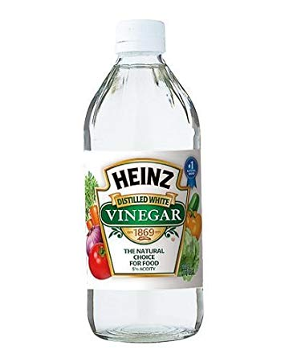

Ceramic electric kettles are popular for their aesthetic appeal and efficient water heating. However, with regular use, especially in hard water areas, these kettles can accumulate mineral deposits that affect their performance and longevity. This guide will walk you through various methods to clean your ceramic electric kettle effectively.

## Introduction

Ceramic electric kettles have gained popularity in recent years, combining the traditional charm of ceramic with modern electric efficiency. These kettles not only add a touch of elegance to your kitchen but also offer excellent heat retention properties.

[Electric kettles have revolutionized our kitchens](https://www.electrickettlesguide.com/how-electric-kettles-made-our-life-easier/), and ceramic models bring their unique benefits to this innovation. However, to continue enjoying these benefits, proper maintenance is crucial.

## Understanding Ceramic Kettles and Their Properties

Ceramic kettles offer several advantages:

1. **Heat Retention**: Ceramic is excellent at retaining heat, keeping water warmer for longer.
2. **Taste Neutrality**: Unlike some metal kettles, ceramic doesn't impart any flavor to the water.
3. **Aesthetic Appeal**: Available in various designs and colors to match kitchen decor.
4. **Durability**: High-quality ceramic is resistant to scratches and stains.

However, ceramic kettles also have unique considerations:

- **Porosity**: Ceramic can be slightly porous, potentially absorbing minerals over time.
- **Weight**: Generally heavier than plastic or some metal kettles.
- **Fragility**: More susceptible to chipping or cracking if mishandled.

For more on kettle materials, see our comparison of [stainless steel vs glass vs plastic kettles](https://www.electrickettlesguide.com/stainless-steel-vs-glass-vs-plastic-kettle/).

## The Science Behind Mineral Buildup

Understanding why mineral buildup occurs can help in prevention and cleaning:

1. **Hard Water**: Contains high levels of dissolved minerals, primarily calcium and magnesium.
2. **Evaporation**: As water boils, it evaporates, leaving minerals behind.
3. **Limescale Formation**: These minerals form a hard, chalky deposit known as limescale.
4. **Impact on Kettle**: Limescale can reduce heating efficiency and affect water taste.

For more information on dealing with hard water, check our guide on [best kettles for hard water](https://www.electrickettlesguide.com/best-kettles-for-hard-water/).

## Why Regular Cleaning is Important

Regular cleaning of your ceramic electric kettle is crucial for several reasons:

1. **Maintains efficiency**: Prevents mineral buildup that can slow heating and increase energy consumption.
2. **Extends kettle life**: Regular cleaning prevents damage to heating elements and internal components.
3. **Ensures taste quality**: Removes residues that can affect water taste and clarity.
4. **Hygiene**: Keeps your kettle sanitary for daily use, preventing potential bacterial growth.
5. **Preserves appearance**: Regular cleaning maintains the kettle's aesthetic appeal.

For more on kettle maintenance, check our general guide on [how to clean an electric kettle](https://www.electrickettlesguide.com/how-to-clean-an-electric-kettle/).

## Effective Cleaning Methods

### 1. Using Distilled White Vinegar

**You'll need:**
- Distilled white vinegar
- Water
- Soft brush or cloth
- Microfiber cloth

**Steps:**
1. Mix equal parts water and white vinegar in the kettle
2. Boil the solution and let it cool for 30 minutes
3. Wipe exterior with a cloth dipped in the solution
4. Gently scrub interior with a soft brush
5. Rinse thoroughly with clean water at least 3 times
6. Boil plain water twice to remove any vinegar smell

**Why it works**: The acetic acid in vinegar effectively dissolves mineral deposits without damaging the ceramic surface.

### 2. Lemon Water Method

**Ingredients:**
- 500ml water
- 1 lemon, sliced

**Steps:**
1. Fill kettle with water and add lemon slices
2. Boil the lemon water and let it sit for 30 minutes
3. Empty and wipe interior with a damp cloth
4. For stubborn stains, make a paste with lemon juice and baking soda
5. Rinse thoroughly at least 5 times
6. Boil fresh water to remove any lemon taste

**Why it works**: Citric acid in lemons is a natural descaler and disinfectant.

### 3. Baking Soda Solution

**You'll need:**
- 30g (2 tbsp) baking soda
- 500ml water

**Steps:**
1. Mix baking soda and water in kettle
2. Boil the solution and let it cool for 20 minutes
3. Scrub gently with a soft brush
4. Rinse thoroughly with cold water
5. Repeat if necessary for stubborn buildup

**Why it works**: Baking soda's mild abrasiveness helps remove scale without scratching the ceramic.

### 4. Commercial Cleaning Solutions

Many commercial products are available specifically for kettle cleaning. Always follow the manufacturer's instructions when using these products. Look for solutions that are:

- Safe for ceramic surfaces
- Biodegradable
- Food-safe

## Environmental Considerations in Kettle Cleaning

When cleaning your ceramic kettle, consider the environmental impact:

1. **Natural Cleaners**: Vinegar, lemon, and baking soda are eco-friendly options.
2. **Water Conservation**: Reuse rinse water for plants or cleaning.
3. **Eco-friendly Commercial Products**: Choose biodegradable and phosphate-free options.
4. **Frequency**: Regular light cleaning reduces the need for harsh chemicals.

For eco-conscious consumers, explore our guide on [best ceramic electric kettles](https://www.electrickettlesguide.com/best-ceramic-electric-kettles/), which often have features that make them easier to clean and maintain.

## Tips for Maintaining Your Ceramic Electric Kettle

1. **Use a limescale catcher**: Slows mineral buildup inside the kettle.
2. **Regular cleaning schedule**: Clean interior bi-weekly, exterior weekly.
3. **Consider water type**: Use filtered water to reduce mineral buildup.
4. **Empty after use**: Don't leave water standing in the kettle.
5. **Gentle handling**: Avoid thermal shock by not filling a hot kettle with cold water.
6. **Dry storage**: Store the kettle with the lid open to prevent moisture buildup.

## Comparison of Cleaning Methods

| Method | Effectiveness | Cost | Eco-Friendliness | Frequency of Use |
|--------|---------------|------|------------------|-------------------|
| Vinegar | High | Low | High | Bi-weekly |
| Lemon Water | Medium | Low | High | Monthly |
| Baking Soda | Medium | Low | High | Monthly |
| Commercial Solutions | High | Medium | Varies | As needed |

## Troubleshooting Common Cleaning Issues

1. **Stubborn Stains**: For persistent stains, create a paste with baking soda and water, apply, and let sit before scrubbing gently.
2. **Odors**: If vinegar or lemon smell persists, boil water with a few drops of vanilla extract.
3. **Discoloration**: Light staining can often be removed with a mixture of cream of tartar and water.
4. **Scratches**: While not removable, minor scratches can be minimized by regularly applying a small amount of mineral oil to the surface.

## Choosing the Right Ceramic Kettle for Easy Maintenance

When selecting a ceramic kettle, consider these features for easier cleaning:

1. **Wide Opening**: Allows easier access for cleaning.
2. **Smooth Interior**: Fewer crevices where limescale can accumulate.
3. **Removable Filter**: Easier to clean and replace when necessary.
4. **Quality Glaze**: A good glaze helps prevent staining and mineral absorption.

For more tips on selecting the right kettle, read our article on [what to check when buying an electric kettle](https://www.electrickettlesguide.com/what-to-check-when-buying-an-electric-kettle/).

## FAQs About Cleaning Ceramic Electric Kettles

1. **Q: Can I use bleach to clean my ceramic kettle?**
   A: No, avoid harsh chemicals like bleach as they can damage the kettle and are unsafe for food-contact surfaces.

2. **Q: How often should I clean my ceramic electric kettle?**
   A: Deep clean every 2-4 weeks, depending on usage and water hardness. Wipe down the exterior weekly.

3. **Q: Is it safe to use abrasive scrubbers on ceramic kettles?**
   A: Avoid abrasive materials as they can scratch the ceramic surface. Use soft brushes or cloths.

4. **Q: Can I put my ceramic kettle in the dishwasher?**
   A: Generally not recommended. Always check the manufacturer's instructions for specific care guidelines.

5. **Q: How do I know if my ceramic kettle needs descaling?**
   A: Look for visible scale buildup, longer boiling times, or changes in water taste.

## Conclusion

Keeping your ceramic electric kettle clean is essential for its performance, longevity, and the quality of your hot beverages. By using these natural and effective cleaning methods regularly, you can ensure that your kettle remains efficient, hygienic, and continues to be a beautiful addition to your kitchen.

Remember, prevention is key. Using filtered water and emptying your kettle after each use can significantly reduce the frequency of deep cleaning needed. For those in hard water areas, consider using a water softener or filtering system to reduce mineral buildup.

Regular maintenance not only keeps your kettle in top condition but also contributes to energy efficiency and better-tasting beverages. With proper care, your ceramic electric kettle can provide years of reliable service and aesthetic pleasure in your kitchen.

For more insights on electric kettles and their maintenance, explore our other articles:
- [Are Electric Kettles Energy Efficient?](https://www.electrickettlesguide.com/are-electric-kettles-energy-efficient/)
- [Best Variable Temperature Kettles](https://www.electrickettlesguide.com/best-variable-temperature-kettles/)
- [How to Make Your Kettle Quieter](https://www.electrickettlesguide.com/how-to-make-your-kettle-quieter/)

By following these cleaning and maintenance tips, you'll ensure that your ceramic electric kettle remains a reliable, efficient, and beautiful appliance in your kitchen for years to come.
