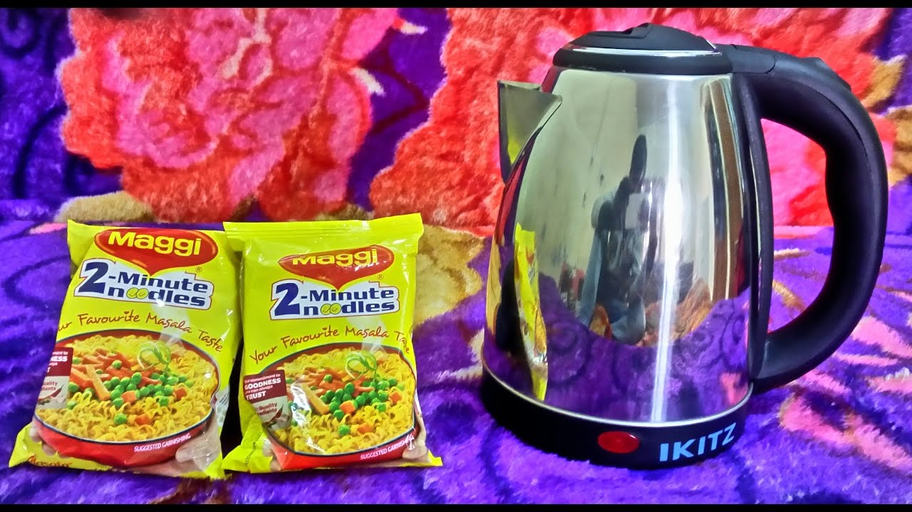

Maggi noodles are a beloved snack for many, offering a quick and satisfying meal option. While traditionally prepared on a stovetop, you can easily cook Maggi using an electric kettle. This guide will show you how to make the most of your electric kettle for cooking these instant noodles, along with tips on choosing the right kettle for the job.

## Introduction

The versatility of electric kettles extends far beyond boiling water for tea or coffee. These handy appliances can be a lifesaver when it comes to preparing quick meals, especially in situations where traditional cooking methods are unavailable or impractical.

[Electric kettles have revolutionized our kitchens](https://www.electrickettlesguide.com/how-electric-kettles-made-our-life-easier/), and their ability to cook instant noodles like Maggi is just another testament to their adaptability. Whether you're a college student, a busy professional, or simply looking for a convenient cooking method, this guide will help you master the art of cooking Maggi in an electric kettle.

## Why Use an Electric Kettle for Cooking Maggi?

There are several compelling reasons to use an electric kettle for preparing Maggi noodles:

1. **Speed**: Electric kettles boil water faster than traditional methods, reducing overall cooking time.
2. **Convenience**: Ideal for dorm rooms, offices, or travel situations where kitchen access is limited.
3. **Energy Efficiency**: Uses less power than a stovetop or microwave. For more on efficiency, check our article on [are electric kettles energy efficient](https://www.electrickettlesguide.com/are-electric-kettles-energy-efficient/).
4. **Minimal Cleanup**: One-pot cooking means less dishes to wash afterward.
5. **Portability**: Most electric kettles are compact and easy to transport.
6. **Temperature Control**: Some models offer precise temperature settings for optimal cooking.

For more versatile cooking ideas with kettles, check our guide on [how to cook with just a kettle](https://www.electrickettlesguide.com/how-to-cook-with-just-a-kettle/).

## Best Electric Kettle Features for Cooking Maggi

When choosing an electric kettle for cooking Maggi, look for these features:

### 1. Concealed Heating Element

- Prevents damage to the heating component when cooking noodles
- Easier to clean after cooking, as noodles won't stick to exposed elements
- Ensures even heating for consistent cooking results

### 2. Built-in Timer

- Helps track cooking time accurately
- Ensures perfectly cooked noodles without overcooking
- Useful for other cooking tasks beyond Maggi preparation

### 3. Customizable Temperature Settings

- Allows for optimal cooking temperature, typically around 95°C (203°F) for instant noodles
- Useful for various recipes beyond Maggi, such as different types of tea or coffee

For kettles with this feature, see our guide on [best variable temperature kettles](https://www.electrickettlesguide.com/best-variable-temperature-kettles/).

### 4. Stainless Steel Construction

- Excellent heat conduction for efficient cooking
- Food-grade safety, ensuring no harmful chemicals leach into your food
- Durable and easy to clean, resistant to stains and odors

Learn more about kettle materials in our [stainless steel vs. glass vs. plastic kettle comparison](https://www.electrickettlesguide.com/stainless-steel-vs-glass-vs-plastic-kettle/).

## Nutritional Considerations for Instant Noodles

While Maggi noodles are convenient, it's important to be aware of their nutritional content:

- **High in Sodium**: Most instant noodles contain high levels of salt.
- **Low in Fiber and Protein**: They're primarily a source of carbohydrates.
- **Contains Preservatives**: To maintain long shelf life.

To make your Maggi meal more nutritious:
1. Add vegetables for fiber and vitamins
2. Include a protein source like eggs or tofu
3. Use only half the seasoning packet to reduce sodium intake
4. Consider whole grain or vegetable-based instant noodles as alternatives

## Step-by-Step Guide to Cooking Maggi in an Electric Kettle

Follow these steps for perfect kettle-cooked Maggi:

1. **Boil Water**:
   - Add 400ml (1.5 cups) of water to your kettle
   - Bring to a boil

2. **Add Noodles**:
   - Once boiling, carefully add Maggi noodles
   - Stir gently for 2 minutes to prevent sticking

3. **Add Flavoring**:
   - Mix in the flavor sachet (consider using only half for reduced sodium)
   - Stir well to distribute evenly

4. **Cook and Rest**:
   - Let noodles cook for an additional 1-2 minutes
   - Turn off kettle and let noodles sit for 1 minute to absorb flavor

5. **Serve**:
   - Drain excess water if desired for thicker noodles
   - Transfer to a bowl and add any additional toppings

Total Cooking Time: Approximately 4-5 minutes

## Customizing Your Maggi: Add-ins and Variations

Enhance your kettle-cooked Maggi with these additions:

1. **Vegetables**: Add frozen peas, corn, or finely chopped carrots before cooking
2. **Protein**: Drop in a beaten egg while stirring for an egg-drop effect
3. **Spices**: Experiment with garlic powder, chili flakes, or black pepper
4. **Herbs**: Fresh cilantro or green onions added after cooking
5. **Sauces**: A dash of soy sauce or sriracha for extra flavor

## Comparing Kettle Cooking to Traditional Methods

| Method | Cooking Time | Energy Use | Convenience | Cleanup |
|--------|--------------|------------|--------------|---------|
| Electric Kettle | 4-5 minutes | Low | High | Easy |
| Stovetop | 5-7 minutes | Moderate | Moderate | Moderate |
| Microwave | 3-4 minutes | Moderate | High | Easy |

Electric kettle cooking stands out for its combination of speed, energy efficiency, and convenience.

## Safety Precautions When Cooking in Electric Kettles

1. **Avoid Overfilling**: Leave space for noodles and boiling action.
2. **Use Caution with Steam**: Be careful when opening the lid to avoid burns.
3. **Handle with Care**: Use oven mitts when touching the kettle during and after cooking.
4. **Clean Thoroughly**: Prevent bacterial growth by cleaning after each use.
5. **Check Manufacturer Guidelines**: Ensure your kettle is suitable for cooking noodles.

For more on kettle safety, read our article on [kettle safety ratings](https://www.electrickettlesguide.com/kettle-safety-ratings/).

## Environmental Impact of Kettle Cooking

Cooking Maggi in an electric kettle can be more environmentally friendly:

- **Energy Efficiency**: Kettles use less energy than stovetops for small tasks.
- **Water Conservation**: Precise water measurement reduces waste.
- **Less Packaging**: Buying larger packs of noodles can reduce overall packaging waste.

For eco-friendly options, consider exploring [ceramic electric kettles](https://www.electrickettlesguide.com/best-ceramic-electric-kettles/).

## Tips for Perfect Kettle-Cooked Maggi

1. **Water Ratio**: Use slightly less water than package instructions for thicker noodles
2. **Cooking Time**: Adjust based on preferred noodle texture
3. **Additions**: Add vegetables or eggs for a nutritious boost
4. **Seasoning**: Experiment with adding seasoning at different stages for varied flavor intensity
5. **Cleaning**: Clean kettle thoroughly after use to prevent flavor transfer

For cleaning tips, see our guide on [how to clean an electric kettle](https://www.electrickettlesguide.com/how-to-clean-an-electric-kettle/).

## FAQs About Cooking Maggi in an Electric Kettle

1. **Q: Is it safe to cook Maggi in an electric kettle?**
   A: Yes, if your kettle is designed for cooking. Always check the manufacturer's guidelines.

2. **Q: Can I cook other instant noodles in my kettle?**
   A: Absolutely! The process is similar for most instant noodles.

3. **Q: How do I clean my kettle after cooking Maggi?**
   A: Use mild soap and warm water. For thorough cleaning, see our cleaning guide linked above.

4. **Q: Can I cook pasta in my electric kettle?**
   A: Yes, check our article on [cooking pasta in a kettle](https://www.electrickettlesguide.com/can-you-cook-pasta-in-a-kettle/) for tips.

5. **Q: Will cooking noodles damage my kettle?**
   A: Not if done properly and cleaned afterward. However, check your kettle's warranty to be sure.

## Conclusion

Cooking Maggi noodles in an electric kettle is a quick, easy, and convenient method, especially when traditional cooking options are limited. By choosing the right kettle and following these simple steps, you can enjoy a delicious bowl of Maggi in just a few minutes.

Remember, while Maggi is a tasty treat, it's best enjoyed as part of a balanced diet. Consider adding vegetables or protein to make your kettle-cooked Maggi a more nutritious meal. The versatility of electric kettles makes them a valuable tool for quick cooking, especially in situations where kitchen access is limited.

For more creative uses of your electric kettle and to explore different models suitable for cooking, check out our other articles:
- [What to Check When Buying an Electric Kettle](https://www.electrickettlesguide.com/what-to-check-when-buying-an-electric-kettle/)
- [Best Electric Kettle with Tea Infuser](https://www.electrickettlesguide.com/best-electric-kettle-with-tea-infuser/)
- [Best Smart Kettles](https://www.electrickettlesguide.com/best-smart-kettles/)

Enjoy your quick and easy kettle-cooked Maggi noodles, and don't be afraid to get creative with your additions and variations!
