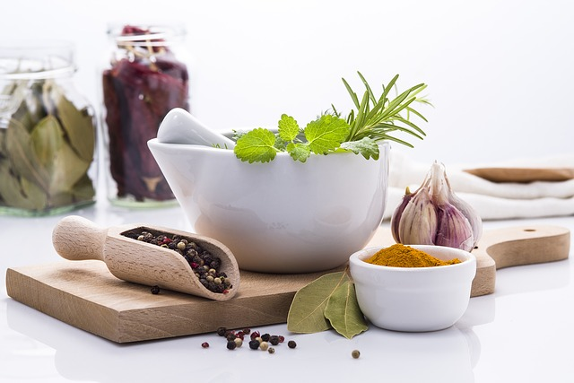
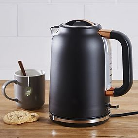
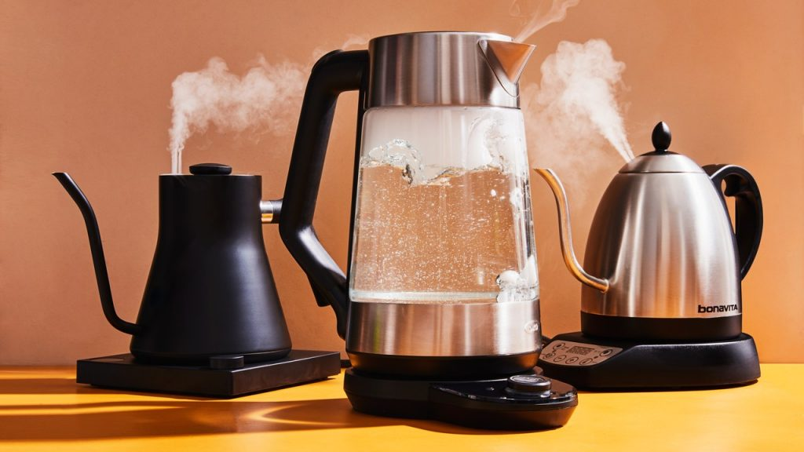
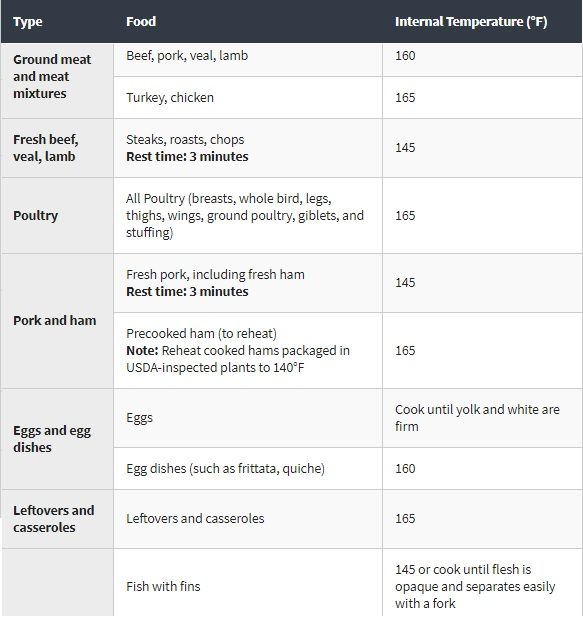
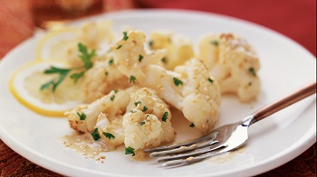
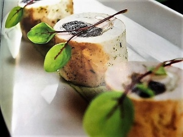
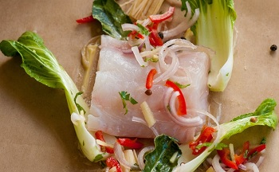
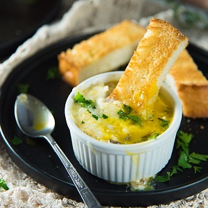
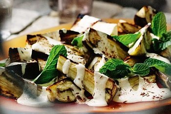
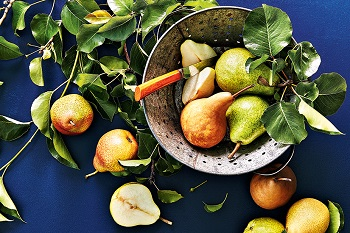

Electric kettles are not just for boiling water for tea or coffee. These versatile appliances can be a game-changer in your kitchen, especially when space or cooking options are limited. This guide will show you how to leverage your electric kettle for cooking, offering tips, tricks, and delicious recipes.

## Introduction

The humble electric kettle has evolved from a simple water boiler to a multipurpose cooking tool. In situations where traditional cooking methods are unavailable or impractical, knowing how to cook with just a kettle can be invaluable. This skill is particularly useful for students, travelers, and those living in small spaces.

[Electric kettles have revolutionized our kitchens](https://www.electrickettlesguide.com/how-electric-kettles-made-our-life-easier/) in many ways, and their cooking capabilities are just another testament to their versatility. Whether you're preparing a quick meal in a dorm room or whipping up a gourmet dish in a hotel, this guide will equip you with the knowledge to make the most of your electric kettle.

## Why Cook with an Electric Kettle?

There are several compelling reasons to consider cooking with an electric kettle:

1. **Speed**: Boils water faster than traditional methods, reducing overall cooking time.
2. **Energy Efficiency**: Consumes less energy than stovetops or ovens. For more on efficiency, check our article on [are electric kettles energy efficient](https://www.electrickettlesguide.com/are-electric-kettles-energy-efficient/).
3. **Versatility**: Useful for various cooking techniques beyond just boiling water.
4. **Space-Saving**: Ideal for small kitchens, dorms, or travel situations where kitchen access is limited.
5. **Portability**: Easy to transport and use in various settings.
6. **Temperature Control**: Some models offer precise temperature settings, perfect for delicate foods.
7. **Safety**: Often equipped with auto shut-off features, reducing the risk of accidents.

## Electric Kettle Functionality for Cooking

Key features that make electric kettles suitable for cooking include:

- **Rapid Boiling**: Quickly reaches boiling point, essential for many recipes.
- **Temperature Control**: Some models allow you to set specific temperatures, ideal for foods that require precise heat.
- **Automatic Shut-off**: Ensures safety and prevents overcooking.
- **Portability and Compact Design**: Perfect for small spaces or travel.
- **Multiple Power Settings**: Allows for different cooking techniques.
- **Keep Warm Function**: Maintains food at serving temperature.

Understanding these features can help you maximize your kettle's cooking potential.

## Best Electric Kettles for Cooking

When choosing a kettle for cooking, consider the following factors:

1. **Capacity**: Look for kettles with at least 1.5-2 liter capacity for versatility.
2. **Material**:
   - Stainless Steel: Durable and easy to clean
   - Glass: Allows visual monitoring of cooking process
   - BPA-free Plastic: Lightweight and affordable
3. **Temperature Control Options**: Precise settings for various cooking needs.
4. **Ease of Cleaning**: Look for wide-mouth designs and removable filters.
5. **Power**: Higher wattage means faster boiling and cooking times.
6. **Additional Features**: Removable base, cordless design, water level indicator.

For specific recommendations, see our guide on [what to check when buying an electric kettle](https://www.electrickettlesguide.com/what-to-check-when-buying-an-electric-kettle/).

## Comparing Kettle Cooking to Other Methods

| Method | Speed | Energy Efficiency | Versatility | Space Required |
|--------|-------|-------------------|--------------|-----------------|
| Electric Kettle | High | High | Moderate | Minimal |
| Stovetop | Moderate | Low | High | Moderate |
| Microwave | High | Moderate | Moderate | Minimal |
| Oven | Low | Low | High | Significant |

Kettle cooking stands out for its combination of speed, energy efficiency, and minimal space requirements.

## Safety Tips for Cooking with a Kettle

Safety should always be a priority when cooking with an electric kettle:

1. **Use Heat-Resistant Containers**: Always use containers that can withstand boiling temperatures.
2. **Be Cautious of Steam and Hot Surfaces**: Use oven mitts or towels when handling hot kettles or containers.
3. **Follow Food Safety Guidelines**: Ensure foods reach safe internal temperatures. Refer to the chart below:

4. **Clean Your Kettle Regularly**: Prevent mineral buildup and ensure hygienic cooking conditions.
5. **Avoid Overfilling**: Leave space for water to boil without spilling.
6. **Use the Right Utensils**: Opt for silicone or wooden utensils to avoid scratching the kettle.
7. **Unplug When Not in Use**: Always disconnect the kettle when finished cooking.

For cleaning tips, read our article on [how to clean an electric kettle](https://www.electrickettlesguide.com/how-to-clean-an-electric-kettle/).

## Nutritional Considerations When Kettle Cooking

While kettle cooking can be convenient, it's important to consider nutritional aspects:

1. **Nutrient Retention**: Boiling can lead to nutrient loss in some foods. Consider steaming where possible.
2. **Balanced Meals**: Incorporate a mix of proteins, carbohydrates, and vegetables in your kettle-cooked meals.
3. **Sodium Intake**: Be mindful of salt content, especially when using packaged or instant foods.
4. **Portion Control**: Use the kettle's capacity to help manage portion sizes.
5. **Healthy Additions**: Enhance nutritional value by adding herbs, spices, or nutrient-rich ingredients to your dishes.

For healthier options, consider exploring [ceramic electric kettles](https://www.electrickettlesguide.com/best-ceramic-electric-kettles/), which are often free from potentially harmful materials.

## Advanced Techniques for Kettle Cooking

Take your kettle cooking skills to the next level with these advanced techniques:

1. **Sous Vide Style Cooking**: Use temperature-controlled kettles for precise cooking of meats and vegetables.
2. **Infusions**: Create flavored oils or herbal infusions for cooking or beverages.
3. **Blanching**: Quickly cook vegetables to preserve color and nutrients.
4. **Steaming**: Use a makeshift steamer basket for healthier cooking.
5. **Rehydrating**: Perfect for dried foods like mushrooms or sun-dried tomatoes.

For more innovative uses, check our guide on [best variable temperature kettles](https://www.electrickettlesguide.com/best-variable-temperature-kettles/).

## Innovative Recipes to Cook with Just a Kettle

### 1. Crunchy Cauliflower with Lemon Butter

**Ingredients:**
- 150g cauliflower
- 20g butter
- Juice of 1/2 lemon
- Salt and pepper
- 2 freezer bags

**Method:**
1. Place cauliflower in one bag, salt in another
2. Boil water in kettle, pour over bags in a container
3. Cover and cook for 15 minutes
4. Serve with lemon butter sauce

### 2. Turkey Roll with Prunes

**Ingredients:**
- 1 turkey fillet
- 3 pitted prunes
- Salt and pepper
- Cellophane
- Curry sauce ingredients

**Method:**
1. Soak prunes in boiled water for 15 minutes
2. Prepare turkey roll with prunes
3. Cook in boiling water for 15-20 minutes
4. Serve with curry sauce

### 3. Fish or Poultry Papillotes

Cook fish or chicken fillets in freezer bags or cellophane with lemon, herbs, and spices.

### 4. Eggs Cocotte with Rose Shrimps

**Ingredients:**
- 1 fresh egg
- 5g butter
- 1 tbsp cream
- 15g shrimps
- Salt and spices

**Method:**
1. Mix shrimp with cream and spices
2. Place in a ramekin with egg
3. Cook in a water bath for 8 minutes

### 5. Aubergine in Paprika

**Ingredients:**
- 125g eggplant
- 30g yogurt
- 10ml olive oil
- Garlic, salt, paprika

**Method:**
1. Slice eggplant thinly
2. Mix with yogurt and spices in a bag
3. Cook in boiling water for 15 minutes

### 6. Pear with Vanilla

**Ingredients:**
- 1 large pear
- 10g sugar
- 10g butter
- Vanilla extract
- Pear alcohol

**Method:**
1. Peel and cube pear
2. Mix with other ingredients in a bag
3. Cook in boiling water for 5 minutes

## Adapting Traditional Recipes for Kettle Use

Many traditional recipes can be adapted for kettle cooking:

1. **Soups and Stews**: Use the kettle to boil ingredients, then let them steep.
2. **Pasta Dishes**: Cook pasta in the kettle, then add pre-made sauce.
3. **Rice-Based Meals**: Cook rice in a heat-safe container inside the kettle.
4. **Vegetable Side Dishes**: Steam or boil vegetables directly in the kettle.
5. **Hot Breakfasts**: Prepare oatmeal or other hot cereals easily.

For more on cooking pasta in a kettle, see our article on [can you cook pasta in a kettle](https://www.electrickettlesguide.com/can-you-cook-pasta-in-a-kettle/).

## Environmental Impact of Kettle Cooking

Kettle cooking can be an environmentally friendly option:

- **Energy Efficiency**: Kettles use less energy than traditional cooking appliances.
- **Water Conservation**: Precise water measurements reduce waste.
- **Reduced Food Waste**: Cooking smaller portions can lead to less food waste.
- **Minimal Packaging**: Many kettle recipes use fresh ingredients, reducing packaging waste.

## FAQs About Cooking with an Electric Kettle

1. **Q: Can I cook pasta in an electric kettle?**
   A: Yes, you can. Check our guide on [cooking pasta in a kettle](https://www.electrickettlesguide.com/can-you-cook-pasta-in-a-kettle/).

2. **Q: Is it safe to cook eggs in an electric kettle?**
   A: Yes, with proper technique. See our article on [boiling eggs in an electric kettle](https://www.electrickettlesguide.com/how-to-boil-eggs-into-an-electric-kettle/).

3. **Q: Can I use my kettle for cooking if I use it for tea?**
   A: Yes, but clean it thoroughly between uses to avoid flavor transfer.

4. **Q: Are there special kettles designed for cooking?**
   A: While most kettles can be used for basic cooking, some models are designed with cooking features. Check our [best electric kettles guide](https://www.electrickettlesguide.com/best-electric-kettles-made-in-the-usa/) for options.

5. **Q: How do I clean my kettle after cooking in it?**
   A: Use a mixture of vinegar and water to clean, then rinse thoroughly. For detailed instructions, see our cleaning guide linked earlier.

## Conclusion

Cooking with an electric kettle opens up a world of culinary possibilities, especially in situations where traditional cooking methods aren't available. From simple meals to gourmet dishes, your kettle can be a versatile tool in the kitchen. Remember to always prioritize safety and cleanliness when using your kettle for cooking.

By mastering these techniques and recipes, you can transform your electric kettle from a simple water boiler into a multi-functional cooking appliance. Whether you're a college student, a traveler, or someone looking to simplify your cooking process, these kettle cooking methods can be a game-changer.

The versatility of electric kettles extends far beyond making tea and coffee. With creativity and the right techniques, you can prepare a wide range of delicious and nutritious meals using just this simple appliance. As you experiment with kettle cooking, you'll likely discover even more innovative ways to use this versatile kitchen tool.

For more insights on electric kettles and their uses, explore our other articles:
- [Best Smart Kettles](https://www.electrickettlesguide.com/best-smart-kettles/)
- [How Electric Kettles Made Our Life Easier](https://www.electrickettlesguide.com/how-electric-kettles-made-our-life-easier/)
- [Best Electric Kettle with Tea Infuser](https://www.electrickettlesguide.com/best-electric-kettle-with-tea-infuser/)

Happy cooking with your electric kettle!
