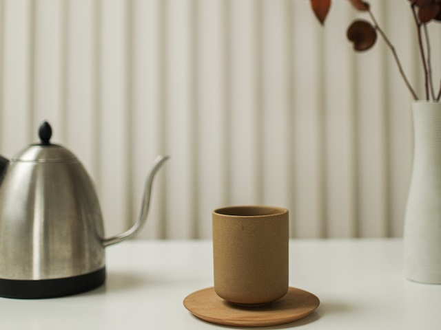
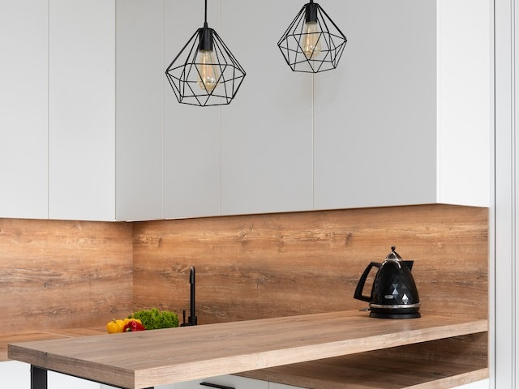
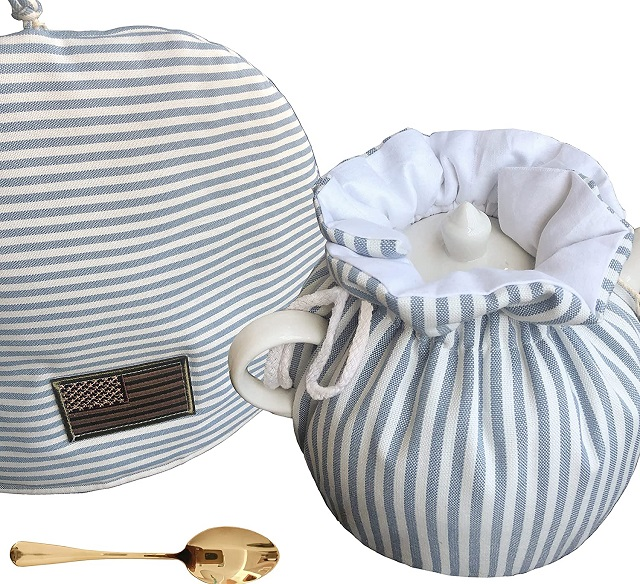

Is your electric kettle disrupting your peace with its jet engine-like noise? You're not alone in this common household annoyance. Fortunately, there are several effective ways to make your kettle quieter. This comprehensive guide will walk you through various solutions, from design considerations to practical tips.

## Introduction

Electric kettles have become indispensable in modern kitchens, offering convenience and efficiency in boiling water. However, the noise they produce can be a significant drawback, especially in quiet environments or during early morning hours.

[Electric kettles have revolutionized our kitchens](https://www.electrickettlesguide.com/how-electric-kettles-made-our-life-easier/), but their noise levels can sometimes be a nuisance. This guide aims to help you enjoy the benefits of your electric kettle without the accompanying racket.

## Understanding Kettle Noise: Causes and Impact

Before diving into solutions, it's important to understand why kettles make noise:

1. **Rapid Boiling**: The primary source of noise is the violent process of water boiling.
2. **Steam Production**: As water turns to steam, it creates pressure and noise.
3. **Vibration**: The kettle's body can vibrate as water boils, amplifying noise.
4. **Mineral Buildup**: Limescale can increase turbulence and noise during boiling.

The impact of kettle noise goes beyond mere annoyance:
- **Sleep Disruption**: Early morning kettle use can wake light sleepers.
- **Stress**: Constant loud noises can contribute to stress and anxiety.
- **Communication Interference**: Loud kettles can interrupt conversations or phone calls.

Understanding these factors can help in choosing the right noise reduction strategy.

## The Science Behind Kettle Noise Reduction

Reducing kettle noise involves several scientific principles:

1. **Insulation**: Double-wall designs create an air barrier that dampens sound.
2. **Surface Tension**: Certain materials and coatings can reduce the size of bubbles, lowering noise.
3. **Heat Distribution**: Even heat distribution can reduce localized boiling and noise.
4. **Acoustic Dampening**: Materials like silicone can absorb vibrations and reduce noise transmission.

For more on the science of kettles, check our article on [are electric kettles energy efficient](https://www.electrickettlesguide.com/are-electric-kettles-energy-efficient/), which touches on heat transfer principles.

## 3 Effective Strategies to Reduce Kettle Noise

### 1. Choose the Right Design for a Quiet Kettle

When selecting a kettle, certain features can significantly reduce noise:

- **Double-wall insulation**: Provides better sound dampening
- **Material combination**: Metal and glass constructions often run quieter
- **Base plate coating**: Special coatings with diffuser rings break up boiling bubbles, reducing noise
- **Rapid boil and auto-shutoff**: These features minimize boiling time and noise duration
- **Gooseneck spouts**: Can reduce noise by controlling water flow

For more on kettle features, check our guide on [what to check when buying an electric kettle](https://www.electrickettlesguide.com/what-to-check-when-buying-an-electric-kettle/).

### 2. Regular Descaling: A Simple Solution for Noisy Kettles

Mineral buildup can increase kettle noise. Regular descaling helps:

- Removes mineral deposits
- Improves efficiency
- Reduces noise during operation
- Extends kettle lifespan

Descaling method:
1. Mix equal parts water and white vinegar
2. Boil the mixture in the kettle
3. Let it sit for an hour or overnight
4. Clean with dish soap and rinse thoroughly
5. Boil plain water 2-3 times to remove any vinegar smell

For detailed cleaning instructions, see our article on [how to clean an electric kettle](https://www.electrickettlesguide.com/how-to-clean-an-electric-kettle/).

### 3. Creative Methods to Muffle Kettle Noise

Try these unconventional but effective methods:

1. **Sound-absorbing mat**: Place the kettle on a mat designed to dampen vibrations and noise.

2. **Tea cozy**: Use a snug-fitting cozy to muffle boiling sounds.

3. **Relocate the kettle**: Place it away from walls or corners to reduce echo.

4. **Timing considerations**: Use the kettle when background noise is higher, if possible.

5. **Water level adjustment**: Boiling less water can sometimes reduce noise levels.

## Environmental Considerations in Noise Reduction

When addressing kettle noise, consider the environmental impact:

1. **Energy Efficiency**: Quieter kettles often boil water more efficiently, saving energy.
2. **Durability**: Long-lasting kettles reduce electronic waste.
3. **Natural Cleaning Methods**: Using vinegar for descaling is eco-friendly.
4. **Material Choice**: Opt for kettles made from recyclable or sustainable materials.

For eco-friendly options, explore our guide on [ceramic electric kettles](https://www.electrickettlesguide.com/best-ceramic-electric-kettles/), which are often quieter and more environmentally friendly.

## Innovative Technologies in Quiet Kettle Design

Recent advancements have led to quieter kettle designs:

1. **Variable Temperature Control**: Allows for gentler boiling. See our [best variable temperature kettles](https://www.electrickettlesguide.com/best-variable-temperature-kettles/) guide.
2. **Smart Kettles**: Some models adjust boiling intensity based on water volume.
3. **Ultrasonic Technology**: Experimental designs use ultrasonic waves to heat water silently.
4. **Magnetic Induction**: Provides even heating and potentially quieter operation.

## DIY Solutions for Noise Reduction

For those who enjoy hands-on solutions:

1. **Insulation Wrapping**: Carefully wrap the kettle body in heat-resistant insulation material.
2. **Silicone Base**: Create a custom silicone base to absorb vibrations.
3. **Water Softener**: Install a water softener to reduce mineral buildup.
4. **Noise-Cancelling Enclosure**: Build a decorative, ventilated enclosure for your kettle.

Always prioritize safety and consult product manuals before modifying your kettle.

## Comparison of Noise Reduction Methods

| Method | Effectiveness | Ease of Implementation | Cost | Longevity |
|--------|---------------|------------------------|------|-----------|
| Design Features | High | Requires new purchase | High | Long-term |
| Regular Descaling | Medium | Easy | Low | Ongoing |
| Sound-absorbing Mat | Medium | Very Easy | Low | Long-term |
| Tea Cozy | Low-Medium | Easy | Low | Long-term |
| Relocation | Low-Medium | Very Easy | Free | Immediate |
| DIY Solutions | Varies | Moderate-Difficult | Low-Medium | Varies |

## FAQs About Quieter Kettles

1. **Q: Do glass kettles make less noise than metal ones?**
   A: Not necessarily. The design and quality matter more than the material alone.

2. **Q: Can I add something to the water to make it boil more quietly?**
   A: It's not recommended as it may damage your kettle or affect water quality.

3. **Q: Are expensive kettles always quieter?**
   A: While higher-end models often have better noise-reduction features, price isn't always an indicator of quietness.

4. **Q: How often should I descale my kettle to keep it quiet?**
   A: Every 1-3 months, depending on water hardness in your area.

5. **Q: Can using filtered water help reduce kettle noise?**
   A: Yes, filtered water can reduce mineral buildup, potentially lowering noise over time.

## When to Consider Replacing Your Kettle

If noise persists after trying these methods, it might be time for a new kettle. Modern models often come with improved noise-reduction technology. Consider:

- [Best Quiet Electric Kettles](https://www.electrickettlesguide.com/best-quiet-electric-kettles/)
- [Best Smart Kettles](https://www.electrickettlesguide.com/best-smart-kettles/), which often include noise-reduction features

When shopping for a new kettle, look for:
1. Advertised quiet operation
2. Customer reviews mentioning noise levels
3. Advanced features like variable temperature control
4. Reputable brands known for quality and durability

## Conclusion

A noisy kettle doesn't have to be a permanent fixture in your kitchen. By understanding the causes of kettle noise, choosing the right design, maintaining your kettle properly, and employing creative noise-reduction techniques, you can significantly reduce kettle noise and enjoy a more peaceful brewing experience.

Remember, the quietest kettle is one that's well-maintained and suited to your specific needs. Whether you opt for a new, quieter model or implement these noise-reduction strategies, you're on your way to more serene tea and coffee times.

The quest for a quieter kettle reflects a broader trend towards creating more peaceful living spaces. As technology advances, we can expect even more innovative solutions to common household noises, enhancing our daily comfort and well-being.

For more insights on electric kettles and their maintenance, explore our other articles:
- [Stovetop Kettle vs Electric Kettle: Which One is Better?](https://www.electrickettlesguide.com/stovetop-kettle-vs-electric-kettle-which-one-is-better/)
- [Best Electric Kettles Made in the USA](https://www.electrickettlesguide.com/best-electric-kettles-made-in-the-usa/)
- [Can Electric Kettles Explode?](https://www.electrickettlesguide.com/can-electric-kettles-explode/)

Embrace these tips, and transform your noisy kettle into a quiet companion for your daily brewing rituals!
