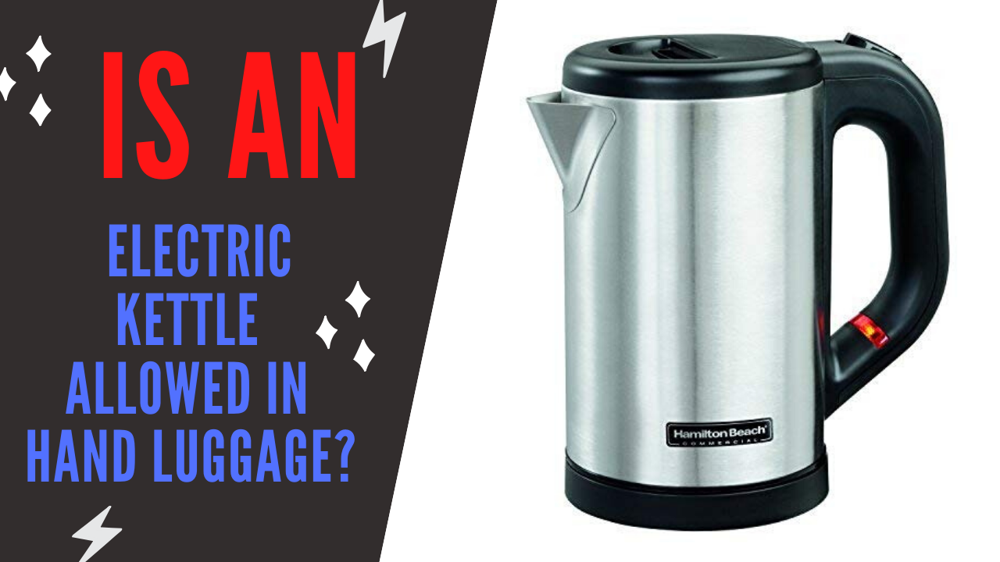

Traveling with your favorite appliances can be tricky, especially when it comes to items like electric kettles. This guide will help you understand the rules surrounding electric kettles in hand luggage and provide tips for hassle-free travel.

## Introduction

For many, a comforting cup of tea or coffee is an essential part of their daily routine, even while traveling. Electric kettles offer convenience and efficiency, making them a popular choice for travelers. However, navigating airport security with electrical appliances can be challenging.

[Electric kettles have revolutionized our kitchens](https://www.electrickettlesguide.com/how-electric-kettles-made-our-life-easier/), and many people want to bring this convenience on their travels. This guide aims to clarify the rules and provide practical advice for traveling with your electric kettle.

## Understanding Hand Luggage Regulations

Hand luggage, also known as carry-on baggage, refers to items passengers are allowed to bring into the aircraft cabin. These typically include:

- Small bags or suitcases
- Personal items (e.g., purses, laptops)
- Essential items needed during the journey

Airlines and airports have specific regulations regarding hand luggage to ensure passenger safety and comfort. These rules can vary by airline and country, so it's crucial to check the specific guidelines for your flight.

Key factors in hand luggage regulations include:
1. Size and weight restrictions
2. Prohibited items
3. Liquid limitations
4. Electronic device policies

For more on travel-friendly appliances, see our guide on [best foldable electric kettle for traveling](https://www.electrickettlesguide.com/best-foldable-electric-kettle-for-traveling/).

## Can You Bring an Electric Kettle in Your Hand Luggage?

The short answer is: Yes, in most cases, you can bring an electric kettle in your hand luggage. However, there are some important considerations:

1. **Size and Weight Restrictions**: The kettle must fit within your airline's size and weight limits for hand luggage. Most airlines allow a main carry-on bag and a personal item, but size limits vary.

2. **Security Checks**: Be prepared for additional screening, as electrical items often require closer inspection. You may need to remove the kettle from your bag and place it in a separate bin for X-ray scanning.

3. **Airline Policies**: Some airlines may have specific rules about electrical appliances. Always check your airline's website or contact their customer service for the most up-to-date information.

4. **Cord Management**: Ensure the kettle's cord is neatly wrapped to avoid tangling with other items during security checks.

5. **Voltage Compatibility**: If traveling internationally, check if your kettle is compatible with the voltage at your destination.

For travel-friendly options, check our guide on [best small electric kettle of 17 ounces/0.5L](https://www.electrickettlesguide.com/best-small-electric-kettle-of-17-ounces-0-5l/).

## Items Generally Prohibited in Hand Luggage

While electric kettles are usually allowed, many items are prohibited in hand luggage for safety reasons:

| Prohibited Items | Examples |
|------------------|----------|
| Sharp Objects    | Knives, scissors (over a certain length) |
| Sporting Equipment | Baseball bats, golf clubs |
| Flammable Items  | Aerosols, fuel |
| Firearms and Weapons | Including replicas and toys |
| Large Liquids    | Containers over 100ml/3.4oz |
| Explosive Materials | Fireworks, flares |

Always check your airline's specific guidelines before packing, as regulations can change and vary between airlines and countries.

## International Travel Considerations

When traveling internationally with an electric kettle, keep these points in mind:

1. **Voltage Differences**: Many countries use different voltages. Ensure your kettle is dual voltage or bring a converter.
2. **Plug Adaptors**: Different countries have different plug types. Bring the appropriate adaptor for your destination.
3. **Customs Regulations**: Some countries may have restrictions on bringing in electrical appliances.
4. **Declaration**: In some cases, you may need to declare electronic items at customs.

For more on international-friendly kettles, see our article on [best electric kettles made in the USA](https://www.electrickettlesguide.com/best-electric-kettles-made-in-the-usa/), which often meet international standards.

## Security Screening Process for Electric Appliances

Understanding the security screening process can help you prepare:

1. **Remove from Bag**: You'll likely need to take the kettle out of your luggage for separate screening.
2. **X-Ray Scanning**: The kettle will go through an X-ray machine.
3. **Possible Swab Test**: Security may swab the kettle for traces of explosives.
4. **Manual Inspection**: In some cases, a manual inspection may be necessary.
5. **Powering On**: You might be asked to demonstrate that the kettle functions normally.

Being prepared for these steps can help streamline your security experience.

## Tips for Traveling with an Electric Kettle

1. **Choose a Travel-Friendly Model**: Opt for compact, lightweight kettles designed for travel.
2. **Empty the Kettle**: Ensure it's completely dry before packing to avoid issues with liquid restrictions.
3. **Pack Carefully**: Wrap the kettle in clothing to protect it and other items.
4. **Be Prepared for Security**: Be ready to remove the kettle from your bag for inspection.
5. **Check Voltage Compatibility**: Ensure your kettle works with the voltage at your destination.
6. **Consider Dual-Purpose Items**: Some travel mugs have built-in heating elements, saving space.
7. **Know the Rules**: Familiarize yourself with your airline's and destination's regulations.

For more travel kettle options, see our article on [best electric kettle with cigarette lighter charger plug-in](https://www.electrickettlesguide.com/best-kettle-with-cigarette-lighter-charger-plug-in/).

## Alternative Travel-Friendly Hot Beverage Solutions

If traveling with an electric kettle seems too cumbersome, consider these alternatives:

1. **Immersion Heaters**: Compact devices that heat water in a cup.
2. **Travel French Press**: Combines brewing and drinking in one container.
3. **Instant Hot Water Bags**: Single-use bags that heat up when activated.
4. **Thermos Flasks**: Pre-fill with hot water for later use.
5. **Hotel Amenities**: Many hotels provide kettles or coffee makers in rooms.

These options can provide hot beverages without the need to pack a full-sized kettle.

## Environmental Impact of Traveling with Electric Kettles

Consider the environmental aspects of traveling with an electric kettle:

1. **Energy Efficiency**: Electric kettles are generally more efficient than other heating methods. See our article on [are electric kettles energy efficient](https://www.electrickettlesguide.com/are-electric-kettles-energy-efficient/) for more details.
2. **Reducing Single-Use Items**: Using a personal kettle can reduce reliance on disposable cups and single-use coffee pods in hotels.
3. **Sustainable Materials**: Look for kettles made from recyclable or sustainable materials.
4. **Longevity**: A durable travel kettle can last for years, reducing waste.

For eco-friendly options, explore our guide on [ceramic electric kettles](https://www.electrickettlesguide.com/best-ceramic-electric-kettles/), which are often more durable and environmentally friendly.

## Choosing the Right Travel Kettle

When selecting a kettle for travel, consider these factors:

1. **Size and Weight**: Opt for compact, lightweight models.
2. **Voltage Compatibility**: Look for dual voltage kettles (110V/220V).
3. **Durability**: Choose kettles made from sturdy materials like stainless steel.
4. **Collapsible Design**: Some kettles can be folded or collapsed for easy packing.
5. **Safety Features**: Auto shut-off and boil-dry protection are essential.
6. **Capacity**: Balance between size and sufficient water capacity for your needs.

For more on choosing the right kettle, see our guide on [what to check when buying an electric kettle](https://www.electrickettlesguide.com/what-to-check-when-buying-an-electric-kettle/).

## FAQs About Traveling with Electric Kettles

1. **Q: Can I use my electric kettle on the plane?**
   A: No, in-flight use of personal electric kettles is generally not allowed due to safety regulations and power limitations.

2. **Q: Do I need to declare my electric kettle at security?**
   A: It's best to inform security officers if asked about electronics in your bag. Be prepared to remove it for separate screening.

3. **Q: Can I pack a kettle in my checked luggage instead?**
   A: Yes, electric kettles are usually allowed in checked luggage without restrictions. However, they're better protected in carry-on luggage.

4. **Q: Are there any special considerations for international travel?**
   A: Check voltage compatibility and consider bringing a travel adapter. Be aware of any customs restrictions at your destination.

5. **Q: How do I clean my kettle while traveling?**
   A: Use bottled water and mild soap, or pack some kettle cleaning tablets. For more cleaning tips, see our guide on [how to clean an electric kettle](https://www.electrickettlesguide.com/how-to-clean-an-electric-kettle/).

## Conclusion

While electric kettles are generally allowed in hand luggage, it's crucial to be aware of airline-specific regulations and general security guidelines. Opting for a travel-friendly kettle and being prepared for security checks can make your journey smoother.

Remember, airport security measures are in place to ensure the safety of all passengers. Always prioritize compliance with these regulations, even if it means temporarily parting with certain items.

Traveling with an electric kettle can enhance your trip by providing the comforts of home wherever you go. By choosing the right travel kettle and understanding the rules, you can enjoy your favorite hot beverages while adhering to travel regulations.

For more information on electric kettles and travel, explore our other articles:
- [How to Make Your Kettle Quieter](https://www.electrickettlesguide.com/how-to-make-your-kettle-quieter/)
- [Best Variable Temperature Kettles](https://www.electrickettlesguide.com/best-variable-temperature-kettles/)
- [Can Electric Kettles Explode?](https://www.electrickettlesguide.com/can-electric-kettles-explode/)

By understanding the rules and planning ahead, you can enjoy the convenience of your electric kettle even while traveling. Safe travels and happy brewing!
