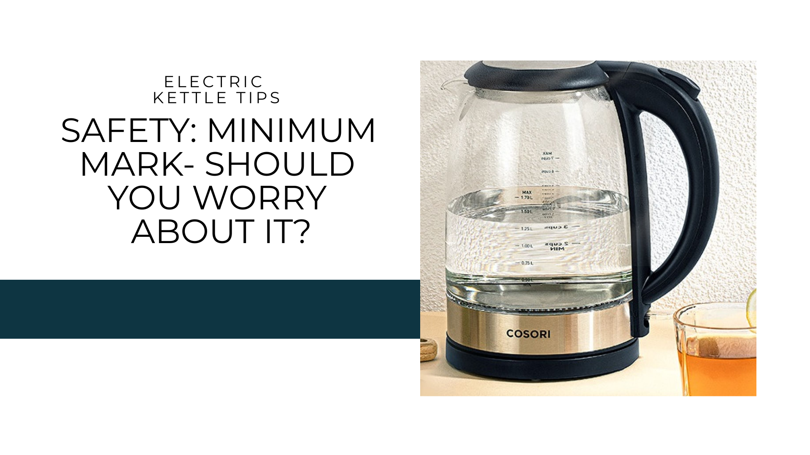
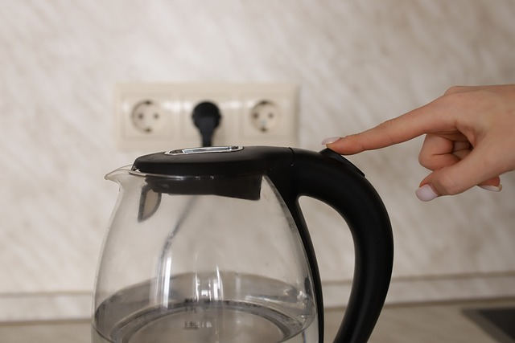
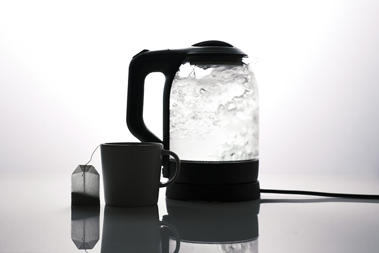
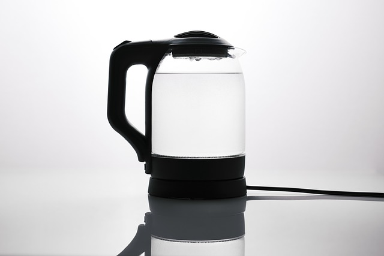

When purchasing an electric kettle, understanding safety ratings is crucial for ensuring a safe and efficient experience. This comprehensive guide will explore kettle safety ratings, focusing on the minimum water mark and its importance.

## Introduction to Kettle Safety Ratings

Electric kettles have become indispensable in modern kitchens, offering convenience and efficiency in boiling water. However, with this convenience comes the responsibility of ensuring safe operation.

[Electric kettles have revolutionized our kitchens](https://www.electrickettlesguide.com/how-electric-kettles-made-our-life-easier/), but understanding their safety features is crucial for optimal use and longevity.

Before buying an electric kettle, always check for safety certifications such as UL (Underwriters Laboratories) or CE (Conformité Européenne). These certifications indicate that the product has undergone rigorous testing and meets safety standards.

Key components of an electric kettle include:
- Heating element
- Internal thermostat
- Power cord
- Water level indicators
- Auto-shutoff mechanism
- Boil-dry protection

For safe usage:
1. Fill with water, not exceeding the maximum level
2. Plug into a power outlet
3. Switch on and wait for boiling
4. Unplug when done and pour carefully

Important safety features to look for:
- Automatic shut-off
- Boil-dry protection
- Cool-touch exterior
- Secure lid locking mechanism
- Concealed heating element

For more on kettle features, check our [guide on what to check when buying an electric kettle](https://www.electrickettlesguide.com/what-to-check-when-buying-an-electric-kettle/).

## Understanding Safety Certifications

Safety certifications play a crucial role in ensuring that electric kettles meet specific safety standards. Here's a breakdown of common certifications:

| Certification | Meaning | Region |
|---------------|---------|--------|
| UL (Underwriters Laboratories) | Meets North American safety standards | USA, Canada |
| CE (Conformité Européenne) | Complies with European health, safety, and environmental protection standards | European Union |
| RoHS (Restriction of Hazardous Substances) | Restricts the use of specific hazardous materials in electrical and electronic products | Global |
| ETL (Electrical Testing Laboratories) | Meets North American safety standards | USA, Canada |

When shopping for an electric kettle, look for these certifications to ensure you're getting a product that meets rigorous safety standards.

## The Science Behind Kettle Safety

Understanding the science behind kettle safety can help you appreciate the importance of safety features:

1. **Thermostat Function**: The thermostat monitors water temperature and triggers the auto-shutoff when boiling point is reached.
2. **Boil-Dry Protection**: Sensors detect when water levels are too low and cut power to prevent damage to the heating element.
3. **Insulation**: Proper insulation prevents the exterior from becoming too hot to touch.
4. **Steam Management**: Designed to safely release steam and prevent pressure buildup.

For more on kettle technology, see our article on [are electric kettles energy efficient](https://www.electrickettlesguide.com/are-electric-kettles-energy-efficient/).

## The Electric Kettle Minimum Mark: Its Importance

The minimum mark on an electric kettle is crucial for safe operation. Here's why it matters:

1. **Safety**: Prevents overheating and potential fire hazards
2. **Efficiency**: Ensures optimal energy use
3. **Longevity**: Protects the kettle's heating element from damage
4. **Proper Functionality**: Ensures accurate temperature readings and auto-shutoff function

### What Happens If You Underfill or Overfill?

| Scenario | Consequences |
|----------|--------------|
| Underfilling | Risk of overheating, element damage, potential fire hazard |
| Overfilling | Water spillage, potential electrical hazards, inefficient boiling |

Always aim to fill between the minimum and maximum marks for safe operation.

## Benefits of Correct Water Levels in Your Kettle

### 1. Avoiding Safety Hazards

- Prevents kettle damage
- Reduces risk of accidents (burns, electrical issues)
- Ensures proper functioning of safety features
- Maintains the integrity of the kettle's internal components

### 2. Extending Appliance Lifespan

- Reduces wear on heating elements
- Prevents scale buildup
- Maintains efficiency over time
- Ensures consistent performance

For tips on maintenance, see our article on [how to clean an electric kettle](https://www.electrickettlesguide.com/how-to-clean-an-electric-kettle/).

### 3. Saving Energy

- Boil only what you need
- Choose appropriate kettle size for your needs
- Consider [energy-efficient models](https://www.electrickettlesguide.com/are-electric-kettles-energy-efficient/)
- Reduce overall electricity consumption

## Common Safety Hazards and How to Avoid Them

1. **Electrical Shock**:
   - Ensure the kettle and power cord are in good condition
   - Never immerse the kettle base in water
   - Use a grounded outlet

2. **Burns and Scalds**:
   - Use the handle and lid carefully
   - Allow the kettle to cool before cleaning
   - Keep away from children and pets

3. **Fire Hazards**:
   - Don't leave the kettle unattended
   - Ensure proper ventilation around the kettle
   - Regularly check for frayed cords or damage

4. **Steam Burns**:
   - Open the lid carefully to avoid steam burns
   - Wait for the kettle to stop steaming before pouring

For more on kettle safety, read our article on [can electric kettles explode](https://www.electrickettlesguide.com/can-electric-kettles-explode/).

## Maintenance Tips for Safe Kettle Operation

Regular maintenance is key to ensuring your kettle remains safe and efficient:

1. **Regular Descaling**: Remove mineral buildup every 1-3 months
2. **Cord Inspection**: Check for frays or damage regularly
3. **Lid and Spout Cleaning**: Ensure these are free from blockages
4. **Base Cleaning**: Wipe the base with a damp cloth (never submerge)
5. **Seal Check**: Regularly inspect the seal around the lid and base

For detailed cleaning instructions, see our guide on [how to clean an electric kettle](https://www.electrickettlesguide.com/how-to-clean-an-electric-kettle/).

## Innovations in Kettle Safety Technology

Recent advancements have led to improved safety features in electric kettles:

1. **Smart Kettles**: WiFi-enabled kettles with remote monitoring and control
2. **Multi-Layer Safety**: Kettles with multiple layers of protection against overheating
3. **Precision Temperature Control**: Allows for optimal brewing temperatures for different beverages
4. **LED Indicators**: Clear visual cues for water levels and operation status
5. **Cordless Design**: Reduces tripping hazards and improves pouring safety

For more on advanced kettle features, check our guide on [best smart kettles](https://www.electrickettlesguide.com/best-smart-kettles/).

## FAQs About Electric Kettle Safety

1. **Q: Can I use my kettle for purposes other than boiling water?**
   A: Some kettles are designed for multiple uses. Check our guide on [how to cook with just a kettle](https://www.electrickettlesguide.com/how-to-cook-with-just-a-kettle/) for safe alternatives.

2. **Q: How often should I descale my kettle?**
   A: Frequency depends on water hardness in your area. Generally, every 1-3 months is recommended.

3. **Q: Are glass kettles safer than plastic ones?**
   A: Both can be safe if they have proper certifications. Glass allows visual monitoring of water levels. For a comparison, see our article on [stainless steel vs. glass vs. plastic kettles](https://www.electrickettlesguide.com/stainless-steel-vs-glass-vs-plastic-kettle/).

4. **Q: Can electric kettles explode?**
   A: While rare, it can happen if safety features fail. Learn more about [kettle safety and potential risks](https://www.electrickettlesguide.com/can-electric-kettles-explode/).

5. **Q: Is it safe to leave water in the kettle after use?**
   A: It's best to empty the kettle after each use to prevent mineral buildup and potential bacterial growth.

## Choosing the Right Kettle for Your Needs

Consider these factors when selecting an electric kettle:

1. **Capacity**: Match to your typical usage
2. **Safety Features**: Look for auto-shutoff and boil-dry protection
3. **Energy Efficiency**: Check power ratings and eco-friendly options
4. **Material**: Choose based on durability and personal preference
5. **Temperature Control**: Consider models with variable temperature settings for different beverages
6. **Brand Reputation**: Research brands known for quality and safety

For specific recommendations, explore our guide on the [best variable temperature kettles](https://www.electrickettlesguide.com/best-variable-temperature-kettles/).

## Conclusion

Understanding and adhering to kettle safety ratings, particularly the minimum water mark, is essential for safe and efficient use of your electric kettle. By following manufacturer guidelines and being mindful of water levels, you can ensure a longer lifespan for your appliance, save energy, and prevent potential safety hazards.

Remember, a well-maintained kettle not only provides you with hot water quickly but also contributes to a safer kitchen environment. Always prioritize safety when using any electrical appliance, and enjoy your perfectly brewed beverages with peace of mind.

The evolving technology in electric kettles continues to improve safety features, making these appliances even more reliable and efficient. By staying informed about these advancements and following proper usage guidelines, you can maximize the benefits of your electric kettle while ensuring a safe kitchen environment.

For more insights on electric kettles and their safe use, explore our other articles:
- [How to Make Your Kettle Quieter](https://www.electrickettlesguide.com/how-to-make-your-kettle-quieter/)
- [Best Electric Kettles Made in the USA](https://www.electrickettlesguide.com/best-electric-kettles-made-in-the-usa/)
- [Stovetop Kettle vs Electric Kettle: Which One is Better?](https://www.electrickettlesguide.com/stovetop-kettle-vs-electric-kettle-which-one-is-better/)

Stay informed, stay safe, and enjoy the convenience of your electric kettle!
