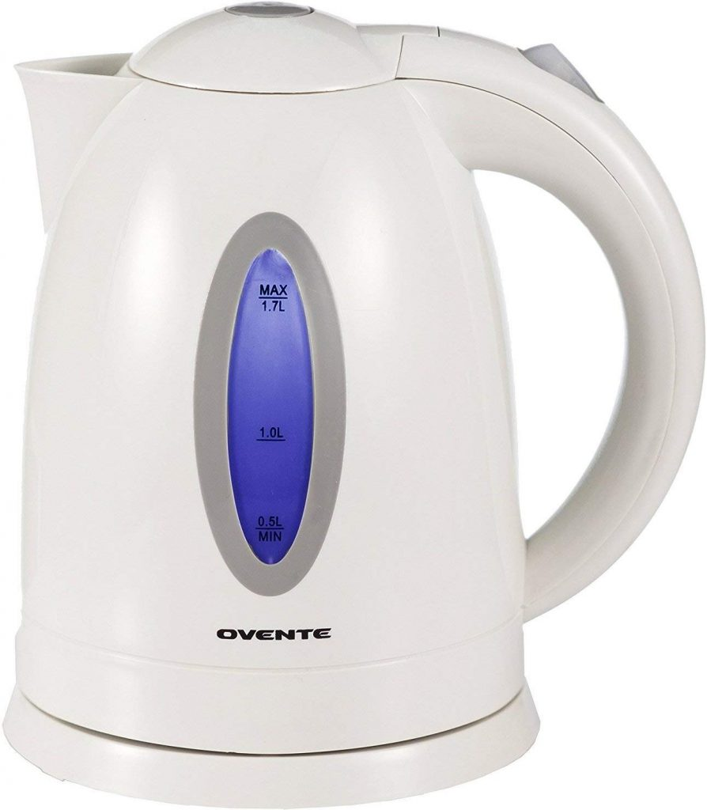

The Ovente 1.7L Cordless Electric Kettle is a popular choice for those seeking a reliable and efficient way to boil water quickly. This review delves into its features, performance, and overall value.

## Design and Build

- **Capacity**: 1.7 liters, suitable for family use
- **Materials**: BPA-free plastic body with 304 food-grade stainless steel interior
- **Colors**: Available in various colors including pink, white, green, and brown
- **Dimensions**: 8.5 x 6.7 x 9.4 inches

### Key Design Features:
- Jug-like shape with a wide base and narrow mouth
- Calibrated scale with LED indicator light
- Concealed 1100-watt heating element
- Removable spout filter for easy cleaning
- 360-degree cordless base for convenient serving

For more on kettle materials, see our comparison of [stainless steel vs glass vs plastic kettles](https://www.electrickettlesguide.com/stainless-steel-vs-glass-vs-plastic-kettle/).

## Performance

- **Boiling Time**: 3-7 minutes (may vary with altitude)
- **Power**: 1100 watts, 120V power source
- **Energy Efficiency**: Fast boiling saves time and energy

## Key Functionalities

1. Rapid water boiling
2. Suitable for tea, coffee, instant noodles, and baby formula preparation
3. Auto shut-off and boil-dry protection for safety

## Specifications Table

| Feature | Specification |
|---------|---------------|
| Capacity | 1.7 liters |
| Power | 1100 watts |
| Voltage | 120V |
| Materials | BPA-free plastic, stainless steel interior |
| Safety Features | Auto shut-off, boil-dry protection |
| Special Features | LED indicator, removable filter |

## Pros and Cons

### Pros:
- Multiple safety features
- LED indicator for easy operation
- Variety of color options
- Easy to clean due to concealed heating element
- Affordable price point

### Cons:
- May not auto shut-off at high altitudes
- Plastic exterior might not appeal to all users

For tips on kettle maintenance, check our guide on [how to clean an electric kettle](https://www.electrickettlesguide.com/how-to-clean-an-electric-kettle/).

## User Experience

The Ovente kettle offers a user-friendly experience with its:
- Easy-to-grip handle
- Convenient power button placement
- Clear water level indicator
- Quiet operation

## Comparison with Other Kettles

| Feature | Ovente 1.7L | Average Electric Kettle | High-End Kettle |
|---------|-------------|-------------------------|-----------------|
| Capacity | 1.7L | 1.5-1.8L | 1.5-2L |
| Power | 1100W | 1000-1500W | 1500-3000W |
| Price Range | $ | $-$$ | $$-$$$ |
| Material | Plastic/Stainless Steel | Varies | Stainless Steel/Glass |
| Special Features | Basic | Moderate | Advanced |

For more kettle options, explore our guide on [best electric kettles made in the USA](https://www.electrickettlesguide.com/best-electric-kettles-made-in-the-usa/).

## FAQs

1. **Q: Is this kettle suitable for hard water areas?**
   A: Yes, but regular descaling is recommended. See our guide on [best kettles for hard water](https://www.electrickettlesguide.com/best-kettles-for-hard-water/).

2. **Q: Can I control the water temperature?**
   A: No, this model doesn't have variable temperature control. For kettles with this feature, check our [best variable temperature kettles](https://www.electrickettlesguide.com/best-variable-temperature-kettles/) guide.

3. **Q: Is it safe to use for boiling milk?**
   A: It's not recommended. This kettle is designed for water only.

4. **Q: How long is the warranty?**
   A: Typically, Ovente offers a 1-year warranty, but check the specific product details.

## Conclusion

The Ovente 1.7L Cordless Electric Kettle offers a good balance of functionality, safety, and affordability. Its rapid boiling capability and easy-to-clean design make it a practical choice for daily use. While it may lack advanced features found in more expensive models, it provides excellent value for its price point.

This kettle is ideal for:
- Households seeking a reliable, no-frills electric kettle
- Those who prioritize safety features
- Users looking for an easy-to-clean appliance

For those seeking more advanced features or different materials, consider exploring other options in our comprehensive kettle guides.

[Check price on Amazon](#)

For more insights on electric kettles and their uses, explore our other articles:
- [What to Check When Buying an Electric Kettle](https://www.electrickettlesguide.com/what-to-check-when-buying-an-electric-kettle/)
- [Are Electric Kettles Energy Efficient?](https://www.electrickettlesguide.com/are-electric-kettles-energy-efficient/)
- [How Electric Kettles Made Our Life Easier](https://www.electrickettlesguide.com/how-electric-kettles-made-our-life-easier/)

Choose wisely and enjoy your perfect cup of tea or coffee with the Ovente 1.7L Cordless Electric Kettle!
