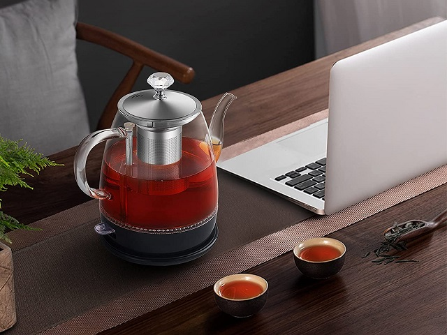

Electric kettles have become indispensable in modern kitchens, offering convenience and efficiency in preparing hot beverages. This comprehensive guide compares the three main types of electric kettles - stainless steel, glass, and plastic - to help you make an informed choice based on your specific needs and preferences.

## Quick Comparison Table

| Model | Material | Capacity | Special Features | Price |
|-------|----------|----------|------------------|-------|
| [Amazon Basics Electric Kettle](https://amzn.to/3Yv4iEg) | Stainless Steel | 1.0L | Auto Shut-Off, Boil Dry Protection | $ |
| [Gooseneck Electric Kettle](https://amzn.to/4dODCCO) | Stainless Steel | 1.0L | Temperature Control, Pour Over Design | $$$ |
| [Cuisinart Cordless Electric Kettle](https://amzn.to/3A3d6HM) | Stainless Steel | 1.7L | 6 Preset Temperatures | $$$ |
| [COSORI Electric Kettle](https://amzn.to/4dKSQZv) | Stainless Steel | 1.5L | Cool-Touch Double Wall | $$ |
| [COMFEE' Electric Kettle](https://amzn.to/3UbREYb) | Stainless Steel | 1.7L | LED Light, Fast Boil | $ |

## Understanding Kettle Materials

The choice of material for your electric kettle can significantly impact its performance, durability, and even the taste of your beverages. Let's delve into the characteristics of each material:

### Plastic Kettles: Affordable but Controversial

Plastic kettles have long been a popular choice due to their affordability and lightweight nature. However, they come with their own set of advantages and drawbacks:

#### Pros:
1. Cost-effective: Generally the most affordable option
2. Lightweight and portable: Ideal for travel or small spaces
3. Good heat retention: Keeps water warm for longer periods

#### Cons:
1. Potential health concerns: Some plastics may contain BPA or other chemicals
2. May affect water taste: Especially noticeable with new kettles or lower-quality plastics
3. Less aesthetically pleasing: Often considered less stylish than glass or stainless steel

#### Maintenance and Cleaning:
Plastic kettles are relatively easy to clean but may require more frequent cleaning to prevent buildup and potential taste issues. Use a mixture of water and white vinegar to clean and descale regularly.

For more information on plastic kettles, including BPA-free options, check our guide on [best electric kettles made in the USA](https://www.electrickettlesguide.com/best-electric-kettles-made-in-the-usa/).

### Glass Kettles: Elegant and Transparent

Glass kettles offer a unique blend of aesthetics and functionality, making them a popular choice for those who value visual appeal:

#### Pros:
1. Visually appealing: Adds a touch of elegance to any kitchen
2. Easy to monitor water level and cleanliness: Transparent design allows for visual inspection
3. No impact on water taste: Glass is inert and doesn't affect flavor

#### Cons:
1. Heavier than plastic models: May be less convenient for some users
2. More fragile: Requires careful handling to prevent breakage
3. Often more expensive: Premium appearance comes at a higher cost

#### Maintenance and Cleaning:
Glass kettles are easy to clean due to their transparent nature. Use a mixture of water and lemon juice or vinegar to remove mineral deposits and maintain clarity. Be gentle when cleaning to avoid scratches or cracks.

Explore our selection of [the best glass kettle models](https://www.electrickettlesguide.com/a-brutal-selection-of-the-best-glass-kettle-models/) for more options and detailed reviews.

### Stainless Steel Kettles: Durable and Popular

Stainless steel kettles have become increasingly popular due to their durability and sleek appearance:

#### Pros:
1. Highly durable: Resistant to scratches, dents, and corrosion
2. Sleek, modern designs: Fits well in contemporary kitchens
3. Often include scale filters: Helps reduce mineral buildup
4. No impact on water taste: High-quality stainless steel is taste-neutral

#### Cons:
1. Can have hot exteriors: Some models address this with insulation
2. Heavier than plastic kettles: May be less portable

#### Maintenance and Cleaning:
Stainless steel kettles are relatively easy to maintain. Use a mixture of water and vinegar to remove mineral deposits. For stubborn stains, a paste of baking soda and water can be effective. Always dry thoroughly to prevent water spots.

## Environmental Impact of Kettle Materials

When considering the environmental impact of different kettle materials, several factors come into play:

1. **Plastic Kettles**: While often recyclable, plastic kettles have the highest environmental impact due to their shorter lifespan and the issues associated with plastic production and disposal.

2. **Glass Kettles**: Glass is infinitely recyclable and made from abundant natural materials. However, its fragility may lead to more frequent replacements.

3. **Stainless Steel Kettles**: These are the most durable option, potentially lasting for many years. Stainless steel is also recyclable, making it a good choice for eco-conscious consumers.

For more information on sustainability in kitchen appliances, check out this [guide on eco-friendly kitchen choices](https://www.treehugger.com/green-home-guide-kitchen-4858774).

## Factors to Consider When Choosing a Kettle Material

1. **Safety**: Consider potential health risks, especially with plastic kettles. Look for BPA-free options if choosing plastic.
2. **Durability**: Assess how long you expect the kettle to last. Stainless steel typically offers the longest lifespan.
3. **Aesthetics**: Choose a material that complements your kitchen decor and personal style.
4. **Functionality**: Look for features like temperature control and rapid boiling, which can be found across all material types.
5. **Maintenance**: Consider ease of cleaning and descaling, which can vary between materials.
6. **Energy Efficiency**: While this depends more on design than material, some kettles are more energy-efficient than others. Check out our article on [are electric kettles energy efficient](https://www.electrickettlesguide.com/are-electric-kettles-energy-efficient/) for more information.

For more on kettle features, check our comprehensive guide on [what to check when buying an electric kettle](https://www.electrickettlesguide.com/what-to-check-when-buying-an-electric-kettle/).

## Top Stainless Steel Kettle Recommendations

### [1. Amazon Basics Electric Kettle](https://amzn.to/3Yv4iEg)

This Amazon Basics Electric Kettle offers a perfect blend of functionality and affordability. With a 1.0L capacity, it's ideal for individual use or small households. The stainless steel construction ensures durability and maintains water purity, while the black and silver design adds a touch of elegance to any kitchen.

The kettle features essential safety measures such as auto shut-off and boil-dry protection, making it a reliable choice for daily use. The Strix thermostat, known for its quality and reliability, ensures precise temperature control. Being BPA-free, it addresses health concerns associated with plastic kettles. Its 1500W power allows for quick boiling, saving you time during busy mornings or when you need a quick cup of tea.

**Key Features:**
- 1.0L (1.1 Quarts) capacity
- Stainless steel construction with black accents
- Auto shut-off and boil-dry protection
- Strix thermostat for accurate temperature control
- BPA-free materials for health safety

**Pros:**
- Affordable price point
- Reliable safety features
- Quick boiling with 1500W power
- Sleek design fits most kitchen decors
- Easy to clean and maintain

**Cons:**
- Smaller capacity may not suit large families
- Limited advanced features compared to premium models

[Check it on Amazon](https://amzn.to/3Yv4iEg)

### [2. Gooseneck Electric Kettle with Temperature Control]((https://amzn.to/4dODCCO))

This gooseneck electric kettle is a dream come true for coffee and tea enthusiasts who value precision in their brewing process. With its 1L capacity and stainless steel construction, it offers both style and functionality. The standout feature is its temperature control with presets, allowing you to achieve the perfect temperature for various types of tea and coffee.

The gooseneck spout design provides excellent control over the water flow, making it ideal for pour-over coffee methods. This kettle combines the durability of stainless steel with the precision needed for specialty brewing techniques. Its sleek design not only looks great on the counter but also ensures easy handling and pouring. Whether you're a barista at home or just someone who appreciates a well-crafted cup of coffee or tea, this kettle offers the control and quality you need.

**Key Features:**
- 1L capacity in stainless steel
- Temperature control with presets
- Gooseneck spout for precise pouring
- Suitable for both tea and pour-over coffee
- Elegant, modern design

**Pros:**
- Precise temperature control for optimal brewing
- Excellent pour control with gooseneck spout
- Versatile for various hot beverages
- Durable stainless steel construction
- Aesthetically pleasing design

**Cons:**
- Higher price point
- Specialized design may not appeal to all users

[Check it on Amazon](https://amzn.to/4dODCCO)

### [3. Cuisinart 1.7-Liter Stainless Steel Cordless Electric Kettle](https://amzn.to/3A3d6HM)

The Cuisinart 1.7-Liter Cordless Electric Kettle is a versatile and high-capacity option for those who need to prepare larger quantities of hot water. Its standout feature is the 6 preset temperatures, making it perfect for various types of tea and coffee that require specific water temperatures for optimal flavor extraction.

Constructed from high-quality stainless steel, this kettle offers durability and a sleek appearance. The cordless design allows for easy pouring and serving, while the base provides stable heating and convenient storage. With its large capacity and precise temperature control, this kettle is ideal for households with multiple tea or coffee drinkers, or for those who frequently entertain guests. The combination of functionality, capacity, and temperature versatility makes it a top choice for discerning hot beverage enthusiasts.

**Key Features:**
- 1.7-Liter capacity
- 6 preset temperatures for various beverages
- Cordless design for easy serving
- Durable stainless steel construction
- Memory feature keeps settings for up to 2 minutes

**Pros:**
- Large capacity suitable for families or entertaining
- Precise temperature control for different types of tea and coffee
- Easy to use with preset options
- Cordless pour for convenience
- Reputable brand known for quality

**Cons:**
- May be more kettle than needed for single users
- Higher price point due to advanced features

[Check it on Amazon](https://amzn.to/3A3d6HM)

### [4. COSORI Electric Kettle]((https://amzn.to/4dKSQZv))

The COSORI Electric Kettle stands out with its innovative cool-touch double wall stainless steel design. This 1.5L kettle combines safety, efficiency, and style in one package. The double-wall insulation keeps the exterior cool to the touch while maintaining the water temperature inside, making it an excellent choice for households with children or for those who prioritize safety.

With a powerful 1500W heating element, this kettle offers fast boiling times, perfect for busy mornings or when you need hot water in a hurry. The automatic shut-off and boil-dry protection features add an extra layer of safety and convenience. Its sleek silver design makes it an attractive addition to any kitchen counter. The kettle's food-grade stainless steel interior ensures that your water remains pure and uncontaminated, making it ideal for those who are particular about their water quality for tea, coffee, or other hot beverages.

**Key Features:**
- 1.5L capacity with cool-touch double wall design
- Food-grade stainless steel interior
- Automatic shut-off and boil-dry protection
- 1500W for fast boiling
- Sleek, modern silver appearance

**Pros:**
- Cool-touch exterior for added safety
- Efficient and quick boiling
- Durable and high-quality construction
- Easy to clean and maintain
- Attractive design suitable for modern kitchens

**Cons:**
- Slightly higher price point due to advanced features
- May be too large for single users or small kitchens

[Check it on Amazon](https://amzn.to/4dKSQZv)

### [5. COMFEE' Stainless Steel Electric Kettle](https://amzn.to/3UbREYb)

The COMFEE' Stainless Steel Electric Kettle offers a perfect blend of functionality and affordability. With its 1.7-liter capacity, this kettle is ideal for families or those who frequently need larger quantities of hot water. The stainless steel construction ensures durability and helps maintain the purity of your water, making it perfect for various hot beverages.

One of the standout features of this kettle is its 1500W heating element, which allows for rapid boiling, saving you precious time in your daily routine. The LED light indicator adds a modern touch and provides a clear visual cue when the kettle is in operation. Safety features like auto shut-off and boil-dry protection offer peace of mind during use. The kettle's sleek design makes it an attractive addition to any kitchen, while its practical features make it a reliable tool for everyday use. Whether you're brewing tea, preparing coffee, or need hot water for cooking, this COMFEE' kettle delivers efficiency and convenience at an accessible price point.

**Key Features:**
- 1.7-liter capacity
- 1500W fast boiling element
- LED light indicator
- Auto shut-off and boil-dry protection
- Durable stainless steel construction

**Pros:**
- Large capacity suitable for families
- Quick boiling time
- Attractive, modern design
- Affordable price point
- Easy to use and clean

**Cons:**
- May be too large for single users or small kitchens
- Limited advanced features compared to premium models

[Check it on Amazon](https://amzn.to/3UbREYb)

## Conclusion

Choosing between stainless steel, glass, and plastic kettles depends on your personal preferences, budget, and needs:

- **Choose Stainless Steel** for durability, a modern look, and long-term reliability. It's an excellent all-round choice for most users.
- **Opt for Glass** if you value aesthetics and want to monitor water quality visually. It's perfect for those who enjoy the brewing process as much as the final product.
- **Consider Plastic** if budget and lightweight design are your priorities, but be mindful of potential health and environmental concerns.

Remember, the best kettle for you is one that fits your lifestyle, kitchen decor, and safety standards. Consider factors like frequency of use, maintenance requirements, and specific features you need in a kettle.

For more insights on electric kettles and their uses, explore our other articles:
- [Best Electric Kettle with Tea Infuser](https://www.electrickettlesguide.com/best-electric-kettle-with-tea-infuser/)
- [Best Variable Temperature Kettles](https://www.electrickettlesguide.com/best-variable-temperature-kettles/)
- [How Electric Kettles Made Our Life Easier](https://www.electrickettlesguide.com/how-electric-kettles-made-our-life-easier/)

Choose wisely and enjoy your perfect cup of tea or coffee with the ideal electric kettle for your needs!
