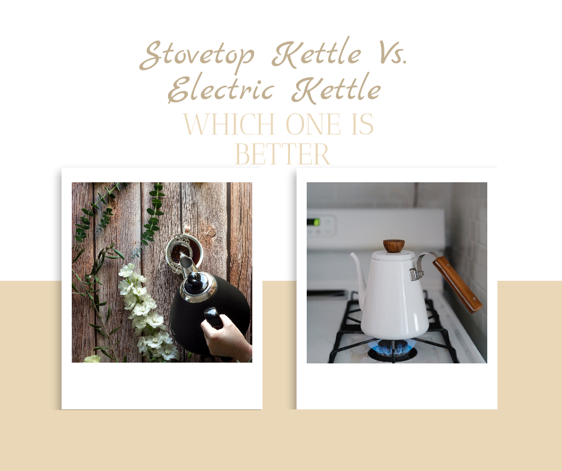

In the world of hot beverage preparation, the debate between stovetop and electric kettles continues. This comprehensive guide will help you understand the advantages and drawbacks of each, enabling you to make an informed decision for your kitchen.

## Stovetop Kettle: Traditional Charm Meets Functionality

### Advantages of Stovetop Kettles

1. **Versatility**: Works on various heat sources, including campfires
2. **Aesthetic Appeal**: Often features classic designs
3. **Durability**: Many models last for decades
4. **No Electricity Needed**: Ideal for power outages or outdoor use

### Drawbacks of Stovetop Kettles

1. **Slower Heating**: Takes longer to boil water
2. **Less Energy Efficient**: Heat loss during the process
3. **Requires Attention**: No auto shut-off feature

For more on stovetop kettles, check our guide on [best stovetop kettles](https://www.electrickettlesguide.com/best-stovetop-kettles/).

## Electric Kettle: Modern Convenience and Efficiency

### Advantages of Electric Kettles

1. **Speed**: Boils water faster than stovetop models
2. **Energy Efficiency**: More efficient use of electricity
3. **Safety Features**: Auto shut-off and boil-dry protection
4. **Temperature Control**: Some models offer precise settings

### Drawbacks of Electric Kettles

1. **Dependence on Electricity**: Not usable during power outages
2. **Limited Capacity**: Generally smaller than stovetop models
3. **Potential for Mineral Build-up**: Requires regular descaling

Learn more about electric kettle features in our article on [what to check when buying an electric kettle](https://www.electrickettlesguide.com/what-to-check-when-buying-an-electric-kettle/).

## Energy Efficiency Comparison

| Appliance | Energy Consumption (1L water) | Boiling Time |
|-----------|-------------------------------|--------------|
| Electric Kettle | 0.115 kWh | ~3:18 mins |
| Induction Hob | 0.123 kWh | ~4:36 mins |
| Gas Stove | 0.27 kWh | ~5:18 mins |
| Glass Ceramic Hob | 0.169 kWh | ~5:42 mins |
| Stovetop | 0.208 kWh | ~6:18 mins |
| Microwave | 0.231 kWh | ~12:18 mins |

Source: Stiftung Warentest

## Cost Comparison (Based on April 2022 Prices)

| Appliance | Cost per Boil (1L) | Annual Cost (1L daily) |
|-----------|---------------------|------------------------|
| Electric Kettle | 4.2 cents | €15.59 |
| Gas Stove | 3.7 cents | €13.57 |
| Induction Hob | 4.6 cents | €16.67 |
| Glass Ceramic Hob | 6.3 cents | €22.91 |
| Stovetop | 7.7 cents | €28.20 |
| Microwave | 8.6 cents | €31.31 |

Source: Stuttgarter Zeitung

## Top Picks: Stovetop and Electric Kettles

### Best Stovetop Kettles

1. **Hario V60 "Buono" Drip Kettle**
   - Ideal for coffee enthusiasts
   - Gooseneck spout for precise pouring
   - Stainless steel construction

2. **Primula Stewart Whistling Stovetop Tea Kettle**
   - Classic design with modern features
   - 1.5-quart capacity
   - Sturdy stainless steel build

### Best Electric Kettles

1. **Ovente Electric Hot Water Kettle**
   - 1.7-liter capacity
   - BPA-free with auto shut-off
   - LED indicator light

2. **COSORI Glass Electric Kettle**
   - 1.7-liter borosilicate glass kettle
   - Stainless steel filter and inner lid
   - Blue LED light indicator

For more electric kettle options, explore our guide on [best variable temperature kettles](https://www.electrickettlesguide.com/best-variable-temperature-kettles/).

## FAQs

1. **Q: Which is faster, electric or stovetop kettle?**
   A: Electric kettles are generally faster, boiling water in about half the time of stovetop kettles.

2. **Q: Are electric kettles more energy-efficient?**
   A: Yes, electric kettles are typically more energy-efficient than stovetop models.

3. **Q: Can I use a stovetop kettle on an induction cooktop?**
   A: Only if the kettle is made of magnetic-based material. Check the manufacturer's specifications.

4. **Q: Do electric kettles affect water taste?**
   A: High-quality electric kettles should not affect water taste. Some models come with filters to improve water quality.

## Conclusion

Choosing between a stovetop and electric kettle depends on your personal preferences, lifestyle, and kitchen setup:

- **Choose a Stovetop Kettle if:**
  - You value traditional aesthetics
  - You need a kettle for outdoor use
  - You prefer a more hands-on approach to brewing

- **Choose an Electric Kettle if:**
  - Speed and convenience are priorities
  - You want precise temperature control
  - Energy efficiency is important to you

Both types have their merits, and many households benefit from having both for different occasions and uses.

For more insights on kettles and their uses, explore our other articles:
- [Are Electric Kettles Energy Efficient?](https://www.electrickettlesguide.com/are-electric-kettles-energy-efficient/)
- [How Electric Kettles Made Our Life Easier](https://www.electrickettlesguide.com/how-electric-kettles-made-our-life-easier/)
- [Best Electric Kettle with Tea Infuser](https://www.electrickettlesguide.com/best-electric-kettle-with-tea-infuser/)

Choose the kettle that best fits your lifestyle and enjoy your perfect cup of tea or coffee!
