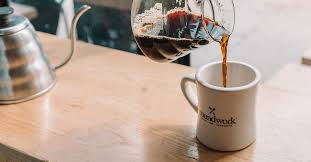
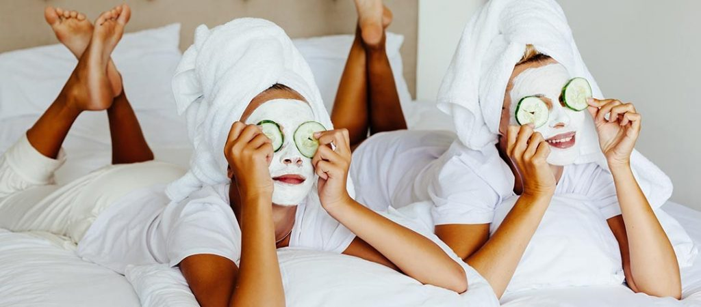

Electric kettles have evolved from a simple tea-making appliance to a versatile kitchen essential. This article explores the numerous benefits of owning an electric kettle, even for non-tea drinkers.

## Introduction

The humble electric kettle has come a long way since its invention in the late 19th century. Originally designed for boiling water quickly, today's electric kettles offer a range of features that make them indispensable in any modern kitchen.

[Electric kettles have revolutionized our kitchens](https://www.electrickettlesguide.com/how-electric-kettles-made-our-life-easier/), offering convenience and efficiency that extend far beyond making a simple cup of tea. Whether you're a busy professional, a culinary enthusiast, or someone who appreciates energy-efficient appliances, an electric kettle can significantly enhance your daily routines.

## The Evolution of Electric Kettles

Understanding the evolution of electric kettles helps appreciate their current versatility:

1. **1891**: First electric kettle invented, took 12 minutes to boil water
2. **1922**: First fully automatic electric kettle introduced
3. **1950s**: Plastic kettles become popular due to affordability
4. **1980s**: Cordless models with separate bases emerge
5. **2000s onwards**: Smart kettles with temperature control and WiFi connectivity

This progression has led to the multi-functional electric kettles we see today, capable of much more than just boiling water.

## 10 Reasons You Need an Electric Kettle

### 1. Unmatched Time-Saving Efficiency

Electric kettles are designed for rapid water boiling, outperforming traditional methods:

- **Speed**: Boils water faster than stovetops or microwaves
- **Convenience**: Perfect for busy mornings and quick meal preparations
- **Portability**: Ideal for students, office workers, and travelers

For more on portability, check our guide on [foldable electric kettles for traveling](https://www.electrickettlesguide.com/best-foldable-electric-kettle-for-traveling/).

### 2. Energy Efficiency Champion

Electric kettles are champions of energy efficiency in the kitchen:

| Method | Energy Efficiency |
|--------|-------------------|
| Electric Kettle | 80-90% |
| Microwave | 50-65% |
| Stovetop | 30-40% |

Benefits:
- Automatic shut-off prevents over-boiling
- Temperature control features for optimal energy use
- No wasted energy heating unnecessary water

Learn more about [energy efficiency in electric kettles](https://www.electrickettlesguide.com/are-electric-kettles-energy-efficient/).

### 3. Perfect for Coffee Enthusiasts

Electric kettles are a coffee lover's dream:
- Ideal for pour-over coffee methods
- Precise temperature control for optimal brewing
- Consistent results every time
- Gooseneck spouts available for controlled pouring

Explore our [guide on the best electric kettles for French press](https://www.electrickettlesguide.com/best-electric-kettle-for-french-press/) for coffee lovers.

### 4. Safety First: BPA-Free Options

Safety is a top priority in modern electric kettles:
- Many models made from stainless steel or glass
- BPA-free plastic options available
- Safer than traditional stovetop kettles
- Auto shut-off features prevent dry boiling

For safe options, check our article on [the safest electric kettles](https://www.electrickettlesguide.com/best-safest-electric-kettles/).

### 5. Convenient Baby Bottle Warmer

Electric kettles can be a lifesaver for parents:
- Safe alternative to microwave warming
- Quick and efficient for late-night feedings
- Consistent temperature for baby's comfort
- Some models offer specific bottle warming settings

### 6. Culinary Multi-Tasker

Electric kettles can assist in various cooking tasks:

| Task | How Electric Kettle Helps |
|------|---------------------------|
| Cooking Pasta | Quick start with pre-boiled water |
| Boiling Eggs | [Easy method for perfect eggs](https://www.electrickettlesguide.com/how-to-boil-eggs-into-an-electric-kettle/) |
| Instant Oatmeal | Faster than stovetop preparation |
| Vegetable Prep | Quick blanching or steaming |
| Rehydrating Dried Foods | Ideal for camping or quick meals |

For more cooking ideas, see our guide on [how to cook with just a kettle](https://www.electrickettlesguide.com/how-to-cook-with-just-a-kettle/).

### 7. Home Spa Treatment Helper

Transform your bathroom into a spa with an electric kettle:
- Perfect for foot soaks
- Ideal for facial steaming treatments
- Consistent temperature for safe use
- Quick hot water for aromatherapy diffusers

### 8. Instant Hot Beverages Beyond Tea

Electric kettles are versatile for various hot drinks:
- Hot chocolate
- Instant soups
- Herbal infusions
- Mulled wine preparation
- Hot toddies for cold evenings

### 9. Cleaning and Sanitizing Aid

An electric kettle can be a powerful cleaning tool:
- Boiling water for cleaning surfaces
- Sterilizing small items like bottle nipples or beauty tools
- Quick hot water for dish cleaning
- Descaling other appliances like coffee makers

### 10. Emergency Preparedness Tool

In emergencies, an electric kettle can be invaluable:
- Reliable hot water source during power outages (if gas-powered)
- Essential for emergency food preparation
- Helps purify water in emergency situations
- Provides comfort with hot beverages during stressful times

## Environmental Impact of Using Electric Kettles

Using an electric kettle can contribute to a more sustainable lifestyle:

1. **Energy Efficiency**: Uses less energy than stovetops or microwaves
2. **Water Conservation**: Encourages boiling only what's needed
3. **Reduced Carbon Footprint**: Faster boiling times mean less energy consumption
4. **Durability**: Quality kettles last for years, reducing electronic waste
5. **Eco-Friendly Materials**: Some models use recycled or sustainable materials

For eco-friendly options, explore our guide on [ceramic electric kettles](https://www.electrickettlesguide.com/best-ceramic-electric-kettles/), which are often more durable and environmentally friendly.

## Comparing Electric Kettles to Other Appliances

| Appliance | Speed | Energy Efficiency | Versatility | Safety |
|-----------|-------|-------------------|-------------|--------|
| Electric Kettle | High | High | Moderate | High |
| Microwave | Moderate | Moderate | High | Moderate |
| Stovetop Kettle | Low | Low | Low | Moderate |
| Coffee Maker | Moderate | Moderate | Low | High |

Electric kettles stand out for their combination of speed, efficiency, and safety.

## Creative Uses for Electric Kettles

Beyond the typical uses, electric kettles can be surprisingly versatile:

1. **Wax Melting**: For candle making or hair removal
2. **Dyeing Fabrics**: Quick hot water for small dyeing projects
3. **Plant Watering**: Use cooled boiled water for sensitive plants
4. **Cocktail Preparation**: Hot water for certain cocktail recipes
5. **Heating Bed Warmers**: Fill hot water bottles quickly and safely

## Choosing the Right Electric Kettle

Consider these factors when selecting an electric kettle:

1. **Material**: Stainless steel, glass, or BPA-free plastic
2. **Capacity**: Based on household needs
3. **Temperature Control**: For precise heating
4. **Safety Features**: Auto shut-off, boil-dry protection
5. **Energy Efficiency**: Look for eco-friendly models
6. **Additional Features**: Variable temperature, keep-warm function, water filter

For a comprehensive guide, read [what to check when buying an electric kettle](https://www.electrickettlesguide.com/what-to-check-when-buying-an-electric-kettle/).

## Maintenance and Care Tips

To ensure your electric kettle lasts:

1. **Regular Descaling**: Use vinegar or a commercial descaler every 1-3 months
2. **Proper Cleaning**: Wipe exterior with a damp cloth, avoid immersing the base
3. **Avoid Overfilling**: Respect minimum and maximum water levels
4. **Use Filtered Water**: Reduces mineral buildup
5. **Store Properly**: Keep in a dry place, avoid leaving water inside when not in use

For detailed cleaning instructions, see our guide on [how to clean an electric kettle](https://www.electrickettlesguide.com/how-to-clean-an-electric-kettle/).

## FAQs About Electric Kettles

1. **Q: Are electric kettles more efficient than stovetop kettles?**
   A: Yes, electric kettles are generally more energy-efficient and faster.

2. **Q: Can I use an electric kettle for anything other than boiling water?**
   A: While primarily designed for water, some models can heat soups or milk. Always check the manufacturer's guidelines.

3. **Q: How often should I clean my electric kettle?**
   A: Regular cleaning is recommended, especially in hard water areas. Descale every 1-3 months.

4. **Q: Are there smart electric kettles available?**
   A: Yes, there are [smart kettles](https://www.electrickettlesguide.com/best-smart-kettles/) with Wi-Fi connectivity and app control.

5. **Q: Can electric kettles be used in countries with different voltages?**
   A: Some models are dual voltage. Always check the specifications before traveling internationally.

## Conclusion

An electric kettle is a versatile and efficient appliance that extends far beyond making tea. Its time-saving capabilities, energy efficiency, and multifunctional uses make it an essential tool for any modern kitchen. Whether you're a coffee lover, a busy parent, a culinary enthusiast, or simply someone who appreciates convenience, an electric kettle can significantly enhance your daily routine.

By investing in a quality electric kettle, you're not just buying a single-purpose appliance but a multi-functional tool that can streamline various aspects of your life. From speeding up your cooking process to creating a mini home spa experience, the possibilities are vast and varied.

As technology continues to advance, we can expect electric kettles to become even more integrated into our smart homes and daily routines. Their impact on energy efficiency and convenience will likely grow, making them an even more essential appliance in the future.

For more insights on electric kettles and their uses, explore our other articles:
- [Best Electric Kettle with Tea Infuser](https://www.electrickettlesguide.com/best-electric-kettle-with-tea-infuser/)
- [Stovetop Kettle vs Electric Kettle: Which One is Better?](https://www.electrickettlesguide.com/stovetop-kettle-vs-electric-kettle-which-one-is-better/)
- [Best Variable Temperature Kettles](https://www.electrickettlesguide.com/best-variable-temperature-kettles/)

Embrace the versatility of an electric kettle and discover how this simple appliance can revolutionize your daily routines!
